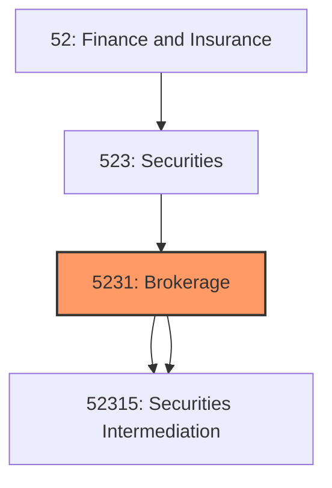
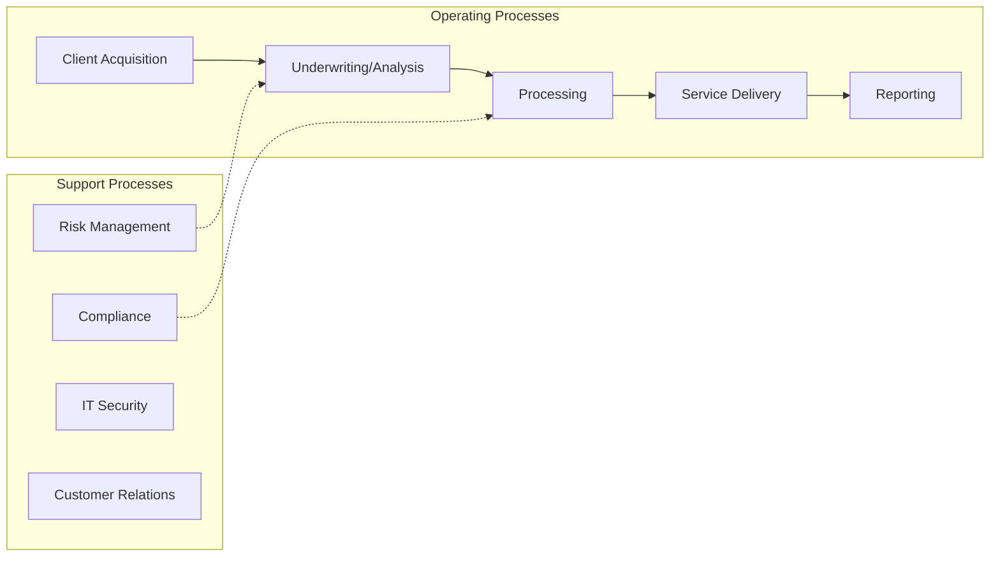

# Brokerage

> This industry group comprises establishments primarily engaged in putting capital at risk in the process of underwriting securities issues or in making markets for securities and commodities; and those acting as agents and/or brokers between buyers and sellers of securities and commodities, usually charging a commission.

## Overview

Brokerage represents an important category within the Finance and Insurance sector (NAICS 52).

This industry group comprises establishments primarily engaged in putting capital at risk in the process of underwriting securities issues or in making markets for securities and commodities; and those acting as agents and/or brokers between buyers and sellers of securities and commodities, usually charging a commission.

## Industry Hierarchy

## Key Statistics

| Metric | Value |
|--------|-------|
| NAICS Code | 5231 |
| Level | Industry Group |
| Parent | [Securities](../) |
| Child Industries | 2 |

## Sub-Industries

| Industry | Code | Description |
|----------|------|-------------|
| [Investment Banking](./InvestmentBanking/) | 52315 | See industry description for 523150 |
| [Securities Intermediation](./SecuritiesIntermediation/) | 52315 | See industry description for 523150 |

## Related Occupations

See the [occupations directory](/occupations) for roles commonly found in this industry.

## Core Business Processes

## Industry Value Chain

```mermaid
graph LR
    subgraph Inputs["Inputs"]
        I1["Capital"]
        I2["Data"]
        I3["Expertise"]
        I4["Technology"]
    end

    subgraph Primary["Primary Activities"]
        A1["Inbound Logistics"]
        A2["Core Operations"]
        A3["Quality Assurance"]
        A4["Outbound/Delivery"]
    end

    subgraph Outputs["Products/Services"]
        O1["Financial Products"]
        O2["Risk Coverage"]
        O3["Advisory"]
    end

    subgraph Customers["Markets"]
        C1["Individuals"]
        C2["Businesses"]
        C3["Institutions"]
        C4["Government"]
    end

    Inputs --> Primary --> Outputs --> Customers
```

---

*Source: NAICS 5231 - Brokerage*
