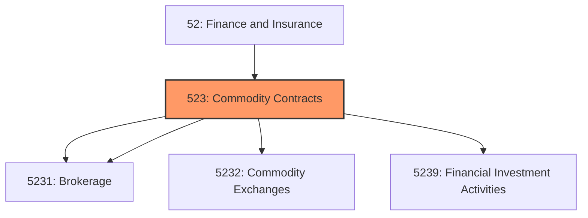
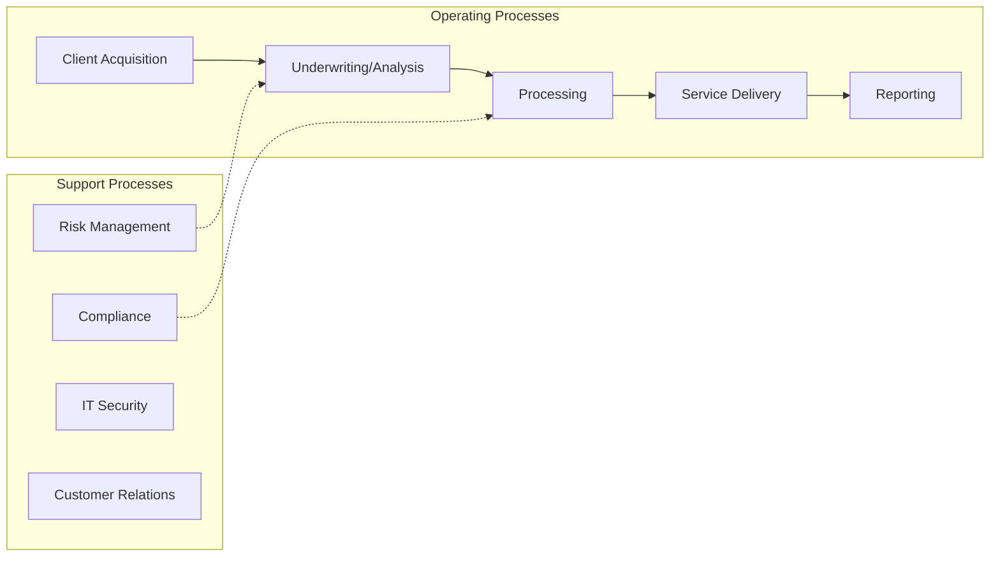

# Commodity Contracts

> Industries in the Securities, Commodity Contracts, and Other Financial Investments and Related Activities subsector group establishments that are primarily engaged in one of the following: (1) underwriting securities issues and/or making markets for securities and commodities; (2) acting as agents (i.

## Overview

Commodity Contracts represents an important category within the Finance and Insurance sector (NAICS 52).

Industries in the Securities, Commodity Contracts, and Other Financial Investments and Related Activities subsector group establishments that are primarily engaged in one of the following: (1) underwriting securities issues and/or making markets for securities and commodities; (2) acting as agents (i.e., brokers) between buyers and sellers of securities and commodities; (3) providing securities and commodity exchange services; and (4) providing other services, such as managing portfolios of assets; providing investment advice; and trust, fiduciary, and custody services.

## Industry Hierarchy

## Key Statistics

| Metric | Value |
|--------|-------|
| NAICS Code | 523 |
| Level | Subsector |
| Parent | [Finance](../) |
| Child Industries | 4 |

## Sub-Industries

| Industry | Code | Description |
|----------|------|-------------|
| [Commodity Contracts Intermediation](./CommodityContractsIntermediation/) | 5231 | This industry group comprises establishments primarily engaged in putting capita |
| [Brokerage](./Brokerage/) | 5231 | This industry group comprises establishments primarily engaged in putting capita |
| [Commodity Exchanges](./CommodityExchanges/) | 5232 | Commodity Exchanges |
| [Financial Investment Activities](./FinancialInvestmentActivities/) | 5239 | This industry group comprises establishments primarily engaged in one of the fol |

## Related Occupations

See the [occupations directory](/occupations) for roles commonly found in this industry.

## Core Business Processes

## Industry Value Chain

```mermaid
graph LR
    subgraph Inputs["Inputs"]
        I1["Capital"]
        I2["Data"]
        I3["Expertise"]
        I4["Technology"]
    end

    subgraph Primary["Primary Activities"]
        A1["Inbound Logistics"]
        A2["Core Operations"]
        A3["Quality Assurance"]
        A4["Outbound/Delivery"]
    end

    subgraph Outputs["Products/Services"]
        O1["Financial Products"]
        O2["Risk Coverage"]
        O3["Advisory"]
    end

    subgraph Customers["Markets"]
        C1["Individuals"]
        C2["Businesses"]
        C3["Institutions"]
        C4["Government"]
    end

    Inputs --> Primary --> Outputs --> Customers
```

## Market Context

Financial services facilitate capital flow and economic activity, with fintech innovation transforming traditional banking and investment models.

| Aspect | Details |
|--------|---------|
| Industry Sector | Finance |
| NAICS/SIC Code | 523 |
| Market Segment | Commodity Contracts |

## Key Business Processes

- Account management
- Lending and credit
- Investment management
- Risk and compliance
- Customer service

## Common Occupations

- [Financial Managers](/occupations/Management/FinancialManagers)
- [Financial Analysts](/occupations/Business/FinancialAnalysts)
- [Loan Officers](/occupations/Business/LoanOfficers)
- [Tellers](/occupations/Administrative/Tellers)

## Regulations and Standards

- Federal Reserve regulations
- SEC requirements
- FDIC insurance requirements
- Bank Secrecy Act (BSA)
- Dodd-Frank Act provisions

## Technology and Tools

- Core banking systems
- Trading platforms
- Risk management systems
- Mobile banking applications
- Blockchain and digital assets

## Industry Trends

- Digital transformation and automation adoption
- Sustainability and environmental compliance focus
- Workforce development and skills training
- Supply chain resilience and optimization
- Customer experience enhancement

---

*Source: NAICS 523 - Commodity Contracts*
