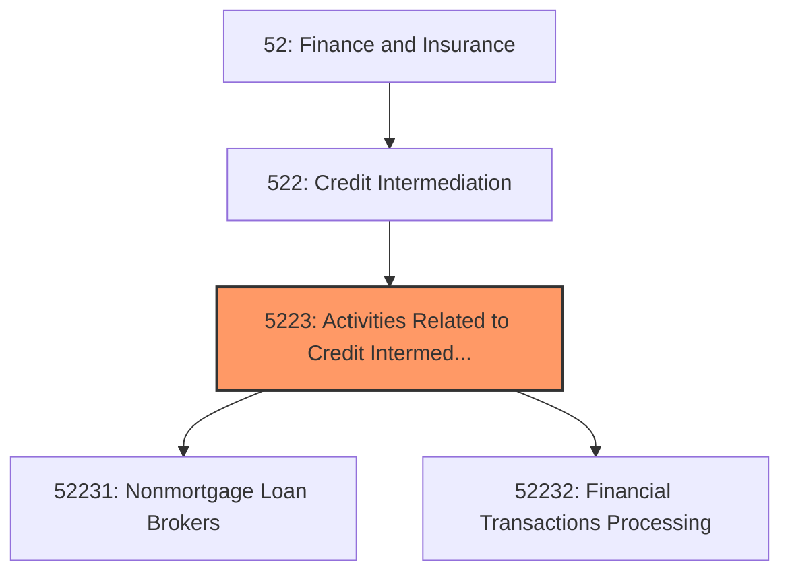
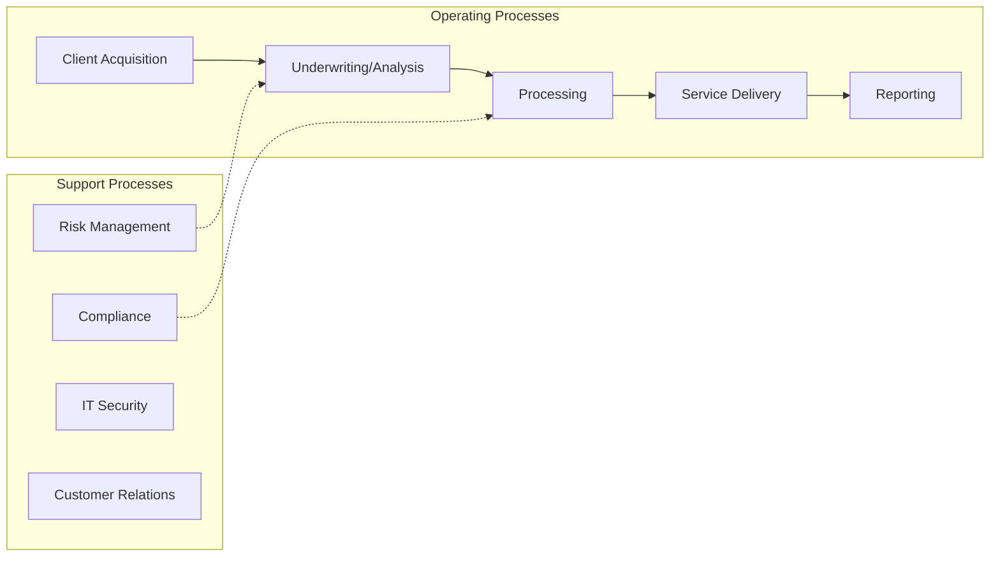

# Activities Related to Credit Intermediation

> This industry group comprises establishments primarily engaged in facilitating credit intermediation by performing activities, such as arranging loans by bringing borrowers and lenders together and clearing checks and credit card transactions.

## Overview

Activities Related to Credit Intermediation represents an important category within the Finance and Insurance sector (NAICS 52). This industry group encompasses establishments primarily engaged in activities related to credit intermediation.

This industry group comprises establishments primarily engaged in facilitating credit intermediation by performing activities, such as arranging loans by bringing borrowers and lenders together and clearing checks and credit card transactions.

## Industry Hierarchy

## Key Statistics

| Metric | Value |
|--------|-------|
| NAICS Code | 5223 |
| Level | Industry Group |
| Parent | [Credit Intermediation](../) |
| Child Industries | 2 |

## Sub-Industries

| Industry | Code | Description |
|----------|------|-------------|
| [Nonmortgage Loan Brokers](./NonmortgageLoanBrokers/) | 52231 | See industry description for 522310 |
| [Financial Transactions Processing](./FinancialTransactionsProcessing/) | 52232 | See industry description for 522320 |

## Core Business Processes

## Industry Value Chain

```mermaid
graph LR
    subgraph Inputs["Inputs"]
        I1["Capital"]
        I2["Data"]
        I3["Expertise"]
        I4["Technology"]
    end

    subgraph Primary["Primary Activities"]
        A1["Inbound Logistics"]
        A2["Core Operations"]
        A3["Quality Assurance"]
        A4["Outbound/Delivery"]
    end

    subgraph Outputs["Products/Services"]
        O1["Financial Products"]
        O2["Risk Coverage"]
        O3["Advisory"]
    end

    subgraph Customers["Markets"]
        C1["Individuals"]
        C2["Businesses"]
        C3["Institutions"]
        C4["Government"]
    end

    Inputs --> Primary --> Outputs --> Customers
```

---

*Source: NAICS 5223 - Activities Related to Credit Intermediation*
