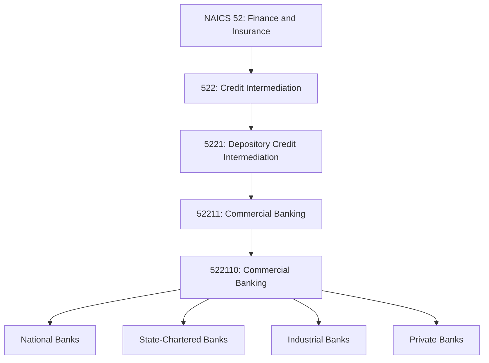
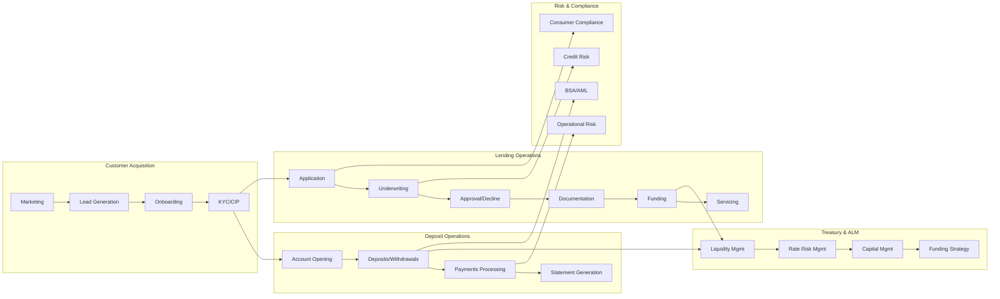
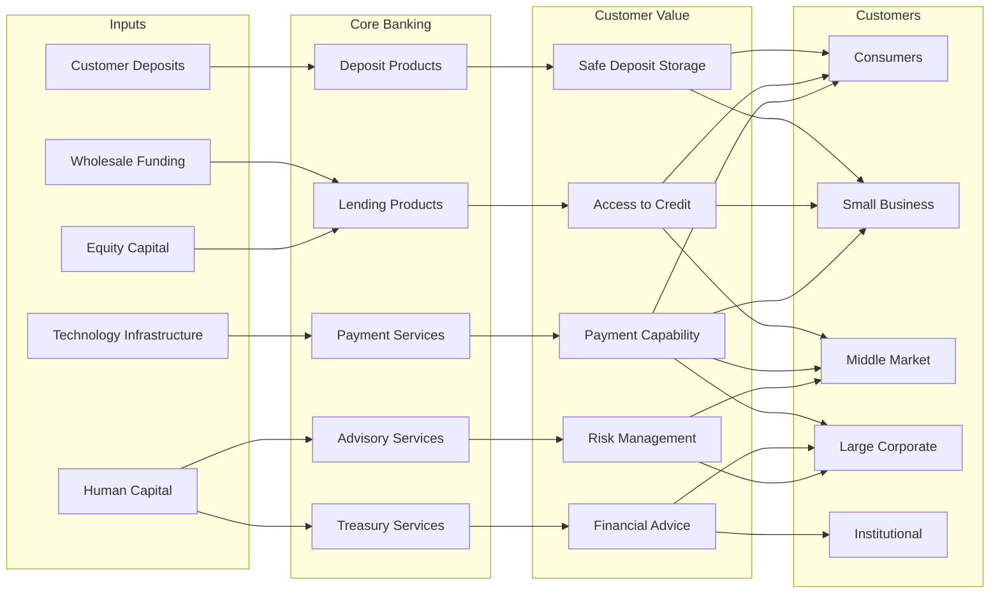

# Commercial Banking

> This industry comprises establishments primarily engaged in accepting demand and other deposits and making commercial, industrial, and consumer loans.

## Overview

Commercial banking is the foundation of the modern financial system. Commercial banks accept various types of deposits (checking, savings, money market, CDs) and use these funds to extend credit through consumer loans, commercial and industrial loans, and real estate lending. They serve as the primary financial intermediaries between depositors seeking safe, liquid places to store funds and borrowers needing credit for consumption and investment.

Commercial banks generate revenue primarily through:
- **Net Interest Income**: The spread between interest earned on loans and investments and interest paid on deposits
- **Fee Income**: Service charges, transaction fees, card interchange, wealth management fees
- **Trading Income**: Gains from securities and derivative transactions (larger banks)

## Industry Hierarchy

## Key Statistics

| Metric | Value |
|--------|-------|
| NAICS Code | 522110 |
| Level | National Industry |
| Parent Industry | [5221: Depository Credit Intermediation](./) |
| Establishments (US) | ~4,200 commercial banks |
| Total Assets (US) | ~$23 trillion |
| Employment (US) | ~1.8 million |

## Business Models

### Retail Banking

Consumer-focused banking serving individuals and households through branch networks, digital channels, and contact centers.

**Products:**
- Checking and savings accounts
- Certificates of deposit
- Residential mortgages
- Home equity loans/lines
- Personal loans
- Credit cards
- Auto loans

**Revenue Drivers:**
- Deposit spreads
- Mortgage origination fees
- Card interchange
- Overdraft/NSF fees
- Account maintenance fees

### Commercial Banking

Business-focused banking serving companies of various sizes with credit, treasury, and advisory services.

**Products:**
- Commercial loans and lines of credit
- Commercial real estate financing
- Equipment financing
- Treasury management
- Merchant services
- Trade finance
- Business credit cards

**Revenue Drivers:**
- Loan interest income
- Commitment and facility fees
- Treasury management fees
- Merchant processing fees
- Foreign exchange services

### Wealth Management

Serving high-net-worth individuals and families with investment, planning, and fiduciary services.

**Products:**
- Investment management
- Financial planning
- Trust and estate services
- Private banking
- Family office services
- Insurance products

**Revenue Drivers:**
- Assets under management fees
- Trust and custody fees
- Advisory fees
- Insurance commissions

## Related Occupations

- [Loan Officers](/occupations/LoanOfficers) - Evaluate loan applications across all segments
- [Bank Tellers](/occupations/BankTellers) - Process retail transactions at branches
- [Personal Bankers](/occupations/PersonalBankers) - Serve retail customers with accounts and loans
- [Commercial Lenders](/occupations/CommercialLenders) - Structure business loans
- [Credit Analysts](/occupations/CreditAnalysts) - Analyze borrower creditworthiness
- [Financial Managers](/occupations/FinancialManagers) - Oversee bank operations
- [Branch Managers](/occupations/BranchManagers) - Lead retail branch teams
- [Relationship Managers](/occupations/RelationshipManagers) - Manage commercial client relationships
- [Compliance Officers](/occupations/ComplianceOfficers) - Ensure regulatory compliance
- [Risk Managers](/occupations/RiskManagers) - Manage credit, market, and operational risk

## Core Business Processes

### Loan Origination

The end-to-end process of receiving, underwriting, and funding loan requests.

**Consumer Lending:**
- Receive application via branch, online, or phone
- Pull credit report and verify income/employment
- Apply automated underwriting rules
- Generate disclosures (TILA, RESPA)
- Close and fund loan

**Commercial Lending:**
- Receive loan request from relationship manager
- Spread financial statements and calculate ratios
- Analyze industry, management, and collateral
- Structure terms and pricing
- Present to credit committee for approval
- Document and fund the credit facility

### Credit Administration

Managing the ongoing risk and performance of the loan portfolio.

**Key Activities:**
- Monitor covenant compliance
- Track collateral values
- Manage loan modifications and renewals
- Rate risk classifications
- Maintain loan loss reserves
- Report to management and regulators

### Treasury Management

Managing the bank's own balance sheet for profitability and stability.

**Key Activities:**
- Project funding needs
- Manage liquidity positions
- Execute investment transactions
- Hedge interest rate risk
- Optimize capital allocation
- Conduct stress testing

## Regulatory Framework

### Prudential Supervision

| Regulator | Role |
|-----------|------|
| **OCC** | Primary regulator for national banks; charters, examines, and supervises |
| **Federal Reserve** | Regulates state member banks and all bank holding companies |
| **FDIC** | Insures deposits; regulates state non-member banks |
| **State Banking Depts** | Charter and supervise state-chartered banks alongside federal agencies |

### Capital Requirements (Basel III)

| Ratio | Minimum | Well-Capitalized |
|-------|---------|------------------|
| CET1 Capital | 4.5% | 6.5% |
| Tier 1 Capital | 6.0% | 8.0% |
| Total Capital | 8.0% | 10.0% |
| Leverage Ratio | 4.0% | 5.0% |

*Plus capital conservation buffer of 2.5% and G-SIB surcharge for largest banks*

### Key Regulations

| Regulation | Purpose |
|------------|---------|
| **Bank Secrecy Act** | Anti-money laundering compliance |
| **USA PATRIOT Act** | Customer identification and due diligence |
| **TILA/Reg Z** | Consumer credit disclosures |
| **RESPA/Reg X** | Mortgage settlement procedures |
| **ECOA/Reg B** | Fair lending and anti-discrimination |
| **CRA** | Community reinvestment obligations |
| **Volcker Rule** | Restrictions on proprietary trading |
| **Reg E** | Electronic fund transfer protections |

### Consumer Protection

- **CFPB**: Supervision and enforcement for consumer financial products
- **Fair Lending**: ECOA and Fair Housing Act compliance
- **UDAAP**: Prohibition on unfair, deceptive, or abusive acts
- **Privacy**: GLBA privacy notices and opt-out rights
- **Complaint Management**: Resolution procedures and regulatory reporting

## Technology & Innovation

### Digital Banking Platforms

Modern commercial banks invest heavily in digital capabilities:

- **Online Banking**: Comprehensive web platforms for retail and commercial
- **Mobile Apps**: Full-featured smartphone banking applications
- **Digital Account Opening**: Paperless new account origination
- **Mobile Deposit**: Check deposit via smartphone camera
- **Real-Time Payments**: Instant payment capabilities (RTP, FedNow)
- **Zelle/P2P**: Person-to-person payment integration

### Commercial Digital Services

- **Treasury Portals**: Online cash management and payment initiation
- **API Banking**: Programmatic access for ERP integration
- **Positive Pay**: Automated check fraud prevention
- **Lockbox Services**: Accelerated receivables processing
- **Commercial Card Programs**: Corporate cards with expense management

### AI and Machine Learning

- **Fraud Detection**: Real-time transaction monitoring
- **Credit Decisioning**: Automated underwriting models
- **Customer Service**: Chatbots and virtual assistants
- **Personalization**: Product recommendations and offers
- **Risk Assessment**: Early warning systems for credit deterioration

### Core Modernization

Banks are modernizing legacy infrastructure:

- **Cloud Migration**: Moving workloads to public/private cloud
- **API Enablement**: Creating composable banking services
- **Real-Time Processing**: Eliminating batch processing delays
- **Data Platforms**: Consolidated data lakes for analytics
- **Open Banking**: Third-party API access compliance

## Competitive Dynamics

### Market Segments

| Segment | Characteristics | Key Players |
|---------|-----------------|-------------|
| **Megabanks** | >$250B assets, national/global | JPMorgan, BofA, Wells, Citi |
| **Large Regionals** | $50-250B assets, multi-state | PNC, US Bank, Truist, TD |
| **Regionals** | $10-50B assets, regional focus | Fifth Third, Huntington, KeyBank |
| **Community** | <$10B assets, local markets | Thousands of local banks |
| **Digital** | Branchless, tech-focused | Ally, Discover, SoFi |

### Competitive Factors

- **Scale and Efficiency**: Operating leverage and technology investment capacity
- **Geographic Footprint**: Branch network reach vs. digital distribution
- **Product Breadth**: Full-service vs. specialized offerings
- **Customer Experience**: Digital capabilities and service quality
- **Price/Rate Competition**: Deposit rates and loan pricing
- **Relationship Depth**: Cross-sell and client retention

### Industry Trends

- **Consolidation**: Continued M&A among regional and community banks
- **Digital Competition**: Fintechs and neobanks capturing market share
- **Fee Pressure**: Overdraft and NSF fee reform
- **Rate Sensitivity**: Net interest margin compression/expansion
- **Embedded Finance**: Banking-as-a-service for non-bank brands
- **ESG Focus**: Climate risk and sustainable finance initiatives

## Industry Value Chain

## Related Industries

- [Credit Unions](./CreditUnions) - Member-owned deposit and lending cooperatives
- [Savings Institutions](./SavingsInstitutions) - Thrift institutions focused on mortgages
- [Investment Banking](../../Securities/Brokerage/InvestmentBanking) - Capital markets and advisory
- [Consumer Lending](../Nondepository/ConsumerLending) - Non-bank consumer finance
- [Financial Transaction Processing](../CreditRelatedActivities/FinancialTransactionProcessing) - Payment networks

---

*Source: NAICS 522110 - Commercial Banking*
