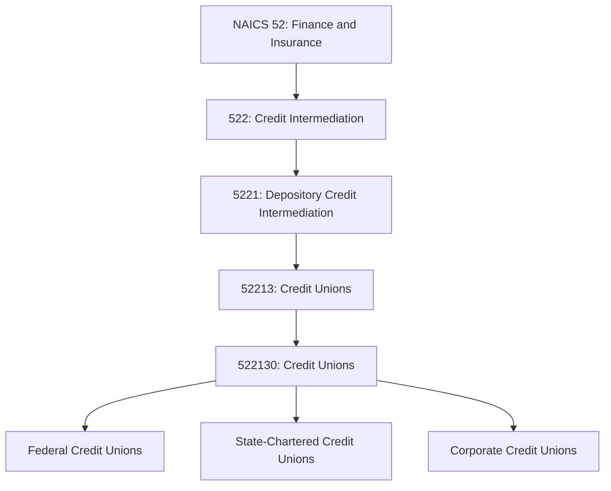
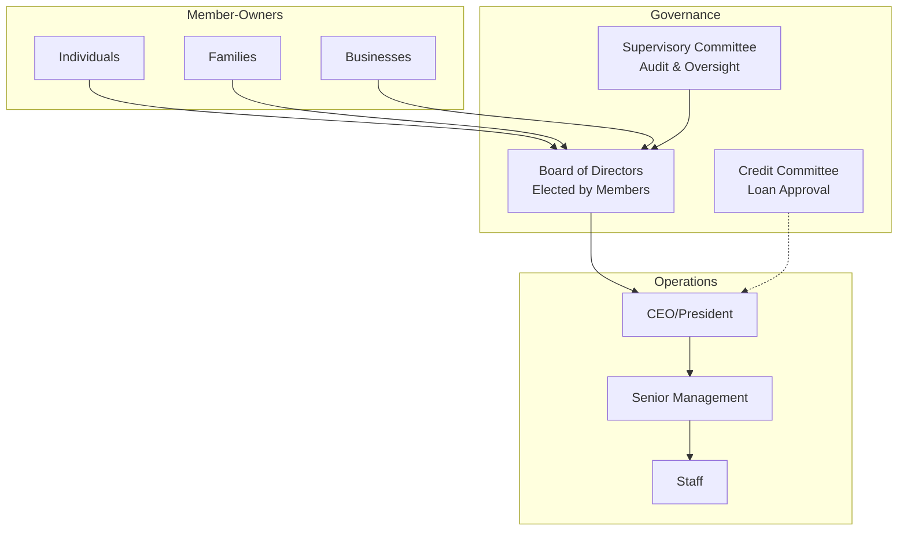
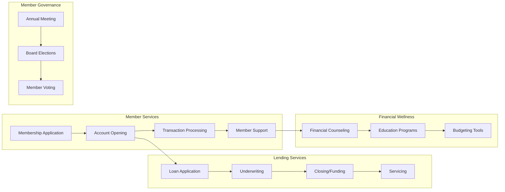
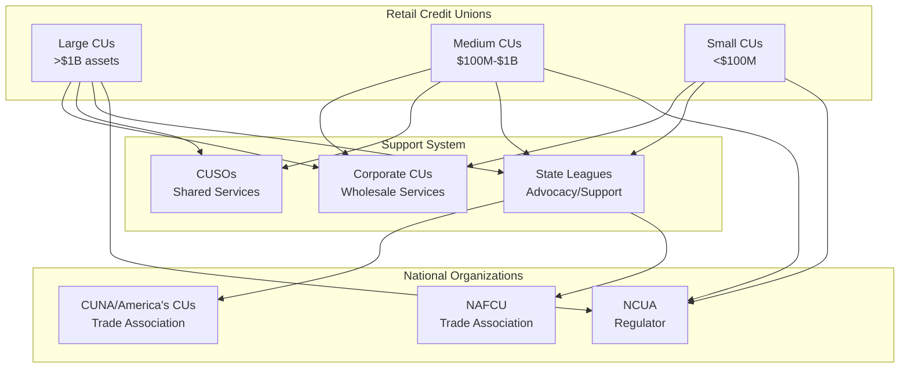

# Credit Unions

> This industry comprises establishments primarily engaged in accepting members' share deposits in cooperatives that are organized to offer consumer loans to their members.

## Overview

Credit unions are member-owned, not-for-profit financial cooperatives that provide banking services to their members. Unlike commercial banks owned by shareholders, credit unions are owned by their depositors (members), who each have equal voting rights regardless of the size of their deposits. This cooperative structure allows credit unions to return earnings to members through higher deposit rates, lower loan rates, and reduced fees.

Credit unions must have a "field of membership" that defines who can join. Common bonds include:
- **Occupational**: Employees of a particular company or industry
- **Associational**: Members of a particular organization or group
- **Community**: Residents of a defined geographic area

The credit union industry is characterized by a strong focus on member service, financial education, and community involvement.

## Industry Hierarchy

## Key Statistics

| Metric | Value |
|--------|-------|
| NAICS Code | 522130 |
| Level | National Industry |
| Parent Industry | [5221: Depository Credit Intermediation](./) |
| Credit Unions (US) | ~4,700 |
| Total Members (US) | ~140 million |
| Total Assets (US) | ~$2.2 trillion |
| Market Share (deposits) | ~7% of US deposits |

## Cooperative Structure

### Ownership Model

### Field of Membership Types

| Type | Description | Example |
|------|-------------|---------|
| **Single Occupational** | Employees of one employer | Boeing Employees CU |
| **Multiple Occupational** | Employees of multiple related employers | Educational CU |
| **Associational** | Members of associations/organizations | Veterans CU |
| **Community** | Residents of geographic area | Coastal Community CU |
| **Multiple Common Bond** | Combination of above | Navy Federal CU |

## Business Model

### Revenue Sources

Unlike for-profit banks, credit unions aim to provide maximum value to members:

| Source | Description |
|--------|-------------|
| **Net Interest Income** | Spread between loan rates and deposit rates |
| **Fee Income** | Service charges, card interchange, loan fees |
| **Investment Income** | Returns on investment portfolio |
| **Other Income** | Insurance commissions, auxiliary services |

### Earnings Distribution

Since credit unions are not-for-profit, earnings are returned to members through:
- Lower loan interest rates
- Higher deposit rates
- Lower fees
- Improved services
- Retained earnings for capital

## Related Occupations

- [Member Services Representatives](/occupations/Administrative/CustomerServiceRepresentatives) - Serve member needs at branches and contact centers
- [Loan Officers](/occupations/Business/LoanOfficers) - Evaluate and process member loan applications
- [Financial Counselors](/occupations/Business/CreditCounselors) - Provide financial education and guidance
- [Branch Managers](/occupations/BranchManagers) - Oversee branch operations and member relationships
- [Collections Specialists](/occupations/CollectionsSpecialists) - Work with delinquent accounts
- [Compliance Officers](/occupations/Business/Operations/ComplianceOfficers) - Ensure regulatory compliance

## Core Business Processes

### Member Onboarding

Enrolling new members and opening their share (deposit) accounts.

**Key Activities:**
- Verify eligibility within field of membership
- Complete membership application
- Conduct identity verification (CIP)
- Open share savings account (minimum deposit)
- Issue member number and access credentials
- Provide financial education resources

### Consumer Lending

Credit unions typically offer attractive rates on consumer loan products.

**Key Activities:**
- Receive loan application from member
- Pull credit report and verify information
- Apply credit union underwriting guidelines
- Consider member relationship and history
- Present to loan officer or credit committee
- Generate disclosures and close loan

### Financial Wellness Programs

Many credit unions emphasize financial education as part of their mission.

**Key Activities:**
- Offer free financial counseling sessions
- Provide budgeting and savings tools
- Host financial literacy workshops
- Partner with schools for youth programs
- Offer debt management assistance
- Provide first-time homebuyer education

## Products and Services

### Deposit Products

| Product | Description | Benefit |
|---------|-------------|---------|
| Share Savings | Basic savings account (ownership share) | Higher rates than banks |
| Share Drafts | Checking account equivalent | Lower/no fees |
| Money Market | Higher-yield savings with access | Competitive rates |
| Share Certificates | CD equivalent | Better rates |
| IRA Accounts | Retirement savings | Tax advantages |
| Youth Accounts | Accounts for minors | Financial education |

### Loan Products

| Product | Description | Advantage |
|---------|-------------|-----------|
| Auto Loans | New and used vehicle financing | Lower rates, flexible terms |
| Personal Loans | Unsecured consumer loans | Competitive rates |
| Credit Cards | Visa/Mastercard products | Lower rates, no annual fees |
| Mortgages | Home purchase and refinance | Competitive rates, local servicing |
| HELOCs | Home equity lines of credit | Lower rates |
| Signature Loans | Character-based unsecured loans | Relationship lending |

### Additional Services

- Online and mobile banking
- Bill pay and transfers
- Remote deposit capture
- ATM network access (CO-OP, Allpoint)
- Shared branching network
- Financial planning services
- Insurance products
- Investment services (through CUSOs)

## Regulatory Framework

### Dual Chartering System

| Charter Type | Primary Regulator | Insurance |
|--------------|-------------------|-----------|
| Federal Credit Union | NCUA | NCUSIF |
| State-Chartered (federally insured) | State + NCUA | NCUSIF |
| State-Chartered (privately insured) | State | Private insurance |

### NCUA Supervision

The National Credit Union Administration (NCUA) serves multiple roles:
- Charters and supervises federal credit unions
- Insures deposits at federally insured credit unions
- Examines credit unions for safety and soundness
- Administers the Central Liquidity Facility

### Key Regulations

| Regulation | Purpose |
|------------|---------|
| **Federal Credit Union Act** | Establishes credit union powers and structure |
| **NCUA Part 700+** | Operating rules for federal credit unions |
| **Field of Membership Rules** | Defines eligible membership |
| **Member Business Lending Cap** | Limits commercial lending to 12.25% of assets |
| **Interest Rate Ceiling** | 18% federal ceiling on loan rates |
| **Net Worth Requirements** | 7% for well-capitalized status |

### Tax Status

Credit unions are exempt from federal income tax under IRC Section 501(c)(1) because they are organized and operated for the mutual benefit of members, not for profit.

## Technology & Innovation

### Digital Services

Credit unions compete with banks through technology:

- **Digital Banking**: Online and mobile platforms
- **Mobile Deposit**: Check deposit via smartphone
- **P2P Payments**: Integration with payment networks
- **Digital Account Opening**: Remote membership enrollment
- **Video Banking**: Virtual teller services

### Shared Services

Credit unions leverage cooperative networks:

| Service | Description |
|---------|-------------|
| **Shared Branching** | Access at 5,000+ locations nationwide |
| **CO-OP ATM Network** | 30,000+ surcharge-free ATMs |
| **CUSO Partnerships** | Shared technology and services |
| **League Resources** | State league support services |

### Fintech Partnerships

- Core system providers (Fiserv, Jack Henry, Symitar)
- Digital platform vendors (Q2, Alkami)
- Payment processors (PSCU, CO-OP)
- Lending platforms (CU Direct, Origence)
- Financial wellness apps (Greenlight, SaverLife)

## Industry Structure

### Credit Union System

### Largest Credit Unions (by assets)

| Credit Union | Assets | Members | Field of Membership |
|--------------|--------|---------|---------------------|
| Navy Federal | $165B+ | 13M+ | Military and DOD |
| State Employees' CU | $50B+ | 2.7M+ | NC state employees |
| Pentagon Federal | $35B+ | 2.9M+ | Military and defense |
| Boeing Employees CU | $30B+ | 1.4M+ | WA state community |
| SchoolsFirst FCU | $28B+ | 1.2M+ | CA educators |

## Competitive Position

### Advantages

- **Lower Rates on Loans**: Not-for-profit returns value to members
- **Higher Rates on Deposits**: Less profit extraction
- **Lower Fees**: Mission-driven fee structures
- **Personal Service**: Member relationship focus
- **Financial Education**: Commitment to member wellness
- **Tax Exemption**: Operating cost advantage

### Challenges

- **Scale Limitations**: Smaller technology budgets
- **Field of Membership**: Growth restrictions
- **Business Lending Cap**: Limited commercial lending
- **Capital Constraints**: Cannot issue stock
- **Talent Competition**: Salary limitations

## Related Industries

- [Commercial Banking](./CommercialBanking) - Competing depository institutions
- [Savings Institutions](./SavingsInstitutions) - Similar community focus
- [Consumer Lending](../Nondepository/ConsumerLending) - Alternative consumer credit
- [Financial Transaction Processing](../CreditRelatedActivities/FinancialTransactionProcessing) - Payment networks

---

*Source: NAICS 522130 - Credit Unions*
