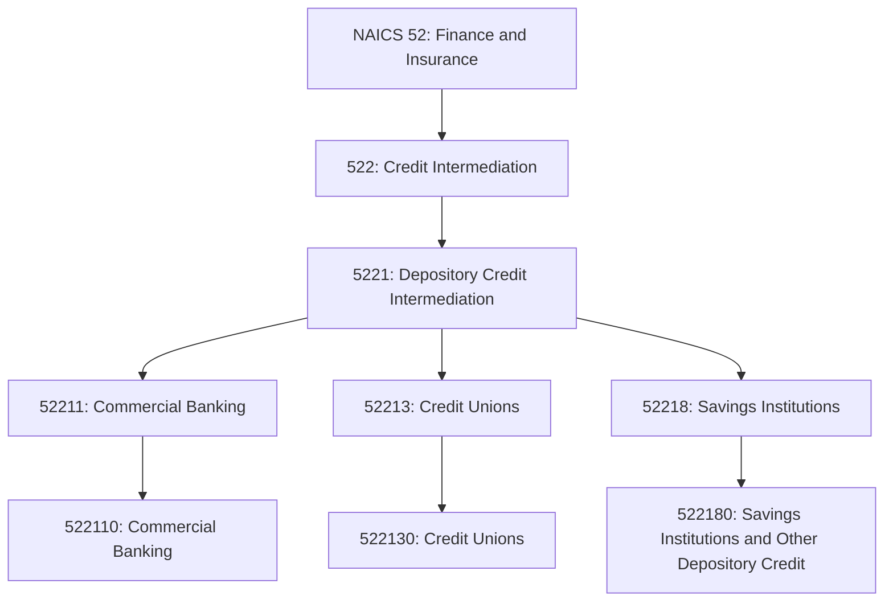
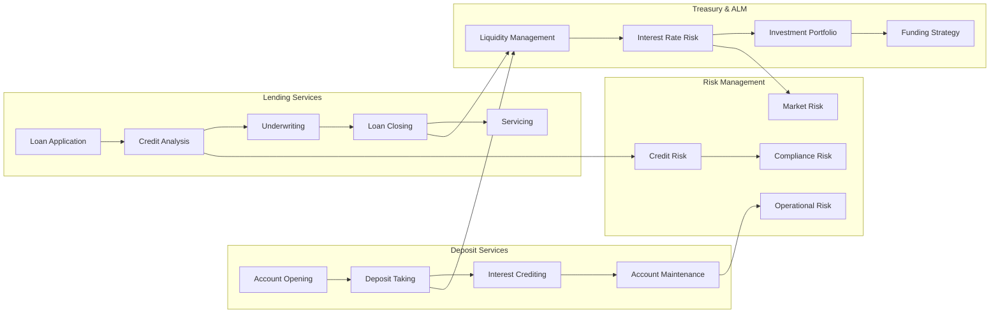
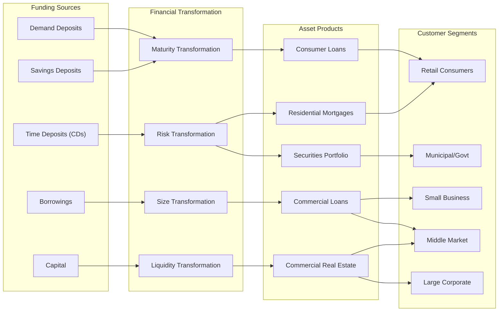

# Depository Credit Intermediation

> This industry group comprises establishments primarily engaged in accepting deposits (or share deposits) and in lending funds from these deposits.

## Overview

Depository credit intermediation represents the traditional banking model where institutions accept deposits from customers and use those funds to make loans. This industry group includes:

- **Commercial Banks**: Full-service banks offering checking, savings, and a wide range of lending products
- **Credit Unions**: Member-owned cooperatives providing deposit and lending services
- **Savings Institutions**: Thrifts and savings banks historically focused on mortgage lending

Within this group, industries are defined on the basis of differences in the types of deposit liabilities assumed and in the nature of the credit extended. The key distinguishing characteristic is that these institutions fund their lending activities primarily through customer deposits rather than capital market borrowing.

## Industry Hierarchy

## Key Statistics

| Metric | Value |
|--------|-------|
| NAICS Code | 5221 |
| Level | Industry Group |
| Parent Subsector | [522: Credit Intermediation](../) |
| Industries | 3 |
| National Industries | 3 |

## Sub-Industries

| Industry | Code | Description |
|----------|------|-------------|
| [Commercial Banking](./CommercialBanking) | 522110 | Full-service banks accepting deposits and making commercial, consumer, and real estate loans |
| [Credit Unions](./CreditUnions) | 522130 | Member-owned cooperatives accepting share deposits and making member loans |
| [Savings Institutions](./SavingsInstitutions) | 522180 | Savings banks and S&Ls primarily engaged in mortgage lending |

## Related Occupations

- [Loan Officers](/occupations/Business/LoanOfficers) - Evaluate, authorize, and recommend loan approval
- [Bank Tellers](/occupations/BankTellers) - Process customer transactions at bank branches
- [Financial Managers](/occupations/Management/FinancialManagers) - Oversee bank operations and portfolios
- [Credit Analysts](/occupations/Business/Financial/CreditAnalysts) - Assess borrower creditworthiness
- [Branch Managers](/occupations/BranchManagers) - Manage retail banking locations
- [Customer Service Representatives](/occupations/Administrative/CustomerServiceRepresentatives) - Handle customer inquiries and transactions
- [Compliance Officers](/occupations/Business/Operations/ComplianceOfficers) - Ensure regulatory compliance

## Core Business Processes

### Deposit Taking

Accepting customer deposits and managing deposit accounts to fund lending activities.

**Key Activities:**
- Open checking, savings, and money market accounts
- Process deposits, withdrawals, and transfers
- Credit interest on deposit balances
- Issue certificates of deposit (CDs)
- Provide online and mobile banking access
- Manage ATM networks and card services
- Ensure deposit insurance compliance

### Loan Underwriting

Evaluating loan applications and making credit decisions based on borrower risk profiles.

**Key Activities:**
- Collect and verify borrower information
- Analyze credit reports and scores
- Evaluate collateral and loan-to-value ratios
- Calculate debt-to-income ratios
- Apply underwriting guidelines and policies
- Structure loan terms and pricing
- Generate loan documents and disclosures

### Asset-Liability Management

Managing the balance between assets (loans) and liabilities (deposits) to maintain profitability and stability.

**Key Activities:**
- Monitor interest rate risk exposure
- Manage duration gap between assets and liabilities
- Maintain adequate liquidity reserves
- Optimize funding mix and cost of funds
- Execute hedging strategies
- Project net interest margin
- Conduct stress testing scenarios

## Industry Value Chain

## Deposit Products

| Product | Description | Characteristics |
|---------|-------------|-----------------|
| Checking/DDA | Transaction accounts with check-writing | Low/no interest, high liquidity |
| Savings | Basic savings accounts | Low interest, withdrawal limits |
| Money Market | Higher-yield savings with check access | Tiered rates, minimum balances |
| CDs | Fixed-term time deposits | Higher rates, early withdrawal penalties |
| IRA/Retirement | Tax-advantaged retirement savings | Various terms, tax benefits |
| Business Checking | Commercial transaction accounts | Analysis fees, cash management |
| Escrow | Custodial accounts for third parties | Real estate, legal purposes |

## Loan Products

| Product | Description | Typical Use |
|---------|-------------|-------------|
| Personal Loans | Unsecured consumer credit | Debt consolidation, major purchases |
| Auto Loans | Vehicle-secured financing | New and used vehicle purchases |
| Credit Cards | Revolving credit lines | Everyday purchases, rewards |
| Home Equity | Second mortgages and HELOCs | Home improvement, debt consolidation |
| Mortgages | Residential real estate loans | Home purchase, refinancing |
| Small Business | SBA and conventional business loans | Working capital, equipment |
| Commercial | Middle market business lending | Expansion, acquisitions |
| CRE | Commercial real estate financing | Property acquisition, construction |

## Regulatory Environment

### Primary Regulators

| Regulator | Institution Type | Functions |
|-----------|-----------------|-----------|
| **OCC** | National banks, federal S&Ls | Chartering, supervision, examination |
| **Federal Reserve** | State member banks, BHCs | Monetary policy, supervision |
| **FDIC** | Insured depositories | Deposit insurance, examination |
| **NCUA** | Credit unions | Chartering, insurance, supervision |
| **State Regulators** | State-chartered banks | Licensing, examination |

### Key Regulations

- **Bank Secrecy Act/AML**: Anti-money laundering compliance
- **Community Reinvestment Act**: Serving community credit needs
- **Regulation E**: Electronic fund transfers
- **Regulation DD**: Truth in Savings disclosures
- **Regulation CC**: Funds availability
- **Basel III**: Capital and liquidity requirements
- **Dodd-Frank**: Systemic risk and consumer protection

### Deposit Insurance

| Program | Administrator | Coverage |
|---------|--------------|----------|
| FDIC Insurance | FDIC | $250,000 per depositor, per institution |
| NCUA Share Insurance | NCUA | $250,000 per member, per credit union |

## Technology & Innovation

### Digital Banking

- **Online Banking**: Web-based account access and transactions
- **Mobile Banking**: Smartphone apps for banking services
- **Digital Account Opening**: Remote new account origination
- **P2P Payments**: Person-to-person money transfers (Zelle, etc.)
- **Digital Wallets**: Integration with Apple Pay, Google Pay

### Branch Transformation

- **Universal Bankers**: Cross-trained staff handling all services
- **ITMs/Video Tellers**: Interactive teller machines
- **Appointment Banking**: Scheduled consultations
- **Smaller Footprints**: Efficient, technology-enabled branches
- **Banking Cafes**: Retail-style community spaces

### Core Banking Systems

- **Cloud-Native Cores**: Modern, API-enabled core systems
- **Open Banking**: Third-party access via APIs
- **Real-Time Processing**: Instant transaction posting
- **AI/ML Applications**: Fraud detection, credit decisioning
- **Data Analytics**: Customer insights and personalization

### Embedded Finance

- **Banking-as-a-Service**: API infrastructure for non-banks
- **Embedded Lending**: Credit at point of sale
- **Embedded Payments**: Integrated payment processing
- **White-Label Products**: Partner-branded banking products

## Competitive Landscape

### Market Structure

| Category | Examples | Market Position |
|----------|----------|-----------------|
| Megabanks | JPMorgan, Bank of America, Wells Fargo, Citi | National footprint, full service |
| Super-Regionals | PNC, US Bank, Truist | Multi-state operations |
| Regional Banks | Fifth Third, Huntington, KeyBank | State/regional focus |
| Community Banks | Local independents | Relationship-focused, local |
| Credit Unions | Navy Federal, BECU, local CUs | Member-owned, tax-exempt |
| Digital Banks | Chime, Ally, SoFi | Mobile-first, no branches |

## Related Industries

- [Commercial Banking](./CommercialBanking) - Full-service commercial banks
- [Credit Unions](./CreditUnions) - Member-owned cooperatives
- [Savings Institutions](./SavingsInstitutions) - Thrifts and savings banks
- [Nondepository Credit](../Nondepository/) - Non-bank lenders
- [Financial Transaction Processing](../CreditRelatedActivities/FinancialTransactionProcessing) - Payment processors

---

*Source: NAICS 5221 - Depository Credit Intermediation*
