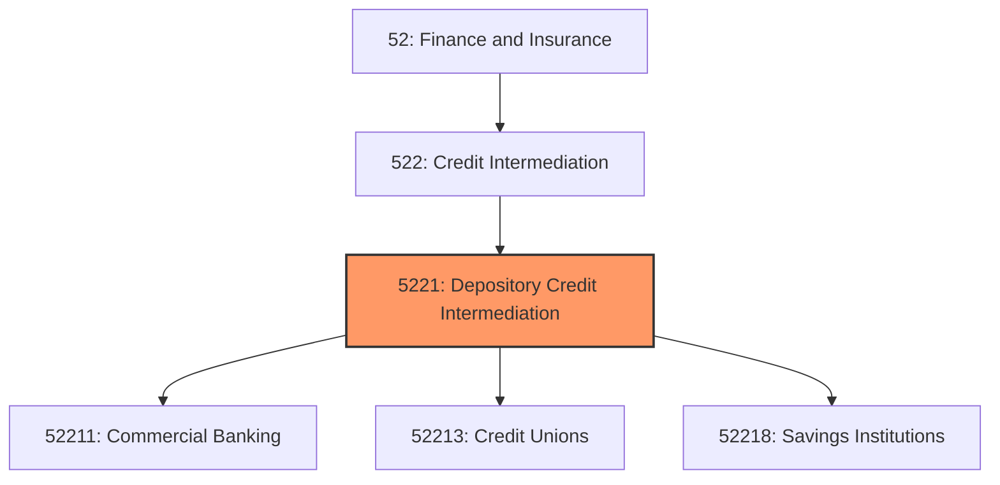
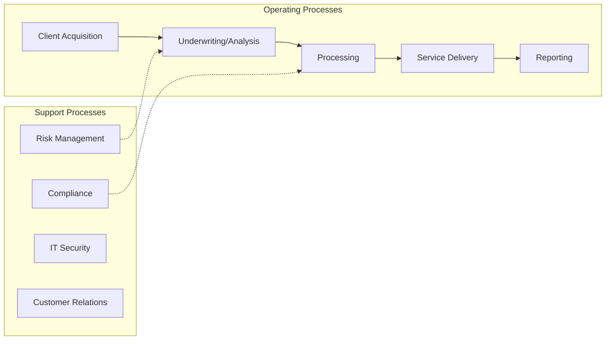

# Depository Credit Intermediation

> This industry group comprises establishments primarily engaged in accepting deposits (or share deposits) and in lending funds from these deposits.

## Overview

Depository Credit Intermediation represents an important category within the Finance and Insurance sector (NAICS 52). This industry group encompasses establishments primarily engaged in depository credit intermediation.

This industry group comprises establishments primarily engaged in accepting deposits (or share deposits) and in lending funds from these deposits. Within this group, industries are defined on the basis of differences in the types of deposit liabilities assumed and in the nature of the credit extended.

## Industry Hierarchy

## Key Statistics

| Metric | Value |
|--------|-------|
| NAICS Code | 5221 |
| Level | Industry Group |
| Parent | [Credit Intermediation](../) |
| Child Industries | 3 |

## Sub-Industries

| Industry | Code | Description |
|----------|------|-------------|
| [Commercial Banking](./CommercialBanking/) | 52211 | See industry description for 522110 |
| [Credit Unions](./CreditUnions/) | 52213 | See industry description for 522130 |
| [Savings Institutions](./SavingsInstitutions/) | 52218 | See industry description for 522180 |

## Core Business Processes

## Industry Value Chain

```mermaid
graph LR
    subgraph Inputs["Inputs"]
        I1["Capital"]
        I2["Data"]
        I3["Expertise"]
        I4["Technology"]
    end

    subgraph Primary["Primary Activities"]
        A1["Inbound Logistics"]
        A2["Core Operations"]
        A3["Quality Assurance"]
        A4["Outbound/Delivery"]
    end

    subgraph Outputs["Products/Services"]
        O1["Financial Products"]
        O2["Risk Coverage"]
        O3["Advisory"]
    end

    subgraph Customers["Markets"]
        C1["Individuals"]
        C2["Businesses"]
        C3["Institutions"]
        C4["Government"]
    end

    Inputs --> Primary --> Outputs --> Customers
```

---

*Source: NAICS 5221 - Depository Credit Intermediation*
