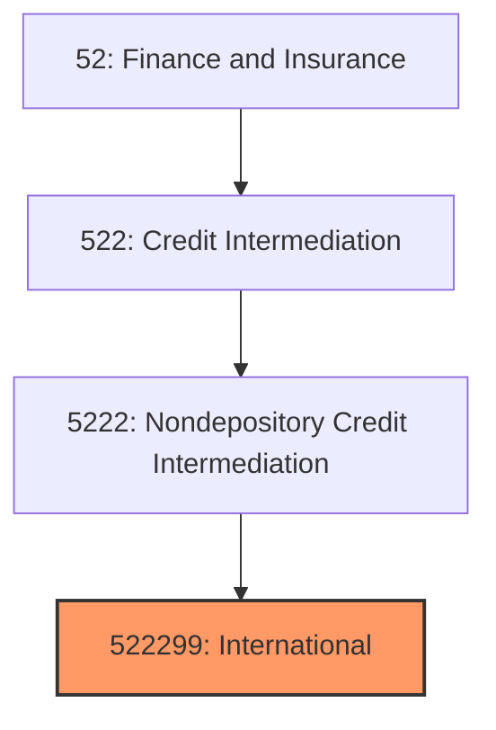
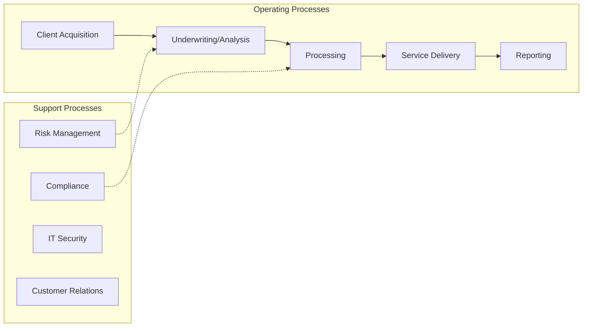

# International

> This U.

## Overview

International represents a specialized segment within the Finance and Insurance sector (NAICS 52).

This U.S. industry comprises (1) establishments primarily engaged in providing working capital funds to U.S. exporters, lending funds to foreign buyers of U.S. goods, and/or lending funds to domestic buyers of imported goods; (2) establishments primarily engaged in buying, pooling, and repackaging loans for sale to others on the secondary market; and (3) establishments primarily providing other nondepository credit (except credit card issuing, sales financing, consumer lending, and real estate credit). Examples of types of lending in this industry are short-term inventory credit, agricultural lending (except real estate and sales financing), and consumer cash lending secured by personal property. Illustrative Examples: Commodity Credit Corporation Factoring accounts receivable Industrial banks (i.e., known as), nondepository International trade financing Morris Plans (i.e., known as), nondepository Pawnshops Secondary market financing Cross-References.

## Industry Hierarchy

## Key Statistics

| Metric | Value |
|--------|-------|
| NAICS Code | 522299 |
| Level | National Industry |
| Child Industries | 0 |

## Related Occupations

See the [occupations directory](/occupations) for roles commonly found in this industry.

## Core Business Processes

## Industry Value Chain

```mermaid
graph LR
    subgraph Inputs["Inputs"]
        I1["Capital"]
        I2["Data"]
        I3["Expertise"]
        I4["Technology"]
    end

    subgraph Primary["Primary Activities"]
        A1["Inbound Logistics"]
        A2["Core Operations"]
        A3["Quality Assurance"]
        A4["Outbound/Delivery"]
    end

    subgraph Outputs["Products/Services"]
        O1["Financial Products"]
        O2["Risk Coverage"]
        O3["Advisory"]
    end

    subgraph Customers["Markets"]
        C1["Individuals"]
        C2["Businesses"]
        C3["Institutions"]
        C4["Government"]
    end

    Inputs --> Primary --> Outputs --> Customers
```

---

*Source: NAICS 522299 - International*
