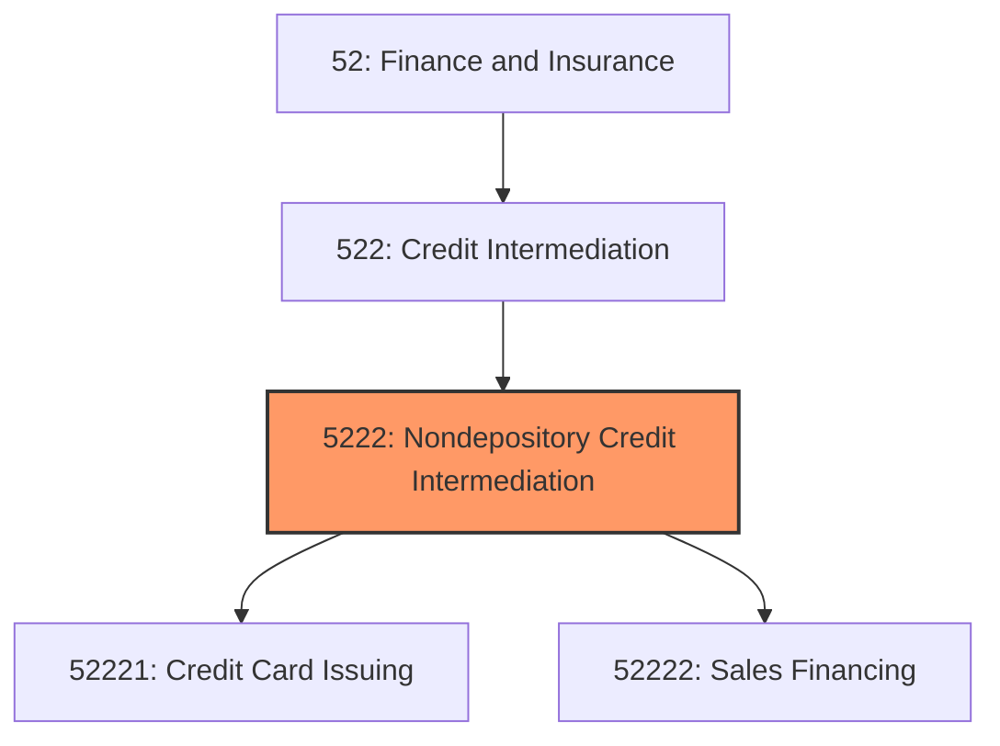
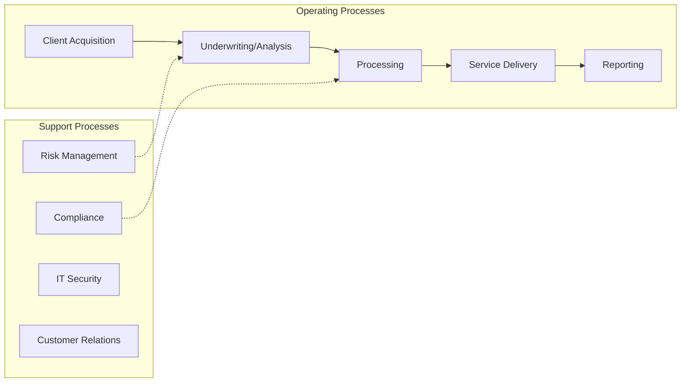

# Nondepository Credit Intermediation

> This industry group comprises establishments, both public (government-sponsored enterprises) and private, primarily engaged in extending credit or lending funds raised by credit market borrowing, such as issuing commercial paper or other debt instruments or by borrowing from other financial intermediaries.

## Overview

Nondepository Credit Intermediation represents an important category within the Finance and Insurance sector (NAICS 52). This industry group encompasses establishments primarily engaged in nondepository credit intermediation.

This industry group comprises establishments, both public (government-sponsored enterprises) and private, primarily engaged in extending credit or lending funds raised by credit market borrowing, such as issuing commercial paper or other debt instruments or by borrowing from other financial intermediaries. Within this group, industries are defined on the basis of the type of credit being extended.

## Industry Hierarchy

## Key Statistics

| Metric | Value |
|--------|-------|
| NAICS Code | 5222 |
| Level | Industry Group |
| Parent | [Credit Intermediation](../) |
| Child Industries | 2 |

## Sub-Industries

| Industry | Code | Description |
|----------|------|-------------|
| [Credit Card Issuing](./CreditCardIssuing/) | 52221 | See industry description for 522210 |
| [Sales Financing](./SalesFinancing/) | 52222 | See industry description for 522220 |

## Core Business Processes

## Industry Value Chain

```mermaid
graph LR
    subgraph Inputs["Inputs"]
        I1["Capital"]
        I2["Data"]
        I3["Expertise"]
        I4["Technology"]
    end

    subgraph Primary["Primary Activities"]
        A1["Inbound Logistics"]
        A2["Core Operations"]
        A3["Quality Assurance"]
        A4["Outbound/Delivery"]
    end

    subgraph Outputs["Products/Services"]
        O1["Financial Products"]
        O2["Risk Coverage"]
        O3["Advisory"]
    end

    subgraph Customers["Markets"]
        C1["Individuals"]
        C2["Businesses"]
        C3["Institutions"]
        C4["Government"]
    end

    Inputs --> Primary --> Outputs --> Customers
```

---

*Source: NAICS 5222 - Nondepository Credit Intermediation*
