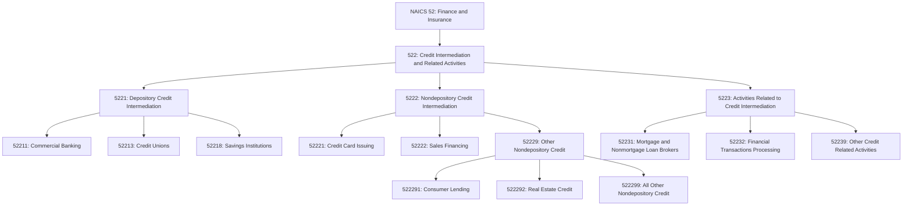
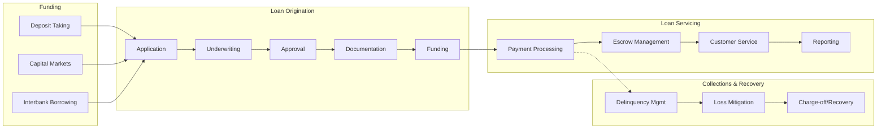
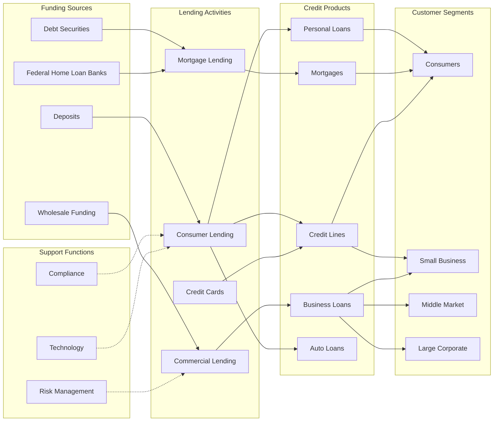

# Credit Intermediation and Related Activities

> Industries in the Credit Intermediation and Related Activities subsector group establishments that lend funds raised from depositors, lend funds raised from credit market borrowing, or facilitate the lending of funds or issuance of credit.

## Overview

This subsector encompasses the core lending activities of the financial system, including:

1. **Depository Credit Intermediation**: Accepting deposits and lending those funds (banks, credit unions, savings institutions)
2. **Nondepository Credit Intermediation**: Lending funds raised through credit market borrowing rather than deposits (credit card issuers, mortgage companies, finance companies)
3. **Activities Related to Credit Intermediation**: Facilitating credit without being a principal lender (mortgage brokers, loan brokers, check cashing, transaction processing)

Credit intermediation is fundamental to economic activity, channeling funds from savers to borrowers while transforming risk, maturity, and scale characteristics of financial assets.

## Industry Hierarchy

## Key Statistics

| Metric | Value |
|--------|-------|
| NAICS Code | 522 |
| Level | Subsector |
| Parent Sector | [52: Finance and Insurance](../) |
| Industry Groups | 3 |
| Industries | 12 |
| National Industries | 14 |

## Sub-Industries

| Industry Group | Code | Description |
|----------------|------|-------------|
| [Depository Credit Intermediation](./Depository/) | 5221 | Banks, credit unions, and thrifts that accept deposits and make loans |
| [Nondepository Credit Intermediation](./Nondepository/) | 5222 | Credit card issuers, sales financing, consumer lending, and mortgage companies |
| [Activities Related to Credit Intermediation](./CreditRelatedActivities/) | 5223 | Loan brokers, transaction processors, and check cashing services |

## Related Occupations

- [Loan Officers](/occupations/LoanOfficers) - Evaluate and authorize loan applications
- [Loan Interviewers and Clerks](/occupations/LoanInterviewersAndClerks) - Interview applicants and process loan documents
- [Credit Analysts](/occupations/CreditAnalysts) - Assess creditworthiness of borrowers
- [Credit Counselors](/occupations/CreditCounselors) - Advise individuals on credit and debt management
- [Financial Managers](/occupations/FinancialManagers) - Oversee lending operations and portfolio management
- [Bank Tellers](/occupations/BankTellers) - Process customer transactions
- [Customer Service Representatives](/occupations/CustomerServiceRepresentatives) - Handle account inquiries and service requests
- [Compliance Officers](/occupations/ComplianceOfficers) - Ensure regulatory compliance

## Core Business Processes

### Loan Origination

Evaluating borrower creditworthiness and structuring loan terms for approval.

**Key Activities:**
- Receive and process loan applications
- Verify income, employment, and assets
- Pull and analyze credit reports
- Assess collateral value (for secured loans)
- Calculate debt-to-income ratios
- Apply underwriting guidelines
- Generate loan documents and disclosures

### Loan Servicing

Managing the ongoing administration of loan portfolios after origination.

**Key Activities:**
- Process monthly payments
- Manage escrow accounts for taxes and insurance
- Handle customer inquiries and requests
- Generate statements and tax documents
- Monitor payment performance
- Manage insurance tracking and force-placed coverage
- Process payoffs and releases

### Credit Risk Management

Assessing and managing exposure to borrower default risk.

**Key Activities:**
- Develop credit policies and underwriting guidelines
- Monitor portfolio performance and delinquency trends
- Maintain loan loss reserves
- Execute loan modifications and workouts
- Manage charge-off and recovery processes
- Report credit performance to bureaus

## Industry Value Chain

## Credit Products

### Consumer Credit

| Product | Description | Typical Terms |
|---------|-------------|---------------|
| Personal Loans | Unsecured installment loans | 12-84 months, fixed rate |
| Credit Cards | Revolving credit lines | Variable APR, minimum payments |
| Auto Loans | Vehicle-secured installment loans | 36-84 months, fixed rate |
| Student Loans | Education financing | Deferred payment, 10-25 years |
| HELOC | Home equity revolving credit | 10-year draw, 20-year repay |

### Mortgage Credit

| Product | Description | Typical Terms |
|---------|-------------|---------------|
| Conventional | Conforming loans sold to GSEs | 15-30 years, fixed or ARM |
| FHA | Government-insured loans | Low down payment, 30 years |
| VA | Veteran-eligible loans | No down payment, 30 years |
| Jumbo | Non-conforming large loans | 15-30 years, various structures |
| Construction | Building financing | Interest-only, converts to permanent |

### Commercial Credit

| Product | Description | Typical Terms |
|---------|-------------|---------------|
| Term Loans | Fixed-term business financing | 1-10 years, amortizing |
| Lines of Credit | Revolving working capital | Annual renewal, variable rate |
| Commercial Mortgages | Property-secured business loans | 5-25 years, various structures |
| Equipment Financing | Asset-secured equipment loans | Matches asset useful life |
| SBA Loans | Government-guaranteed small business loans | 7(a), 504, Express programs |

## Regulatory Environment

### Prudential Regulators

| Regulator | Jurisdiction |
|-----------|--------------|
| **OCC** | National banks and federal savings associations |
| **Federal Reserve** | State member banks, bank holding companies |
| **FDIC** | State non-member banks, deposit insurance |
| **NCUA** | Federal credit unions, share insurance |
| **State Banking Depts** | State-chartered institutions |

### Consumer Protection

- **CFPB**: Consumer financial protection rules and enforcement
- **Truth in Lending Act (TILA)**: Disclosure requirements for credit terms
- **Equal Credit Opportunity Act (ECOA)**: Anti-discrimination in lending
- **Fair Credit Reporting Act (FCRA)**: Credit bureau accuracy and consumer rights
- **Fair Debt Collection Practices Act (FDCPA)**: Collection practices regulation
- **Real Estate Settlement Procedures Act (RESPA)**: Mortgage disclosure and practices
- **Home Mortgage Disclosure Act (HMDA)**: Mortgage data reporting

### Capital and Liquidity

- **Basel III**: Risk-based capital and liquidity standards
- **Leverage Ratio**: Minimum capital to total assets
- **Liquidity Coverage Ratio**: Short-term liquidity requirements
- **Net Stable Funding Ratio**: Long-term funding stability
- **Stress Testing**: CCAR/DFAST for large institutions

## Technology & Innovation

### Digital Lending

- **Online Applications**: Streamlined digital application processes
- **Automated Underwriting**: AI/ML-powered credit decisioning
- **E-closing**: Digital mortgage closing and notarization
- **Mobile Servicing**: Self-service payment and account management apps
- **Digital Wallets**: Integration with payment platforms

### Alternative Data

- **Cash Flow Underwriting**: Using bank transaction data for credit decisions
- **Rental Payment History**: Incorporating rent payments in credit assessment
- **Utility Payments**: Using utility payment patterns
- **Social/Behavioral Data**: Alternative indicators of creditworthiness

### Fintech Disruption

- **Marketplace Lending**: Peer-to-peer and platform-based lending
- **Buy Now Pay Later**: Point-of-sale financing alternatives
- **Earned Wage Access**: Early access to earned wages
- **Neobanks**: Digital-only banking with integrated lending
- **Banking-as-a-Service**: API-enabled lending infrastructure

### Process Automation

- **RPA**: Robotic process automation for document processing
- **OCR/ICR**: Automated document extraction
- **Blockchain**: Smart contracts for loan administration
- **Cloud Computing**: Scalable infrastructure for lending systems

## Related Industries

- [Commercial Banking](./Depository/CommercialBanking) - Full-service deposit and lending
- [Credit Unions](./Depository/CreditUnions) - Member-owned credit cooperatives
- [Consumer Lending](./Nondepository/ConsumerLending) - Personal finance companies
- [Real Estate Credit](./Nondepository/RealEstateCredit) - Mortgage banking
- [Financial Transaction Processing](./CreditRelatedActivities/FinancialTransactionProcessing) - Payment processing

---

*Source: NAICS 522 - Credit Intermediation and Related Activities*
