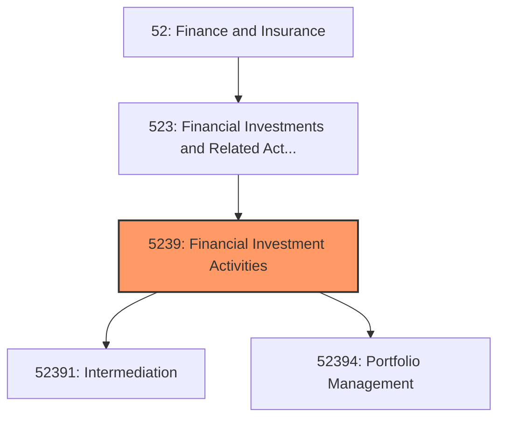
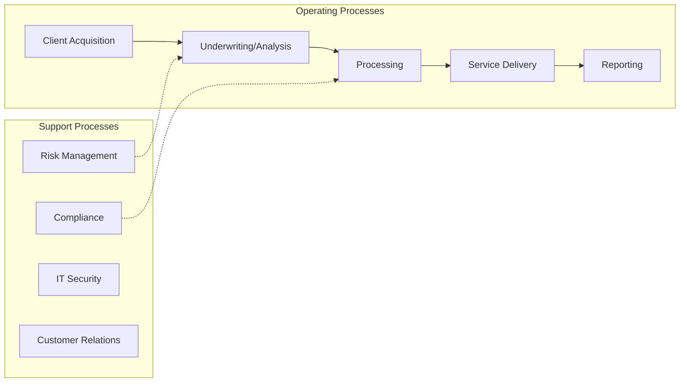

# Financial Investment Activities

> This industry group comprises establishments primarily engaged in one of the following: (1) acting as principals in buying or selling financial contracts (except investment bankers, securities dealers, and commodity contracts dealers); (2) acting as agents (i.

## Overview

Financial Investment Activities represents an important category within the Finance and Insurance sector (NAICS 52). This industry group encompasses establishments primarily engaged in financial investment activities.

This industry group comprises establishments primarily engaged in one of the following: (1) acting as principals in buying or selling financial contracts (except investment bankers, securities dealers, and commodity contracts dealers); (2) acting as agents (i.e., brokers) (except securities brokerages and commodity contracts brokerages) in buying or selling financial contracts; or (3) providing other investment services (except securities and commodity exchanges), such as portfolio management; investment advice; and trust, fiduciary, and custody services.

## Industry Hierarchy

## Key Statistics

| Metric | Value |
|--------|-------|
| NAICS Code | 5239 |
| Level | Industry Group |
| Parent | [Financial Investments and Related Activities](../) |
| Child Industries | 2 |

## Sub-Industries

| Industry | Code | Description |
|----------|------|-------------|
| [Intermediation](./Intermediation/) | 52391 | See industry description for 523910 |
| [Portfolio Management](./PortfolioManagement/) | 52394 | See industry description for 523940 |

## Core Business Processes

## Industry Value Chain

```mermaid
graph LR
    subgraph Inputs["Inputs"]
        I1["Capital"]
        I2["Data"]
        I3["Expertise"]
        I4["Technology"]
    end

    subgraph Primary["Primary Activities"]
        A1["Inbound Logistics"]
        A2["Core Operations"]
        A3["Quality Assurance"]
        A4["Outbound/Delivery"]
    end

    subgraph Outputs["Products/Services"]
        O1["Financial Products"]
        O2["Risk Coverage"]
        O3["Advisory"]
    end

    subgraph Customers["Markets"]
        C1["Individuals"]
        C2["Businesses"]
        C3["Institutions"]
        C4["Government"]
    end

    Inputs --> Primary --> Outputs --> Customers
```

---

*Source: NAICS 5239 - Financial Investment Activities*
