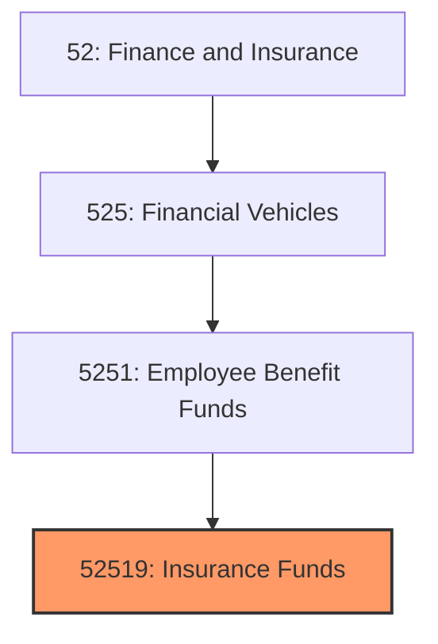
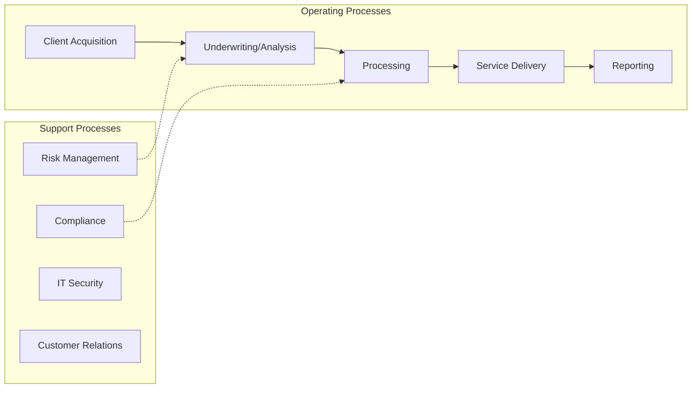

# Insurance Funds

> See industry description for 525190.

## Overview

Insurance Funds represents an important category within the Finance and Insurance sector (NAICS 52). This industry encompasses establishments primarily engaged in insurance funds.

## Industry Hierarchy

## Key Statistics

| Metric | Value |
|--------|-------|
| NAICS Code | 52519 |
| Level | Industry |
| Parent | [Employee Benefit Funds](../) |
| Child Industries | 0 |

## Core Business Processes

## Industry Value Chain

---

*Source: NAICS 52519 - Insurance Funds*
