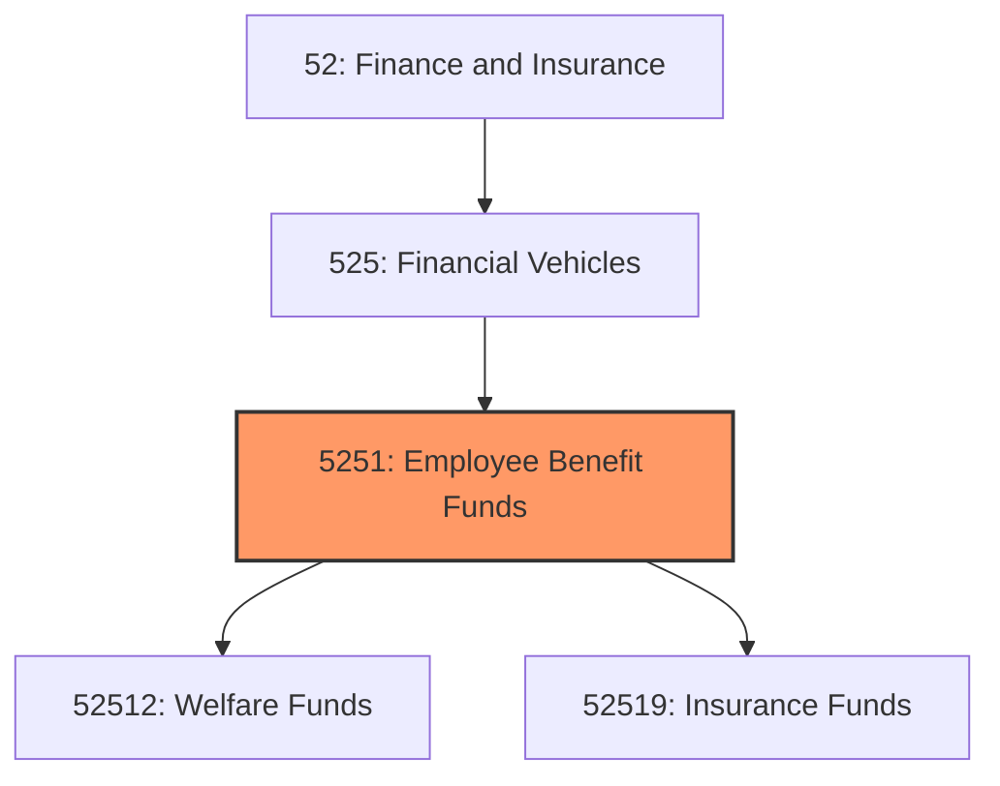
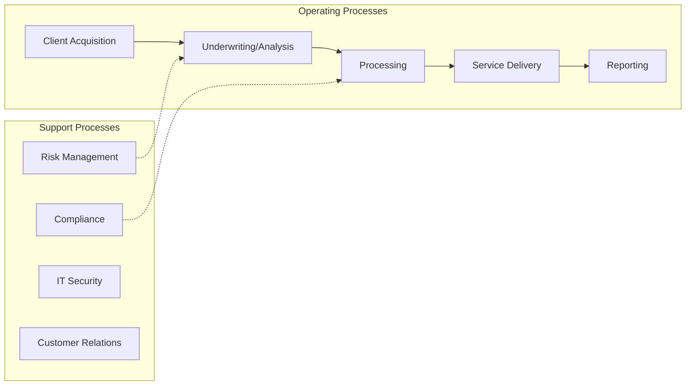

# Employee Benefit Funds

> This industry group comprises legal entities (i.

## Overview

Employee Benefit Funds represents an important category within the Finance and Insurance sector (NAICS 52). This industry group encompasses establishments primarily engaged in employee benefit funds.

This industry group comprises legal entities (i.e., funds, plans, and/or programs) organized to provide insurance and employee benefits exclusively for the sponsor, firm, or its employees or members.

## Industry Hierarchy

## Key Statistics

| Metric | Value |
|--------|-------|
| NAICS Code | 5251 |
| Level | Industry Group |
| Parent | [Financial Vehicles](../) |
| Child Industries | 2 |

## Sub-Industries

| Industry | Code | Description |
|----------|------|-------------|
| [Welfare Funds](./WelfareFunds/) | 52512 | See industry description for 525120 |
| [Insurance Funds](./InsuranceFunds/) | 52519 | See industry description for 525190 |

## Core Business Processes

## Industry Value Chain

```mermaid
graph LR
    subgraph Inputs["Inputs"]
        I1["Capital"]
        I2["Data"]
        I3["Expertise"]
        I4["Technology"]
    end

    subgraph Primary["Primary Activities"]
        A1["Inbound Logistics"]
        A2["Core Operations"]
        A3["Quality Assurance"]
        A4["Outbound/Delivery"]
    end

    subgraph Outputs["Products/Services"]
        O1["Financial Products"]
        O2["Risk Coverage"]
        O3["Advisory"]
    end

    subgraph Customers["Markets"]
        C1["Individuals"]
        C2["Businesses"]
        C3["Institutions"]
        C4["Government"]
    end

    Inputs --> Primary --> Outputs --> Customers
```

---

*Source: NAICS 5251 - Employee Benefit Funds*
