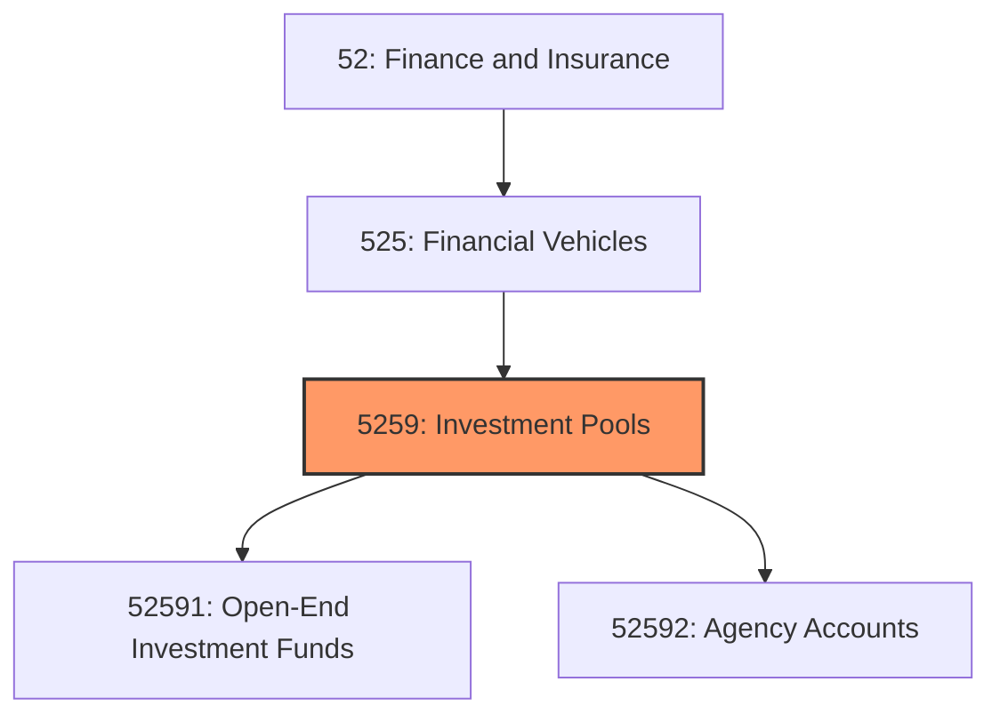
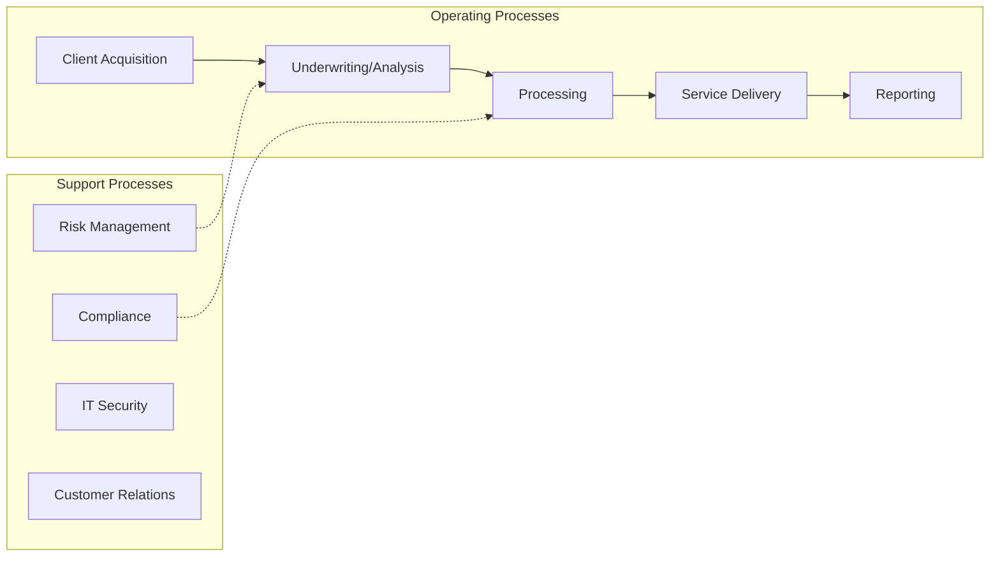

# Investment Pools

> This industry group comprises legal entities (i.

## Overview

Investment Pools represents an important category within the Finance and Insurance sector (NAICS 52). This industry group encompasses establishments primarily engaged in investment pools.

This industry group comprises legal entities (i.e., investment pools and/or funds) organized to pool securities or other assets (except insurance and employee benefit funds) on behalf of shareholders, unitholders, or beneficiaries.

## Industry Hierarchy

## Key Statistics

| Metric | Value |
|--------|-------|
| NAICS Code | 5259 |
| Level | Industry Group |
| Parent | [Financial Vehicles](../) |
| Child Industries | 2 |

## Sub-Industries

| Industry | Code | Description |
|----------|------|-------------|
| [Open-End Investment Funds](./OpenendInvestmentFunds/) | 52591 | See industry description for 525910 |
| [Agency Accounts](./AgencyAccounts/) | 52592 | See industry description for 525920 |

## Core Business Processes

## Industry Value Chain

```mermaid
graph LR
    subgraph Inputs["Inputs"]
        I1["Capital"]
        I2["Data"]
        I3["Expertise"]
        I4["Technology"]
    end

    subgraph Primary["Primary Activities"]
        A1["Inbound Logistics"]
        A2["Core Operations"]
        A3["Quality Assurance"]
        A4["Outbound/Delivery"]
    end

    subgraph Outputs["Products/Services"]
        O1["Financial Products"]
        O2["Risk Coverage"]
        O3["Advisory"]
    end

    subgraph Customers["Markets"]
        C1["Individuals"]
        C2["Businesses"]
        C3["Institutions"]
        C4["Government"]
    end

    Inputs --> Primary --> Outputs --> Customers
```

---

*Source: NAICS 5259 - Investment Pools*
