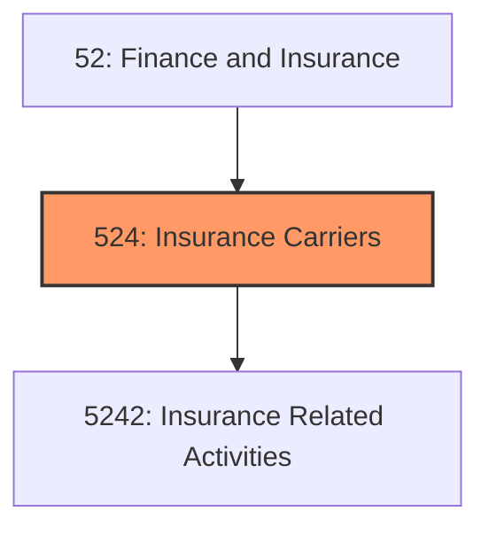
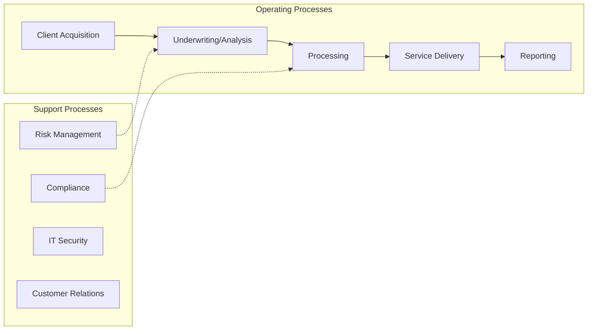

# Insurance Carriers

> Industries in the Insurance Carriers and Related Activities subsector group establishments that are primarily engaged in one of the following: (1) underwriting (assuming the risk, assigning premiums, and so forth) annuities and insurance policies or (2) facilitating such underwriting by selling insurance policies and by providing other insurance and employee benefit related services.

## Overview

Insurance Carriers represents an important category within the Finance and Insurance sector (NAICS 52). This subsector encompasses establishments primarily engaged in insurance carriers.

Industries in the Insurance Carriers and Related Activities subsector group establishments that are primarily engaged in one of the following: (1) underwriting (assuming the risk, assigning premiums, and so forth) annuities and insurance policies or (2) facilitating such underwriting by selling insurance policies and by providing other insurance and employee benefit related services.

## Industry Hierarchy

## Key Statistics

| Metric | Value |
|--------|-------|
| NAICS Code | 524 |
| Level | Subsector |
| Parent | [Insurance](../) |
| Child Industries | 1 |

## Sub-Industries

| Industry | Code | Description |
|----------|------|-------------|
| [Insurance Related Activities](./InsuranceRelatedActivities/) | 5242 | This industry group comprises establishments primarily engaged in (1) acting as  |

## Core Business Processes

## Industry Value Chain

---

*Source: NAICS 524 - Insurance Carriers*
