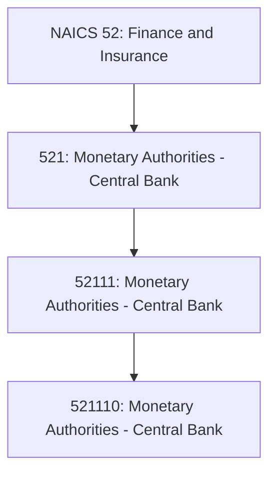
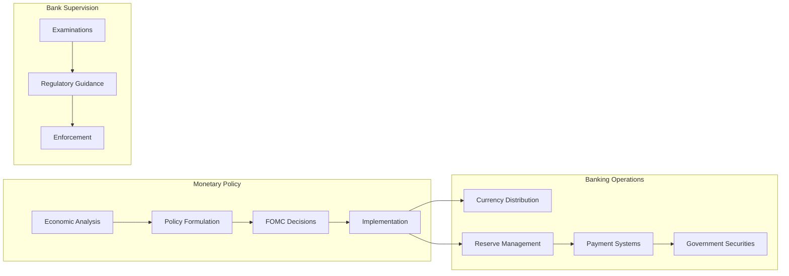
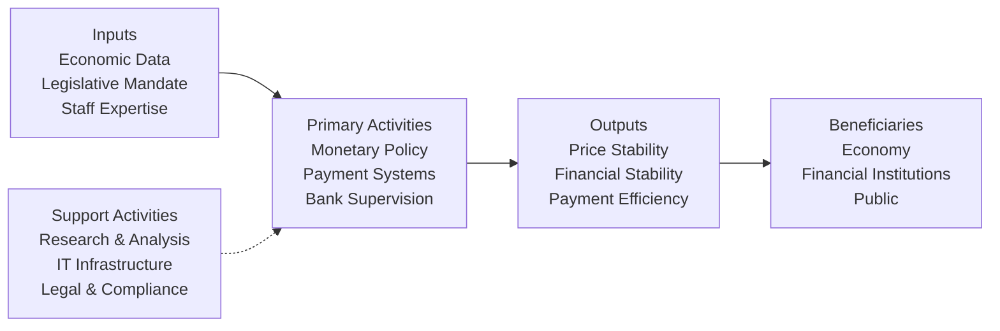

# Monetary Authorities - Central Bank

> The Monetary Authorities-Central Bank subsector groups establishments that engage in performing central banking functions, such as issuing currency, managing the Nation's money supply and international reserves, and acting as a fiscal agent for the central government.

## Overview

This subsector comprises a single industry (NAICS 521110) that includes the Federal Reserve Banks and other establishments performing central banking functions. These institutions are unique in their role as monetary authorities, setting monetary policy and serving as the "lender of last resort" for depository institutions.

Central banking functions include:
- **Currency Issuance**: Printing and distributing physical currency
- **Money Supply Management**: Controlling monetary aggregates through open market operations
- **International Reserves**: Managing foreign exchange and gold reserves
- **Reserve Banking**: Holding deposits representing reserves of commercial banks
- **Fiscal Agent**: Handling government securities issuance and transactions
- **Payment Systems**: Operating wholesale payment and settlement systems

## Industry Hierarchy

## Key Statistics

| Metric | Value |
|--------|-------|
| NAICS Code | 521 |
| Level | Subsector |
| Parent Sector | [52: Finance and Insurance](../) |
| Industry Groups | 1 |
| National Industries | 1 |

## Establishments

The primary establishment in the United States is the **Federal Reserve System**, which consists of:

| Component | Description |
|-----------|-------------|
| Board of Governors | Federal agency overseeing the Federal Reserve System |
| Federal Reserve Banks | 12 regional reserve banks (Boston, New York, Philadelphia, Cleveland, Richmond, Atlanta, Chicago, St. Louis, Minneapolis, Kansas City, Dallas, San Francisco) |
| Federal Open Market Committee (FOMC) | Sets monetary policy through open market operations |

## Related Occupations

- [Economists](/occupations/Science/Economists) - Analyze economic data and monetary policy
- [Financial Examiners](/occupations/Business/FinancialExaminers) - Ensure compliance with banking regulations
- [Financial Analysts](/occupations/Business/Financial/FinancialAnalysts) - Analyze financial markets and conditions
- [Budget Analysts](/occupations/Business/Financial/BudgetAnalysts) - Manage government fiscal operations
- [Compliance Officers](/occupations/Business/Operations/ComplianceOfficers) - Oversee regulatory compliance

## Core Business Processes

### Monetary Policy Implementation

Setting and executing monetary policy to achieve maximum employment, stable prices, and moderate long-term interest rates.

**Key Activities:**
- Analyze economic indicators and financial conditions
- Set target federal funds rate
- Conduct open market operations (buying/selling securities)
- Adjust reserve requirements and discount rates
- Communicate policy decisions and economic outlooks
- Coordinate with international central banks

### Payment System Operations

Operating critical payment infrastructure that facilitates trillions of dollars in daily transactions.

**Key Activities:**
- Process large-value wire transfers (Fedwire)
- Operate automated clearinghouse (FedACH)
- Distribute currency and coin to depository institutions
- Clear and settle checks through the Federal Reserve System
- Maintain real-time gross settlement systems
- Develop and implement instant payment services (FedNow)

### Bank Supervision and Regulation

Supervising and regulating depository institutions to ensure safety, soundness, and consumer protection.

**Key Activities:**
- Examine state member banks and bank holding companies
- Issue regulations and supervisory guidance
- Take enforcement actions for violations
- Monitor systemic risks across the financial system
- Coordinate with other regulatory agencies
- Conduct stress tests for large financial institutions

## Industry Value Chain

## Federal Reserve Functions

### Monetary Policy Tools

| Tool | Description | Impact |
|------|-------------|--------|
| Federal Funds Rate | Target rate for overnight lending between banks | Short-term interest rates |
| Open Market Operations | Buying/selling government securities | Money supply and reserves |
| Discount Window | Lending to depository institutions | Emergency liquidity |
| Reserve Requirements | Required reserves banks must hold | Credit expansion capacity |
| Interest on Reserves | Interest paid on bank reserves | Incentive to hold reserves |

### Payment and Settlement Systems

| System | Description | Volume |
|--------|-------------|--------|
| Fedwire Funds | Real-time gross settlement for large-value payments | ~$4 trillion daily |
| Fedwire Securities | Transfer of government securities | ~$3 trillion daily |
| FedACH | Batch processing for retail payments | ~150 million transactions daily |
| FedNow | Instant payments (24/7/365) | Launched 2023 |
| National Settlement Service | Multilateral settlement for private payment systems | Variable |

## Regulatory Framework

### Federal Reserve Act

The legal foundation establishing the Federal Reserve System in 1913, defining its structure, responsibilities, and authority.

### Independence and Accountability

- **Operational Independence**: Fed makes policy decisions independently
- **Congressional Oversight**: Regular testimony and reports to Congress
- **Transparency**: Meeting minutes, economic projections, and policy statements published
- **GAO Audits**: Limited audits of Fed operations (excludes monetary policy)

### Key Regulations

- **Regulation D**: Reserve requirements
- **Regulation Q**: Capital planning and stress testing
- **Regulation YY**: Enhanced prudential standards
- **Regulation II**: Debit card interchange fees

## Technology & Innovation

The Federal Reserve is advancing critical payment infrastructure:

### Payment Modernization
- **FedNow Service**: Real-time payment and settlement system enabling instant transfers 24/7/365
- **ISO 20022**: Migration to international messaging standards for richer payment data
- **Digital Currency Research**: Exploring central bank digital currency (CBDC) implications

### Supervision Technology
- **SupTech**: Using AI and machine learning for supervisory monitoring
- **Stress Testing Models**: Advanced modeling for systemic risk assessment
- **Real-Time Monitoring**: Enhanced surveillance of financial markets and institutions

### Cybersecurity
- **Critical Infrastructure Protection**: Securing payment systems from cyber threats
- **Information Sharing**: Coordinating threat intelligence with financial sector
- **Resilience Testing**: Regular exercises and contingency planning

## Related Industries

- [Commercial Banking](../CreditIntermediation/Depository/CommercialBanking) - Primary recipients of monetary policy
- [Credit Unions](../CreditIntermediation/Depository/CreditUnions) - Depository institutions using Fed services
- [Savings Institutions](../CreditIntermediation/Depository/SavingsInstitutions) - Thrift institutions under Fed supervision
- [Financial Transaction Processing](../CreditIntermediation/CreditRelatedActivities/FinancialTransactionProcessing) - Payment processing infrastructure

---

*Source: NAICS 521 - Monetary Authorities - Central Bank*
