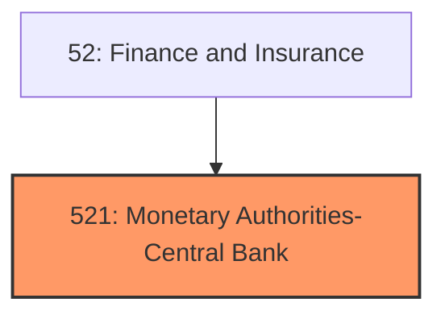
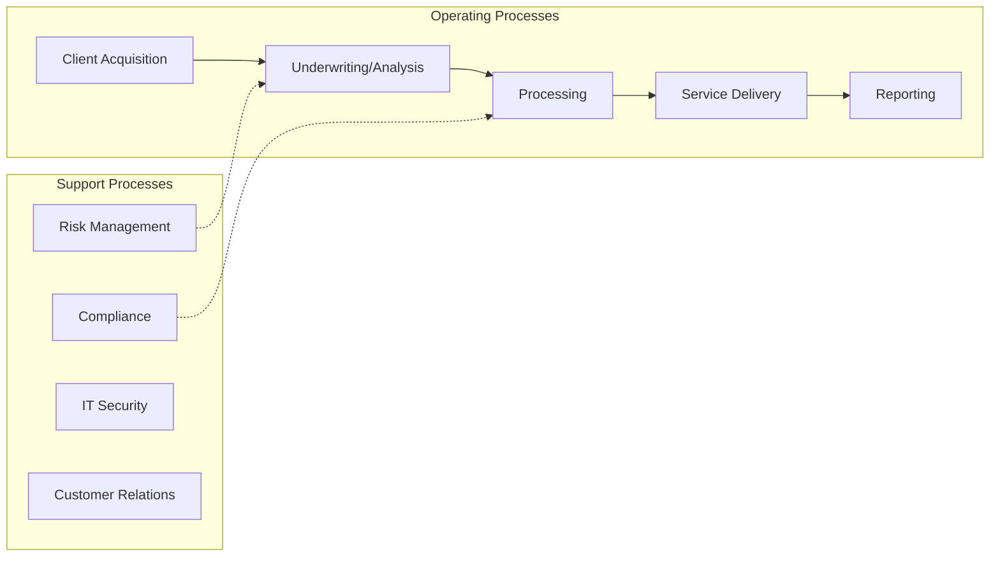

# Monetary Authorities-Central Bank

> The Monetary Authorities-Central Bank subsector groups establishments that engage in performing central banking functions, such as issuing currency, managing the Nation's money supply and international reserves, holding deposits that represent the reserves of other banks and other central banks, and acting as a fiscal agent for the central government.

## Overview

Monetary Authorities-Central Bank represents an important category within the Finance and Insurance sector (NAICS 52). This subsector encompasses establishments primarily engaged in monetary authorities-central bank.

The Monetary Authorities-Central Bank subsector groups establishments that engage in performing central banking functions, such as issuing currency, managing the Nation's money supply and international reserves, holding deposits that represent the reserves of other banks and other central banks, and acting as a fiscal agent for the central government.

## Industry Hierarchy

## Key Statistics

| Metric | Value |
|--------|-------|
| NAICS Code | 521 |
| Level | Subsector |
| Parent | [Insurance](../) |
| Child Industries | 0 |

## Core Business Processes

## Industry Value Chain

```mermaid
graph LR
    subgraph Inputs["Inputs"]
        I1["Capital"]
        I2["Data"]
        I3["Expertise"]
        I4["Technology"]
    end

    subgraph Primary["Primary Activities"]
        A1["Inbound Logistics"]
        A2["Core Operations"]
        A3["Quality Assurance"]
        A4["Outbound/Delivery"]
    end

    subgraph Outputs["Products/Services"]
        O1["Financial Products"]
        O2["Risk Coverage"]
        O3["Advisory"]
    end

    subgraph Customers["Markets"]
        C1["Individuals"]
        C2["Businesses"]
        C3["Institutions"]
        C4["Government"]
    end

    Inputs --> Primary --> Outputs --> Customers
```

---

*Source: NAICS 521 - Monetary Authorities-Central Bank*
