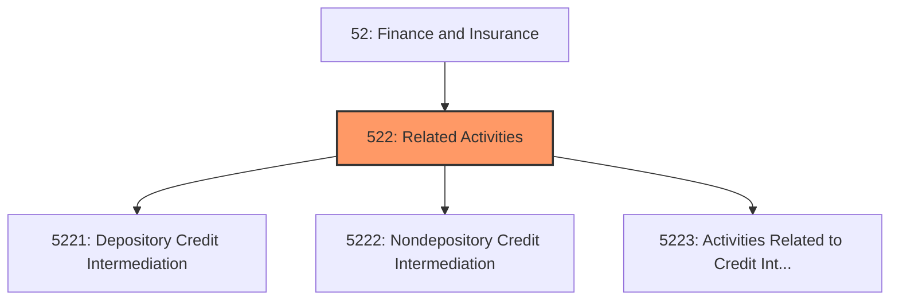
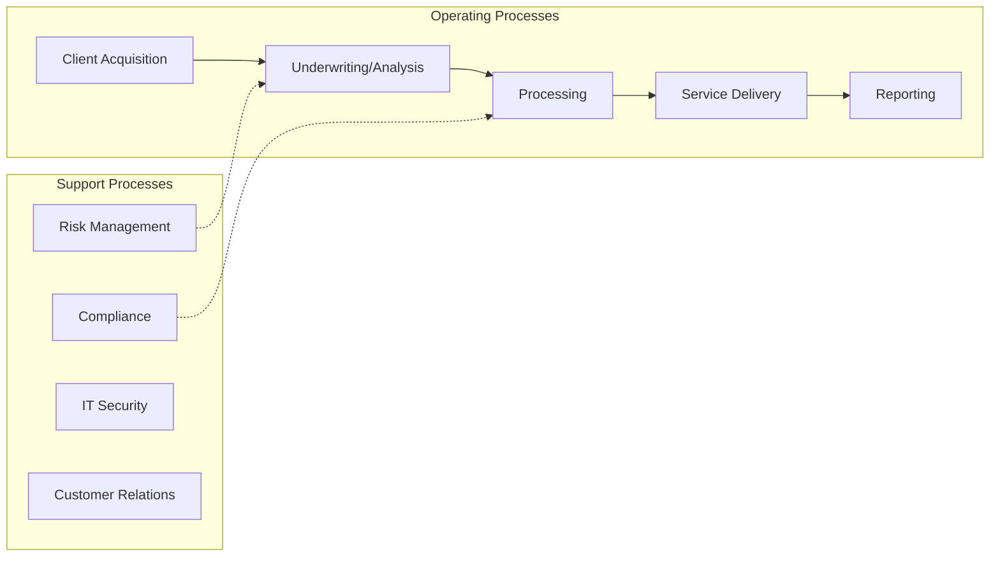

# Related Activities

> Industries in the Credit Intermediation and Related Activities subsector group establishments that (1) lend funds raised from depositors; (2) lend funds raised from credit market borrowing; or (3) facilitate the lending of funds or issuance of credit by engaging in such activities as mortgage and loan brokerage, clearinghouse and reserve services, and check cashing services.

## Overview

Related Activities represents an important category within the Finance and Insurance sector (NAICS 52).

Industries in the Credit Intermediation and Related Activities subsector group establishments that (1) lend funds raised from depositors; (2) lend funds raised from credit market borrowing; or (3) facilitate the lending of funds or issuance of credit by engaging in such activities as mortgage and loan brokerage, clearinghouse and reserve services, and check cashing services.

## Industry Hierarchy

## Key Statistics

| Metric | Value |
|--------|-------|
| NAICS Code | 522 |
| Level | Subsector |
| Parent | [Finance](../) |
| Child Industries | 3 |

## Sub-Industries

| Industry | Code | Description |
|----------|------|-------------|
| [Depository Credit Intermediation](./DepositoryCreditIntermediation/) | 5221 | This industry group comprises establishments primarily engaged in accepting depo |
| [Nondepository Credit Intermediation](./NondepositoryCreditIntermediation/) | 5222 | This industry group comprises establishments, both public (government-sponsored  |
| [Activities Related to Credit Intermediation](./ActivitiesRelatedToCreditIntermediation/) | 5223 | This industry group comprises establishments primarily engaged in facilitating c |

## Related Occupations

See the [occupations directory](/occupations) for roles commonly found in this industry.

## Core Business Processes

## Industry Value Chain

```mermaid
graph LR
    subgraph Inputs["Inputs"]
        I1["Capital"]
        I2["Data"]
        I3["Expertise"]
        I4["Technology"]
    end

    subgraph Primary["Primary Activities"]
        A1["Inbound Logistics"]
        A2["Core Operations"]
        A3["Quality Assurance"]
        A4["Outbound/Delivery"]
    end

    subgraph Outputs["Products/Services"]
        O1["Financial Products"]
        O2["Risk Coverage"]
        O3["Advisory"]
    end

    subgraph Customers["Markets"]
        C1["Individuals"]
        C2["Businesses"]
        C3["Institutions"]
        C4["Government"]
    end

    Inputs --> Primary --> Outputs --> Customers
```

## Market Context

Financial services facilitate capital flow and economic activity, with fintech innovation transforming traditional banking and investment models.

| Aspect | Details |
|--------|---------|
| Industry Sector | Finance |
| NAICS/SIC Code | 522 |
| Market Segment | Related Activities |

## Key Business Processes

- Account management
- Lending and credit
- Investment management
- Risk and compliance
- Customer service

## Common Occupations

- [Financial Managers](/occupations/Management/FinancialManagers)
- [Financial Analysts](/occupations/Business/FinancialAnalysts)
- [Loan Officers](/occupations/Business/LoanOfficers)
- [Tellers](/occupations/Administrative/Tellers)

## Regulations and Standards

- Federal Reserve regulations
- SEC requirements
- FDIC insurance requirements
- Bank Secrecy Act (BSA)
- Dodd-Frank Act provisions

## Technology and Tools

- Core banking systems
- Trading platforms
- Risk management systems
- Mobile banking applications
- Blockchain and digital assets

## Industry Trends

- Digital transformation and automation adoption
- Sustainability and environmental compliance focus
- Workforce development and skills training
- Supply chain resilience and optimization
- Customer experience enhancement

---

*Source: NAICS 522 - Related Activities*
