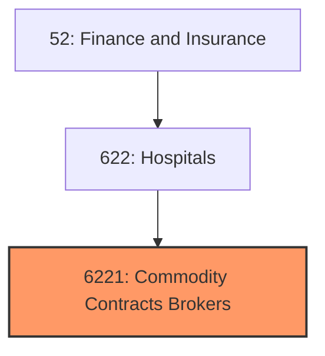
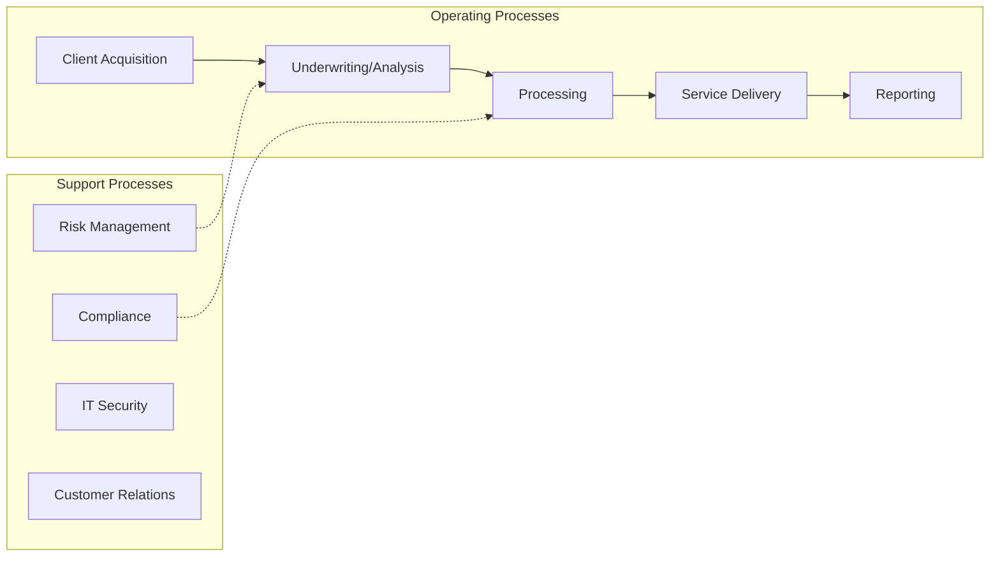

# Commodity Contracts Brokers

> Commodity Contracts Brokers and Dealers.

## Overview

Commodity Contracts Brokers represents an important category within the Finance and Insurance sector (SIC 6221).

## Industry Hierarchy

## Key Statistics

| Metric | Value |
|--------|-------|
| SIC Code | 6221 |
| Level | SIC (6221) |
| Child Industries | 0 |

## Related Occupations

- [Financial Managers](/occupations/Management/FinancialManagers) - Direct financial activities of organizations
- [Accountants and Auditors](/occupations/Business/Financial/AccountantsAndAuditors) - Examine and prepare financial records
- [Loan Officers](/occupations/Business/LoanOfficers) - Evaluate and authorize loan applications
- [Financial and Investment Analysts](/occupations/Business/FinancialAndInvestmentAnalysts) - Analyze financial data and investment opportunities

## Core Business Processes

## Industry Value Chain

```mermaid
graph LR
    subgraph Inputs["Inputs"]
        I1["Capital"]
        I2["Data"]
        I3["Expertise"]
        I4["Technology"]
    end

    subgraph Primary["Primary Activities"]
        A1["Inbound Logistics"]
        A2["Core Operations"]
        A3["Quality Assurance"]
        A4["Outbound/Delivery"]
    end

    subgraph Outputs["Products/Services"]
        O1["Financial Products"]
        O2["Risk Coverage"]
        O3["Advisory"]
    end

    subgraph Customers["Markets"]
        C1["Individuals"]
        C2["Businesses"]
        C3["Institutions"]
        C4["Government"]
    end

    Inputs --> Primary --> Outputs --> Customers
```

## Regulatory Environment

- **SEC** (Securities and Exchange Commission) - Regulates securities markets and financial reporting
- **FDIC** (Federal Deposit Insurance Corporation) - Insures deposits and supervises banks
- **Federal Reserve** - Sets monetary policy and regulates banking institutions
- **CFPB** (Consumer Financial Protection Bureau) - Enforces consumer financial regulations

## Technology & Innovation

- **Fintech and Digital Banking** - Mobile banking, digital wallets, and neobank platforms
- **Blockchain and DeFi** - Distributed ledger technology for payments and smart contracts
- **AI-Powered Risk Assessment** - Machine learning credit scoring and fraud detection
- **Open Banking** - API-driven financial services and data sharing ecosystems

## Industry Outlook

The finance and insurance sector is being reshaped by fintech innovation, digital banking, and evolving regulatory frameworks. AI and machine learning are transforming risk assessment, fraud detection, and customer service. Open banking and embedded finance are creating new business models, while cryptocurrency and digital assets continue to influence the financial landscape.

---

*Source: SIC 6221 - Commodity Contracts Brokers*
