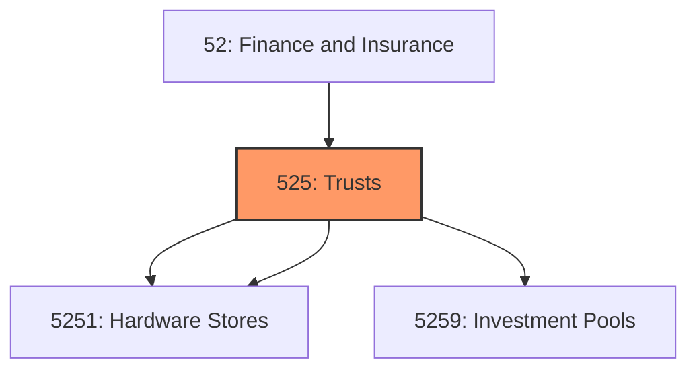
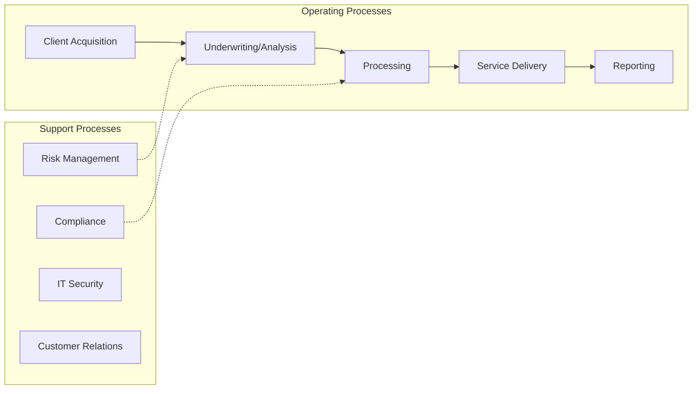

# Trusts

> Industries in the Funds, Trusts, and Other Financial Vehicles subsector group legal entities (i.

## Overview

Trusts represents an important category within the Finance and Insurance sector (NAICS 52).

Industries in the Funds, Trusts, and Other Financial Vehicles subsector group legal entities (i.e., funds, plans, and/or programs) organized to pool securities or other assets on behalf of shareholders or beneficiaries of employee benefit or other trust funds. The portfolios are customized to achieve specific investment characteristics, such as diversification, risk, rate of return, and price volatility. These entities earn interest, dividends, and other investment income, but have little or no employment and no revenue from the sale of services. Establishments with employees devoted to the management of funds are classified in Industry Group 5239, Other Financial Investment Activities. Establishments primarily engaged in holding the securities of (or other equity interests in) other firms are classified in Sector 55, Management of Companies and Enterprises. Equity real estate investment trusts (REITs) that are primarily engaged in leasing buildings, dwellings, or other real estate property to others are classified in Subsector 531, Real Estate.

## Industry Hierarchy

## Key Statistics

| Metric | Value |
|--------|-------|
| NAICS Code | 525 |
| Level | Subsector |
| Parent | [Finance](../) |
| Child Industries | 2 |

## Sub-Industries

| Industry | Code | Description |
|----------|------|-------------|
| [Employee Benefit Funds](./EmployeeBenefitFunds/) | 5251 | This industry group comprises legal entities (i |
| [Investment Pools](./InvestmentPools/) | 5259 | This industry group comprises legal entities (i |

## Related Occupations

See the [occupations directory](/occupations) for roles commonly found in this industry.

## Core Business Processes

## Industry Value Chain

```mermaid
graph LR
    subgraph Inputs["Inputs"]
        I1["Capital"]
        I2["Data"]
        I3["Expertise"]
        I4["Technology"]
    end

    subgraph Primary["Primary Activities"]
        A1["Inbound Logistics"]
        A2["Core Operations"]
        A3["Quality Assurance"]
        A4["Outbound/Delivery"]
    end

    subgraph Outputs["Products/Services"]
        O1["Financial Products"]
        O2["Risk Coverage"]
        O3["Advisory"]
    end

    subgraph Customers["Markets"]
        C1["Individuals"]
        C2["Businesses"]
        C3["Institutions"]
        C4["Government"]
    end

    Inputs --> Primary --> Outputs --> Customers
```

## Market Context

Financial services facilitate capital flow and economic activity, with fintech innovation transforming traditional banking and investment models.

| Aspect | Details |
|--------|---------|
| Industry Sector | Finance |
| NAICS/SIC Code | 525 |
| Market Segment | Trusts |

## Key Business Processes

- Account management
- Lending and credit
- Investment management
- Risk and compliance
- Customer service

## Common Occupations

- [Financial Managers](/occupations/Management/FinancialManagers)
- [Financial Analysts](/occupations/Business/FinancialAnalysts)
- [Loan Officers](/occupations/Business/LoanOfficers)
- [Tellers](/occupations/Administrative/Tellers)

## Regulations and Standards

- Federal Reserve regulations
- SEC requirements
- FDIC insurance requirements
- Bank Secrecy Act (BSA)
- Dodd-Frank Act provisions

## Technology and Tools

- Core banking systems
- Trading platforms
- Risk management systems
- Mobile banking applications
- Blockchain and digital assets

## Industry Trends

- Digital transformation and automation adoption
- Sustainability and environmental compliance focus
- Workforce development and skills training
- Supply chain resilience and optimization
- Customer experience enhancement

---

*Source: NAICS 525 - Trusts*
