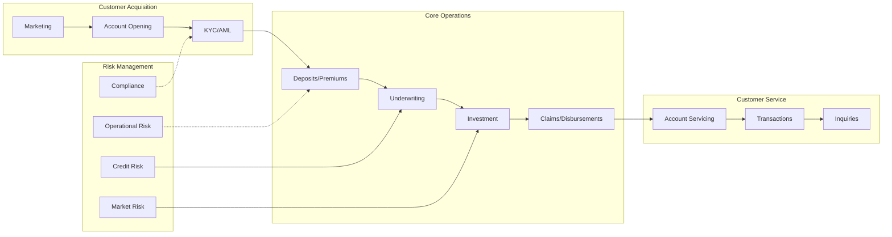
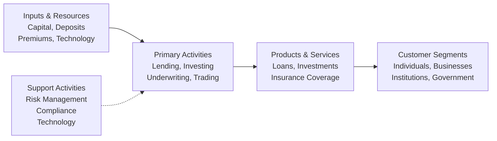

# Finance and Insurance

> The Finance and Insurance sector comprises establishments primarily engaged in financial transactions (involving the creation, liquidation, or change in ownership of financial assets) and/or in facilitating financial transactions.

## Overview

This sector encompasses three principal types of activities:

1. **Financial Intermediation**: Raising funds through deposits or securities, incurring liabilities, and using those funds to acquire financial assets through loans or securities purchases. This channels funds from lenders to borrowers while transforming funds with respect to maturity, scale, and risk.

2. **Risk Pooling**: Underwriting insurance and annuities by collecting premiums, building reserves, investing those reserves, and making contractual payments based on expected incidence of insured risk.

3. **Facilitating Services**: Providing specialized services supporting financial intermediation, insurance, and employee benefit programs.

Industries within this sector are defined by their unique production processes, specialized human and physical capital, and distinctive patterns of acquiring and allocating financial capital.

## Industry Hierarchy

```mermaid
graph TD
    S52["NAICS 52: Finance and Insurance"]
    S52 --> SS521["521: Monetary Authorities - Central Bank"]
    S52 --> SS522["522: Credit Intermediation"]
    S52 --> SS523["523: Securities and Investments"]
    S52 --> SS524["524: Insurance Carriers and Related"]
    S52 --> SS525["525: Funds, Trusts, Financial Vehicles"]

    SS522 --> G5221["5221: Depository Credit Intermediation"]
    SS522 --> G5222["5222: Nondepository Credit Intermediation"]
    SS522 --> G5223["5223: Activities Related to Credit"]

    G5221 --> I52211["52211: Commercial Banking"]
    G5221 --> I52213["52213: Credit Unions"]
    G5221 --> I52218["52218: Savings Institutions"]

    G5222 --> I52221["52221: Credit Card Issuing"]
    G5222 --> I52222["52222: Sales Financing"]
    G5222 --> I522291["522291: Consumer Lending"]
    G5222 --> I522292["522292: Real Estate Credit"]

    SS523 --> G5231["5231: Securities and Commodity Brokerage"]
    SS523 --> G5232["5232: Commodity Exchanges"]
    SS523 --> G5239["5239: Other Financial Investment Activities"]

    SS524 --> G5241["5241: Insurance Carriers"]
    SS524 --> G5242["5242: Agencies and Brokerages"]

    SS525 --> G5251["5251: Employee Benefit Funds"]
    SS525 --> G5259["5259: Investment Pools and Trusts"]
```

## Key Statistics

| Metric | Value |
|--------|-------|
| NAICS Code | 52 |
| Level | Sector |
| Subsectors | 5 |
| Industry Groups | 11 |
| Industries | 48 |

## Sub-Industries

| Subsector | Code | Description |
|-----------|------|-------------|
| Monetary Authorities - Central Bank | 521 | Central banking functions including currency issuance and money supply management |
| Credit Intermediation and Related | 522 | Depository and nondepository lending, mortgage and loan brokerage |
| Securities, Commodity Contracts, Investments | 523 | Securities underwriting, brokerage, exchanges, and investment management |
| [Insurance Carriers and Related](../Insurance/) | 524 | Insurance underwriting, agencies, brokerages, and related services |
| Funds, Trusts, and Other Financial Vehicles | 525 | Investment pools, employee benefit funds, and trust administration |

## Related Occupations

- [Financial Managers](/occupations/FinancialManagers) - Financial planning and analysis
- [Loan Officers](/occupations/LoanOfficers) - Credit evaluation and lending
- [Securities and Commodities Traders](/occupations/SecuritiesAndCommoditiesTraders) - Trading operations
- [Insurance Underwriters](/occupations/InsuranceUnderwriters) - Risk assessment
- [Financial Analysts](/occupations/FinancialAnalysts) - Investment analysis
- [Personal Financial Advisors](/occupations/PersonalFinancialAdvisors) - Wealth management
- [Claims Adjusters](/occupations/ClaimsAdjusters) - Insurance claims processing

## Core Business Processes

### Credit and Lending

Evaluating creditworthiness and extending credit to individuals and businesses through various lending products.

**Key Activities:**
- Assess borrower creditworthiness
- Structure loan terms and conditions
- Process loan applications and documentation
- Monitor loan portfolio performance
- Manage collections and workouts

### Investment Management

Managing portfolios of financial assets on behalf of clients or for proprietary purposes.

**Key Activities:**
- Develop investment strategies
- Conduct securities analysis and research
- Execute trades and manage portfolios
- Monitor performance and risk
- Provide investment advice and reporting

### Insurance Underwriting

Assessing and assuming risks through insurance policies and managing claims processes.

**Key Activities:**
- Evaluate risk and set premiums
- Issue insurance policies
- Process and adjudicate claims
- Manage reserves and reinsurance
- Handle policy renewals and modifications

## Industry Value Chain

## Financial Institution Types

### Depository Institutions
Accept deposits and make loans. Includes commercial banks, savings institutions, and credit unions. Funds raised from deposits are used to make consumer, commercial, and real estate loans.

### Nondepository Credit Intermediation
Extend credit without accepting deposits. Includes credit card issuers, sales financing companies, consumer lenders, and mortgage companies. Funds are raised through credit market borrowing.

### Securities and Investment Firms
Underwrite securities, make markets, provide brokerage services, and manage investments. Includes investment banks, securities dealers, and portfolio managers.

### Insurance Companies
Pool risk through underwriting insurance policies. Collect premiums, invest reserves, and pay claims. Includes life, health, property, and casualty insurers.

## Regulatory Environment

The financial sector operates under extensive regulation:

- **Federal Reserve**: Monetary policy and bank holding company supervision
- **OCC/FDIC**: National bank and deposit insurance regulation
- **SEC**: Securities markets and investment advisors
- **State Insurance Commissioners**: Insurance company regulation
- **CFPB**: Consumer financial protection
- **FINRA**: Self-regulatory organization for broker-dealers
- **Basel Accords**: International capital and liquidity standards
- **AML/BSA**: Anti-money laundering and bank secrecy requirements

## Technology & Innovation

The financial sector is experiencing significant digital transformation:

- **Digital Banking**: Mobile apps, online platforms, and neobanks
- **Payment Innovation**: Real-time payments, digital wallets, and contactless
- **Blockchain and DLT**: Cryptocurrency, smart contracts, and settlement
- **Artificial Intelligence**: Fraud detection, credit scoring, and robo-advisors
- **Cloud Computing**: Scalable infrastructure and data analytics
- **Open Banking**: APIs and data sharing with third parties
- **Cybersecurity**: Advanced threat detection and protection
- **RegTech**: Automated compliance and regulatory reporting

## Transaction Processing

Financial industries extensively use electronic means for:

- Verifying financial balances
- Authorizing transactions
- Transferring funds between accounts
- Notifying institutions of transactions
- Providing daily summaries and reconciliation

Transaction processing activities integral to finance services are classified within this sector rather than data processing.

---

*Source: NAICS 52 - Finance and Insurance*
