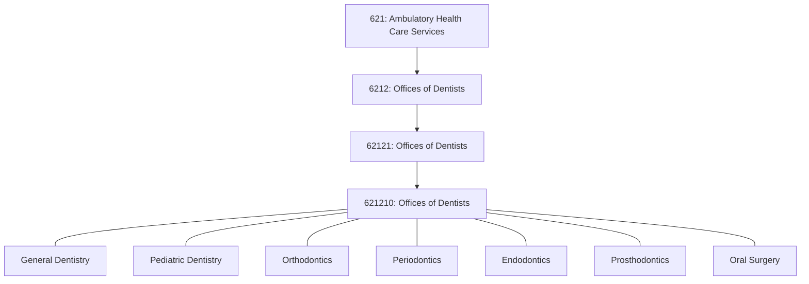

# Offices of Dentists

> This industry comprises establishments of health practitioners having the degree of D.M.D. (Doctor of Dental Medicine), D.D.S. (Doctor of Dental Surgery), or D.D.Sc. (Doctor of Dental Science) primarily engaged in the independent practice of general or specialized dentistry or dental surgery.

## Overview

Dental offices provide comprehensive preventive, cosmetic, and emergency care, or specialize in single fields of dentistry. These practitioners operate private or group practices in their own offices (e.g., centers, clinics) or in the facilities of others, such as hospitals or HMO medical centers.

The dental industry operates somewhat independently from the broader healthcare system, with separate insurance products (dental plans), distinct regulatory frameworks (state dental boards), and different practice patterns than medical care.

## Industry Hierarchy

## Key Statistics

| Metric | Value |
|--------|-------|
| NAICS Code | 6212 |
| Level | Industry Group |
| Parent Subsector | [Ambulatory Health Care](../) |
| National Industry | 621210 |

## Dental Specialties

| Specialty | Focus Area | Typical Procedures |
|-----------|------------|-------------------|
| General Dentistry | Comprehensive oral care | Exams, cleanings, fillings, crowns |
| Pediatric Dentistry | Children's oral health | Preventive care, sealants, behavior management |
| Orthodontics | Teeth and jaw alignment | Braces, aligners, retainers |
| Periodontics | Gum disease | Scaling, root planing, gum surgery |
| Endodontics | Root canal therapy | Root canals, apicoectomy |
| Prosthodontics | Tooth replacement | Dentures, implants, bridges |
| Oral and Maxillofacial Surgery | Surgical procedures | Extractions, jaw surgery, implants |
| Oral Pathology | Oral diseases | Biopsy, cancer diagnosis |
| Oral Radiology | Imaging | X-rays, CBCT, interpretation |

## Core Business Processes

### Preventive Care
Regular maintenance visits including professional cleaning and examinations.

**Key Activities:**
- Patient education on oral hygiene
- Prophylaxis (cleaning) by dental hygienist
- Periodontal assessments
- Diagnostic radiographs
- Dentist examination
- Fluoride treatments and sealants

### Restorative Treatment
Procedures to repair damaged or decayed teeth.

**Key Activities:**
- Cavity preparation and filling placement
- Crown and bridge fabrication/placement
- Root canal therapy
- Extraction procedures
- Implant placement and restoration

## Regulatory Environment

### State Dental Board
- **Dentist Licensure**: Dental degree, examinations, continuing education
- **Hygienist Supervision**: Direct, indirect, or general supervision requirements
- **Expanded Function Dental Assistants**: State-specific scope of practice
- **Specialty Recognition**: Specialty practice restrictions

### Federal Requirements
- **OSHA**: Bloodborne pathogen standards, infection control
- **DEA**: Controlled substance prescribing (for sedation, pain management)
- **HIPAA**: Patient privacy and information security
- **EPA**: Dental amalgam separator rule

### Infection Control
- **CDC Guidelines**: Infection prevention in dental settings
- **State Regulations**: Equipment sterilization requirements
- **OSAP**: Organization for Safety, Asepsis and Prevention standards

## Technology & EHR

### Dental Practice Management Systems
| System | Market Position | Key Features |
|--------|-----------------|--------------|
| Dentrix | Market leader | Comprehensive, imaging integration |
| Eaglesoft | Large practices | Treatment planning, patient engagement |
| Open Dental | Growing | Open-source, customizable |
| Curve Dental | Cloud-based | Modern interface, anywhere access |
| CareStack | Emerging | All-in-one cloud platform |

### Digital Dentistry
- **Digital Radiography**: Reduced radiation, instant images
- **Intraoral Scanners**: Digital impressions for restorations
- **CAD/CAM Systems**: Same-day crowns and restorations
- **CBCT Imaging**: 3D imaging for implants and complex cases
- **AI Diagnostics**: Cavity detection, treatment planning assistance

### Patient Engagement
- Online scheduling and appointment reminders
- Patient portals for forms and records
- Teledentistry for consultations
- Treatment presentation tools
- Review and reputation management

## Insurance and Payment

### Dental Insurance Structure
| Plan Type | Coverage Model | Cost Sharing |
|-----------|---------------|--------------|
| DPPO | Preferred provider organization | Lower in-network costs |
| DHMO | Dental HMO, capitated | Fixed copays |
| Indemnity | Traditional insurance | UCR-based reimbursement |
| Discount Plans | Membership discount | Fee reductions, not insurance |

### Coverage Limitations
- **Annual Maximums**: Typical $1,000-$2,500 per year
- **Waiting Periods**: Major services often have wait periods
- **Frequency Limits**: Exams, cleanings, x-rays limited
- **Procedure Categories**: Preventive, basic, major with different cost shares

### Fee-for-Service Predominance
Unlike medical care, dental remains predominantly fee-for-service with:
- CDT procedure coding
- UCR (usual, customary, reasonable) fee basis
- Direct patient payments for non-covered services
- Limited value-based payment adoption

## Practice Models

### Solo Practice
Traditional dentist-owned practice:
- Full autonomy over practice decisions
- Complete financial responsibility
- Challenging succession planning

### Group Practice
Multiple dentists practicing together:
- Shared overhead and resources
- Call coverage and time off flexibility
- Various ownership structures (partnership, associate)

### Dental Service Organizations (DSOs)
Corporate management of dental practices:
- Business operations management
- Economies of scale (supplies, equipment)
- Administrative support services
- Various models (franchise, corporate-owned, management only)

### Specialty Referral Models
- General dentist refers to specialist
- Co-treatment arrangements
- In-house specialist coverage

## Cross-References

**Distinct from:**
- Dental hygienists practicing independently - see [621399 Offices of All Other Miscellaneous Health Practitioners](../OtherHealthPractitioners/OtherPractitioners)
- Dental laboratories - classified under manufacturing (339116)
- Hospital dental clinics - see [622 Hospitals](../../Hospitals/)

---

*Source: NAICS 6212 - Offices of Dentists (621210)*
