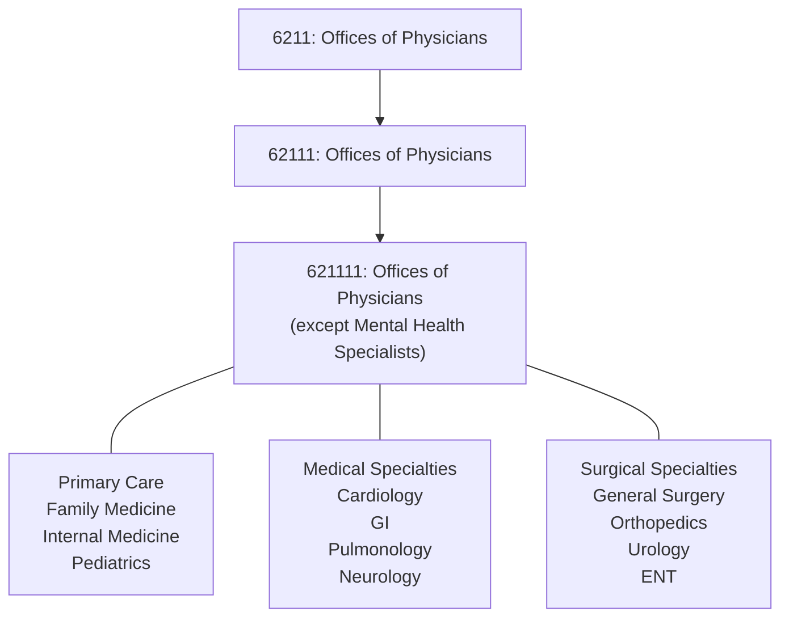
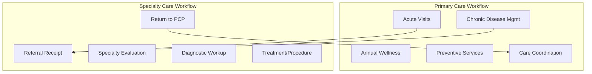

# Offices of Physicians (except Mental Health Specialists)

> This U.S. industry comprises establishments of health practitioners having the degree of M.D. (Doctor of Medicine) or D.O. (Doctor of Osteopathic Medicine) primarily engaged in the independent practice of general or specialized medicine (except psychiatry or psychoanalysis) or surgery.

## Overview

This is the largest national industry within healthcare, encompassing all physician practices except those focused on psychiatric care. These practitioners operate private or group practices in their own offices (e.g., centers, clinics) or in the facilities of others, such as hospitals or HMO medical centers.

The industry includes both primary care specialties (family medicine, internal medicine, pediatrics, OB/GYN) and all other medical and surgical specialties including cardiology, orthopedics, gastroenterology, oncology, neurology, dermatology, and all surgical subspecialties.

## Industry Hierarchy

## Key Statistics

| Metric | Value |
|--------|-------|
| NAICS Code | 621111 |
| Level | National Industry (6-digit) |
| Parent Industry | [Offices of Physicians](../) (6211) |
| Subsector | [Ambulatory Health Care](../../) (621) |

## Specialty Distribution

### Primary Care Specialties
| Specialty | Description | Common Settings |
|-----------|-------------|-----------------|
| Family Medicine | Comprehensive care across lifespan | Solo, group, FQHC |
| Internal Medicine | Adult primary care | Group practice, hospital-based |
| Pediatrics | Infant through adolescent care | Pediatric groups, health systems |
| OB/GYN | Women's health and obstetrics | OB groups, hospital-affiliated |

### Medical Specialties
| Specialty | Focus Area | Typical Referral Source |
|-----------|------------|------------------------|
| Cardiology | Heart and vascular diseases | PCP, ED, hospitalists |
| Gastroenterology | Digestive system disorders | PCP, surgeons |
| Pulmonology | Respiratory conditions | PCP, hospitalists |
| Endocrinology | Hormonal disorders, diabetes | PCP referral |
| Nephrology | Kidney diseases | PCP, hospitalists |
| Rheumatology | Autoimmune and joint diseases | PCP referral |
| Oncology | Cancer diagnosis and treatment | Multi-disciplinary teams |
| Neurology | Nervous system disorders | PCP, ED |
| Dermatology | Skin conditions | PCP, self-referral |
| Allergy/Immunology | Allergic conditions | PCP, self-referral |

### Surgical Specialties
| Specialty | Procedures | Care Settings |
|-----------|------------|---------------|
| General Surgery | Abdominal, trauma, breast | Hospital, ASC |
| Orthopedic Surgery | Musculoskeletal procedures | ASC, hospital |
| Cardiovascular Surgery | Heart and vascular surgery | Hospital |
| Neurosurgery | Brain and spine surgery | Hospital |
| Plastic Surgery | Reconstructive, cosmetic | ASC, office |
| Urology | Urinary tract surgery | ASC, hospital |
| Otolaryngology (ENT) | Head and neck surgery | ASC, office |
| Ophthalmology | Eye surgery and care | ASC, office |

## Core Business Processes

## Regulatory Environment

### CMS Requirements
- **Medicare PECOS Enrollment**: Provider enrollment required for Medicare billing
- **MIPS Participation**: Quality, improvement activities, promoting interoperability, cost
- **Medicare Advantage**: Contracts with MA plans, quality bonuses
- **Specialty-Specific**: Various coverage determination rules

### State Medical Board
- **Initial Licensure**: Medical degree, residency, examination
- **Maintenance of Licensure**: CME requirements, periodic renewal
- **Disciplinary Oversight**: Complaint investigation, sanctions
- **Interstate Compact**: IMLC for multi-state licensure

### Specialty Board Certification
- **ABMS Boards**: 24 member boards for specialty certification
- **MOC Requirements**: Maintenance of Certification requirements
- **Subspecialty Certification**: Additional fellowship-based certifications

## Technology & EHR

### EHR Adoption
Physician offices have achieved near-universal EHR adoption following HITECH incentives:

| Component | Function | Key Requirements |
|-----------|----------|------------------|
| Clinical Documentation | Progress notes, assessments | Structured data, templates |
| Order Entry (CPOE) | Labs, imaging, referrals | Drug-drug interaction alerts |
| E-Prescribing | Medication management | EPCS for controlled substances |
| Results Management | Lab and imaging review | Auto-notification, trending |
| Patient Portal | Patient engagement | Information blocking compliance |

### Clinical Decision Support
- Drug-drug interaction checking
- Clinical guideline alerts
- Quality measure reminders
- Preventive care notifications
- Risk stratification tools

### Interoperability Requirements
- **Information Blocking**: Prohibited practices under 21st Century Cures
- **FHIR APIs**: Patient access API requirements
- **TEFCA**: Trusted Exchange Framework participation
- **ADT Notifications**: Care transition alerts

## Care Delivery Models

### Traditional Fee-for-Service
- Payment per service rendered
- Volume-based incentives
- CPT/HCPCS coding for all services
- RVU-based Medicare payment

### Value-Based Care Models
| Model | Structure | Risk Level |
|-------|-----------|------------|
| PCMH | Care coordination payments | Low |
| Shared Savings ACO | Upside-only shared savings | Low-Medium |
| Full-Risk ACO | Two-sided risk contracts | Medium-High |
| Direct Contracting | Capitated primary care | High |
| Bundled Payments | Episode-based payment | Medium |

### Practice Consolidation Trends
- Health system employment
- Private equity acquisition
- Large group formation
- Management services organizations (MSOs)
- Virtual network participation

## Cross-References

**Excluded from this industry:**
- Psychiatric and psychoanalysis practices - see [621112 Offices of Physicians, Mental Health Specialists](./PsychiatristOffices)
- Freestanding surgical centers - see [621493 Freestanding Ambulatory Surgical Centers](../OutpatientCareCenters/SurgicalCenters)

---

*Source: NAICS 621111 - Offices of Physicians (except Mental Health Specialists)*
