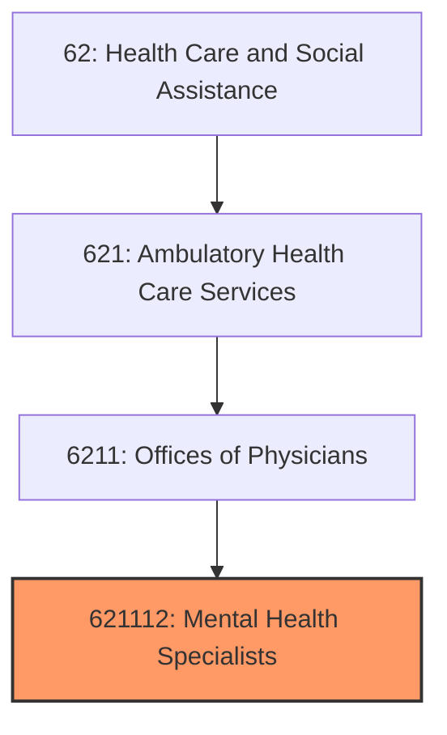
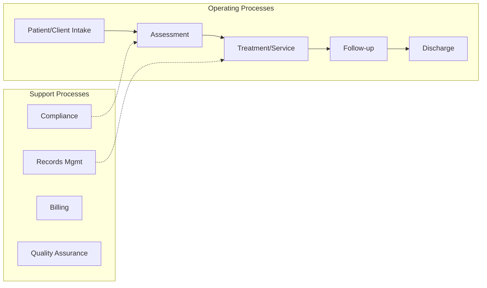

# Mental Health Specialists

> This U.

## Overview

Mental Health Specialists represents a specialized segment within the Health Care and Social Assistance sector (NAICS 62).

This U.S. industry comprises establishments of health practitioners having the degree of M.D. (Doctor of Medicine) or D.O. (Doctor of Osteopathic Medicine) primarily engaged in the independent practice of psychiatry or psychoanalysis. These practitioners operate private or group practices in their own offices (e.g., centers, clinics) or in the facilities of others, such as hospitals or HMO medical centers. Cross-References.

## Industry Hierarchy

## Key Statistics

| Metric | Value |
|--------|-------|
| NAICS Code | 621112 |
| Level | National Industry |
| Child Industries | 0 |

## Related Occupations

See the [occupations directory](/occupations) for roles commonly found in this industry.

## Core Business Processes

## Industry Value Chain

```mermaid
graph LR
    subgraph Inputs["Inputs"]
        I1["Medical Supplies"]
        I2["Equipment"]
        I3["Professionals"]
    end

    subgraph Primary["Primary Activities"]
        A1["Inbound Logistics"]
        A2["Core Operations"]
        A3["Quality Assurance"]
        A4["Outbound/Delivery"]
    end

    subgraph Outputs["Products/Services"]
        O1["Patient Care"]
        O2["Diagnostics"]
        O3["Treatment"]
    end

    subgraph Customers["Markets"]
        C1["Patients"]
        C2["Insurers"]
        C3["Government"]
        C4["Employers"]
    end

    Inputs --> Primary --> Outputs --> Customers
```

---

*Source: NAICS 621112 - Mental Health Specialists*
