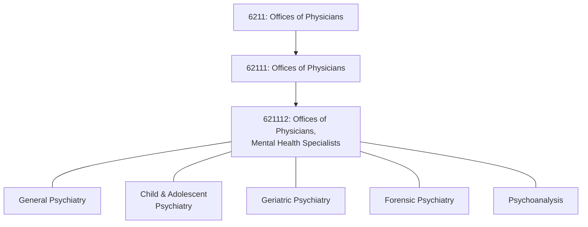
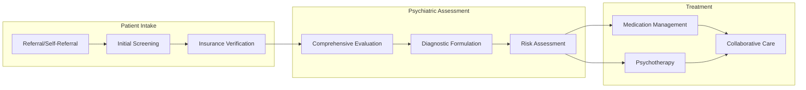

# Offices of Physicians, Mental Health Specialists

> This U.S. industry comprises establishments of health practitioners having the degree of M.D. (Doctor of Medicine) or D.O. (Doctor of Osteopathic Medicine) primarily engaged in the independent practice of psychiatry or psychoanalysis.

## Overview

This national industry includes physicians specializing in the diagnosis and treatment of mental, emotional, and behavioral disorders. These practitioners operate private or group practices in their own offices (e.g., centers, clinics) or in the facilities of others, such as hospitals or HMO medical centers.

Psychiatrists are uniquely positioned in mental health care as they can prescribe medications, distinguish between psychiatric and medical conditions, and provide a full range of treatment modalities including psychotherapy, medication management, and interventional psychiatry.

## Industry Hierarchy

## Key Statistics

| Metric | Value |
|--------|-------|
| NAICS Code | 621112 |
| Level | National Industry (6-digit) |
| Parent Industry | [Offices of Physicians](../) (6211) |
| Subsector | [Ambulatory Health Care](../../) (621) |

## Psychiatric Subspecialties

| Subspecialty | Patient Population | Focus Areas |
|--------------|-------------------|-------------|
| General Psychiatry | Adults | Depression, anxiety, bipolar, schizophrenia |
| Child & Adolescent | Ages 0-18 | ADHD, autism, behavioral disorders, trauma |
| Geriatric Psychiatry | Older adults | Dementia-related behaviors, late-life depression |
| Addiction Psychiatry | All ages | Substance use disorders, dual diagnosis |
| Consultation-Liaison | Medical patients | Psychiatric comorbidity in medical settings |
| Forensic Psychiatry | Legal system | Competency evaluations, criminal assessments |
| Psychosomatic Medicine | Complex medical | Mind-body conditions |

## Core Business Processes

### Initial Psychiatric Evaluation
Comprehensive assessment including psychiatric history, mental status examination, and treatment planning.

**Key Components:**
- Chief complaint and history of present illness
- Past psychiatric and medical history
- Medication history and response
- Family and social history
- Mental status examination
- Risk assessment (suicide, homicide, self-harm)
- Diagnostic formulation using DSM-5
- Treatment recommendations

### Medication Management
Ongoing pharmacotherapy for psychiatric conditions with monitoring and adjustment.

**Key Activities:**
- Medication selection and prescribing
- Side effect monitoring and management
- Therapeutic drug monitoring (lithium, clozapine)
- Prior authorization management
- Coordination with primary care

## Regulatory Environment

### Licensure and Certification
- **State Medical License**: Required for practice
- **Board Certification**: American Board of Psychiatry and Neurology (ABPN)
- **Subspecialty Certification**: Child/adolescent, addiction, forensic, geriatric
- **DEA Registration**: Required for controlled substance prescribing

### Mental Health Parity
- **MHPAEA**: Mental Health Parity and Addiction Equity Act
- **ACA Requirements**: Essential health benefits inclusion
- **State Parity Laws**: Additional state-specific requirements
- **Enforcement**: CMS and state insurance commissioner oversight

### Privacy and Documentation
- **HIPAA**: Standard health information protections
- **42 CFR Part 2**: Special protections for substance use records
- **State Mental Health Laws**: Involuntary commitment procedures
- **Consent Requirements**: Specific consent for psychotherapy notes

### Prescribing Regulations
- **Controlled Substances**: DEA Schedule II-V prescribing rules
- **State PDMP**: Prescription drug monitoring program requirements
- **Buprenorphine**: X-waiver requirements (now eliminated for standard treatment)
- **Clozapine REMS**: Clozapine Risk Evaluation and Mitigation Strategy

## Technology & EHR

### Psychiatric-Specific EHR Features
| Feature | Purpose | Regulatory Driver |
|---------|---------|-------------------|
| Psychotherapy Notes | Separate documentation | HIPAA special protection |
| Risk Documentation | Suicide/violence assessment | Standard of care |
| Medication Tracking | Psychiatric medications | Safety monitoring |
| Rating Scales | PHQ-9, GAD-7, etc. | Quality measurement |
| Telehealth Integration | Virtual psychiatry | Expanded access |

### Telepsychiatry
Psychiatric care has been a leader in telehealth adoption:
- Video-based psychiatric evaluations
- Remote medication management
- Interstate practice via compact or state-specific licenses
- Integration with primary care (collaborative care model)
- School-based telehealth services

### Clinical Decision Support
- Drug-drug interaction alerts (psychiatric medications)
- Metabolic monitoring reminders (atypical antipsychotics)
- Controlled substance monitoring alerts
- Suicide risk assessment tools
- Treatment algorithm guidance

## Care Delivery Models

### Traditional Office-Based Care
- Fee-for-service psychiatric evaluations
- Medication management visits
- Individual psychotherapy (if provided)
- Group therapy sessions

### Collaborative Care Model
Integrated behavioral health in primary care settings:
- Psychiatrist serves as consultant
- Care manager provides patient follow-up
- Primary care prescribes under consultation
- Billable under CoCM codes (99492-99494)

### Telepsychiatry Models
| Model | Setting | Patient Access |
|-------|---------|----------------|
| Hub-and-Spoke | Remote clinics | Rural access |
| Direct-to-Patient | Home-based | Convenience |
| Inpatient Consultation | Hospital | 24/7 coverage |
| Emergency Services | ED | Crisis evaluation |

### Value-Based Arrangements
- Episode-based payments for depression treatment
- Behavioral health integration in ACOs
- Mental health carve-out contracts
- Per-member-per-month behavioral health

## Cross-References

**Distinct from:**
- Non-physician mental health practitioners - see [621330 Offices of Mental Health Practitioners](../OtherHealthPractitioners/MentalHealthPractitioners)
- Outpatient mental health centers - see [621420 Outpatient Mental Health and Substance Abuse Centers](../OutpatientCareCenters/MentalHealthCenters)
- Psychiatric hospitals - see [622210 Psychiatric and Substance Abuse Hospitals](../../Hospitals/PsychiatricHospitals/)

---

*Source: NAICS 621112 - Offices of Physicians, Mental Health Specialists*
