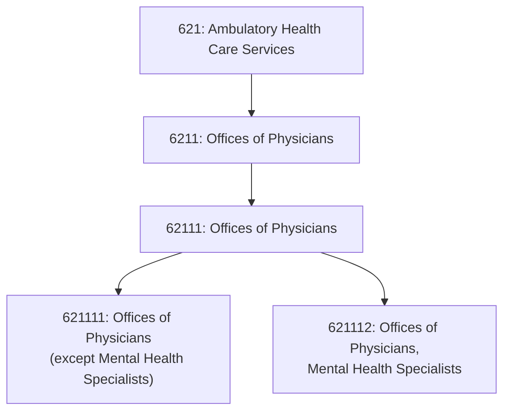
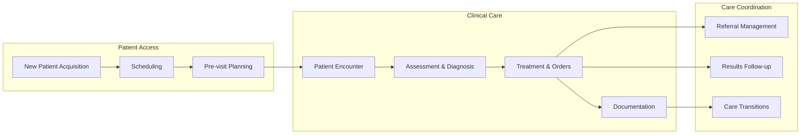

# Offices of Physicians

> This industry group comprises establishments of health practitioners having the degree of M.D. (Doctor of Medicine) or D.O. (Doctor of Osteopathic Medicine) primarily engaged in the independent practice of general or specialized medicine or surgery.

## Overview

Physician offices represent the primary point of entry into the healthcare system for most patients. These practitioners operate private or group practices in their own offices (e.g., centers, clinics) or in the facilities of others, such as hospitals or HMO medical centers.

The industry includes both primary care physicians (family medicine, internal medicine, pediatrics) and specialists across all medical and surgical disciplines. Practice models range from solo practitioners to large multi-specialty group practices with hundreds of physicians.

## Industry Hierarchy

## Key Statistics

| Metric | Value |
|--------|-------|
| NAICS Code | 6211 |
| Level | Industry Group |
| Parent Subsector | [Ambulatory Health Care](../) |
| National Industries | 2 |

## National Industries

| Industry | Code | Description |
|----------|------|-------------|
| [Offices of Physicians (except Mental Health)](/industries/Healthcare/AmbulatoryHealthCare/PhysicianOffices/GeneralPhysicians) | 621111 | General and specialty medical/surgical practice |
| [Offices of Physicians, Mental Health Specialists](/industries/Healthcare/AmbulatoryHealthCare/PhysicianOffices/PsychiatristOffices) | 621112 | Psychiatry and psychoanalysis practice |

## Related Occupations

- [Family Medicine Physicians](/occupations/FamilyMedicinePhysicians) - Primary care
- [Internal Medicine Physicians](/occupations/InternistsGeneralInternal) - Adult primary care
- [Pediatricians](/occupations/Pediatricians) - Children's health
- [Surgeons](/occupations/Surgeons) - Surgical specialties
- [Cardiologists](/occupations/Cardiologists) - Heart and vascular
- [Orthopedic Surgeons](/occupations/OrthopedicSurgeons) - Musculoskeletal
- [Dermatologists](/occupations/Dermatologists) - Skin conditions
- [Psychiatrists](/occupations/Psychiatrists) - Mental health

## Core Business Processes

## Regulatory Environment

### Licensure Requirements
- **State Medical Board License**: Required for practice in each state
- **Board Certification**: Specialty certification (ABMS, AOA)
- **DEA Registration**: Required for controlled substance prescribing
- **Hospital Privileges**: For procedures requiring hospital access
- **State Specific**: Some states require additional certifications

### Medicare Participation
- **PECOS Enrollment**: Provider Enrollment, Chain, and Ownership System
- **Opt-In/Out Options**: Participating, non-participating, or opted-out
- **MIPS Reporting**: Quality, improvement activities, promoting interoperability, cost
- **APM Participation**: ACOs, bundled payments, PCF

### Compliance Requirements
- **HIPAA**: Privacy and security of health information
- **Stark Law**: Physician self-referral prohibitions
- **Anti-Kickback Statute**: Prohibition on remuneration for referrals
- **False Claims Act**: Accurate billing and coding
- **EMTALA**: Emergency treatment obligations (for on-call duties)

## Technology & EHR

### EHR Requirements
- **ONC Certification**: Certified EHR Technology (CEHRT)
- **E-Prescribing**: EPCS for controlled substances
- **Interoperability**: Information blocking compliance
- **Patient Access**: API-based access to health records

### Common EHR Platforms
| Platform | Market Segment | Key Features |
|----------|---------------|--------------|
| Epic | Large practices, health systems | Comprehensive, integrated |
| athenahealth | Small-medium practices | Cloud-based, RCM services |
| eClinicalWorks | Multi-specialty groups | Customizable workflows |
| NextGen | Specialty practices | Specialty-specific content |
| Allscripts | Various sizes | Interoperability focus |

### Practice Analytics
- Provider productivity (wRVU tracking)
- Quality measure performance
- Patient satisfaction scores
- Financial performance dashboards
- Population health metrics

## Care Delivery Models

### Traditional Practice Models
- **Solo Practice**: Single physician, full autonomy
- **Single-Specialty Group**: Multiple physicians, same specialty
- **Multi-Specialty Group**: Multiple specialties under one organization
- **Academic Practice**: Faculty practice plans at medical schools

### Emerging Models
- **Employed Physician**: Hospital or health system employment
- **Direct Primary Care**: Membership-based, no insurance billing
- **Concierge Medicine**: Enhanced access and services
- **Retail Clinics**: Limited-scope care in retail settings
- **Virtual-First Care**: Telehealth-primary delivery

---

*Source: NAICS 6211 - Offices of Physicians*
