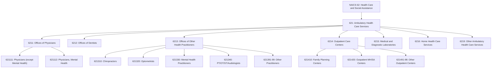
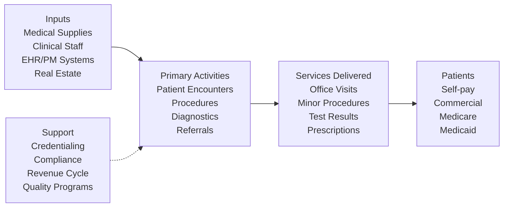

# Ambulatory Health Care Services

> Industries in this subsector provide health care services directly or indirectly to ambulatory patients and do not usually provide inpatient services.

## Overview

Health practitioners in the Ambulatory Health Care Services subsector provide outpatient services, with the facilities and equipment not usually being the most significant part of the production process. This subsector encompasses the broadest range of healthcare delivery settings, from solo physician practices to multi-specialty group practices, urgent care centers, and diagnostic facilities.

Ambulatory care represents the largest component of healthcare delivery in the United States, with the majority of patient encounters occurring in outpatient settings. The shift from inpatient to outpatient care has been driven by advances in medical technology, payment incentives, and patient preference for less invasive treatment options.

## Industry Hierarchy

## Key Statistics

| Metric | Value |
|--------|-------|
| NAICS Code | 621 |
| Level | Subsector |
| Parent Sector | [Health Care and Social Assistance](../) |
| Industry Groups | 7 |
| National Industries | 22 |

## Sub-Industries

| Industry Group | Code | Description |
|----------------|------|-------------|
| [Offices of Physicians](./PhysicianOffices/) | 6211 | Medical and surgical practice by M.D. and D.O. practitioners |
| [Offices of Dentists](./DentalOffices/) | 6212 | General and specialized dental practice |
| [Offices of Other Health Practitioners](./OtherHealthPractitioners/) | 6213 | Chiropractic, optometry, mental health, PT/OT/ST services |
| [Outpatient Care Centers](./OutpatientCareCenters/) | 6214 | Organized outpatient facilities with medical staff |
| [Medical and Diagnostic Laboratories](./MedicalLaboratories/) | 6215 | Clinical testing and diagnostic imaging services |
| [Home Health Care Services](./HomeHealthCare/) | 6216 | Skilled nursing and therapy services in the home |
| [Other Ambulatory Health Care Services](./OtherAmbulatory/) | 6219 | Ambulance services, blood banks, and other ambulatory care |

## Related Occupations

- [Physicians and Surgeons](/occupations/PhysiciansAndSurgeons) - Medical diagnosis and treatment
- [Dentists](/occupations/Dentists) - Oral health care
- [Nurse Practitioners](/occupations/NursePractitioners) - Advanced practice nursing
- [Physician Assistants](/occupations/PhysicianAssistants) - Physician extender services
- [Medical Assistants](/occupations/MedicalAssistants) - Clinical and administrative support
- [Phlebotomists](/occupations/Phlebotomists) - Blood collection services
- [Physical Therapists](/occupations/PhysicalTherapists) - Rehabilitation services

## Core Business Processes

### Practice Management

Managing the operational aspects of ambulatory care delivery including scheduling, patient flow, provider productivity, and resource utilization.

**Key Activities:**
- Patient scheduling and appointment management
- Provider template optimization
- Patient flow and wait time management
- Staff scheduling and resource allocation
- Practice analytics and performance monitoring

### Clinical Workflow Management

Coordinating clinical activities from patient arrival through encounter completion.

**Key Activities:**
- Patient rooming and vital signs documentation
- Care team coordination (MA, RN, Provider)
- Order management and results tracking
- Prescription management and e-prescribing
- Referral coordination and tracking

## Industry Value Chain

## Regulatory Environment

### Federal Requirements
- **Medicare Enrollment**: PECOS registration, NPI requirements
- **CLIA**: Clinical Laboratory Improvement Amendments for laboratory testing
- **DEA Registration**: Controlled substance prescribing authority
- **Meaningful Use/MIPS**: Quality reporting and EHR incentives
- **Stark Law/Anti-Kickback**: Self-referral and kickback prohibitions

### State Licensing
- **Medical Board Licensure**: Physician and practitioner licensing
- **Facility Licensure**: Ambulatory surgery centers, urgent care facilities
- **Corporate Practice of Medicine**: State restrictions on practice ownership
- **Scope of Practice**: NP/PA supervision requirements vary by state

### Accreditation
- **AAAHC**: Accreditation Association for Ambulatory Health Care
- **AAASF**: American Association for Accreditation of Ambulatory Surgery Facilities
- **NCQA PCMH**: Patient-Centered Medical Home recognition
- **Specialty Board Certification**: Specialty-specific practice requirements

## Technology & Innovation

### Practice Technology Stack
- **EHR Systems**: Epic, Cerner, athenahealth, eClinicalWorks, NextGen
- **Practice Management**: Scheduling, billing, patient portal
- **Revenue Cycle**: Claims clearinghouse, denial management
- **Patient Engagement**: Appointment reminders, patient portal, surveys

### Emerging Technologies
- **Telehealth Platforms**: Synchronous and asynchronous virtual care
- **Remote Patient Monitoring**: Chronic disease management devices
- **AI-Assisted Diagnostics**: Clinical decision support, imaging analysis
- **Digital Therapeutics**: Software-based treatment interventions
- **Automated Check-in**: Kiosks, mobile check-in, digital forms

### Care Delivery Models
| Model | Description | Technology Requirements |
|-------|-------------|------------------------|
| Traditional FFS | Per-visit payment | Basic EHR/PM |
| PCMH | Care coordination focus | Registries, care management |
| Direct Primary Care | Membership-based | Simplified billing |
| Concierge Medicine | Enhanced access | Communication tools |
| Value-Based Care | Quality-linked payment | Analytics, population health |

## Payment and Reimbursement

### Medicare Payment Systems
- **MPFS**: Medicare Physician Fee Schedule (RVU-based)
- **APCs**: Ambulatory Payment Classifications (for ASCs)
- **MIPS**: Merit-based Incentive Payment System adjustments
- **APMs**: Advanced Alternative Payment Models

### Commercial Payers
- Fee-for-service contracts with negotiated rates
- Value-based arrangements with quality incentives
- Capitated contracts for defined populations
- Bundled payment arrangements

---

*Source: NAICS 621 - Ambulatory Health Care Services*
