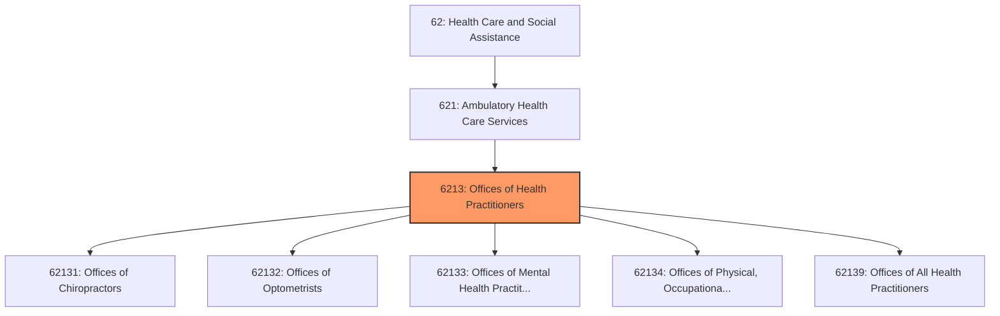
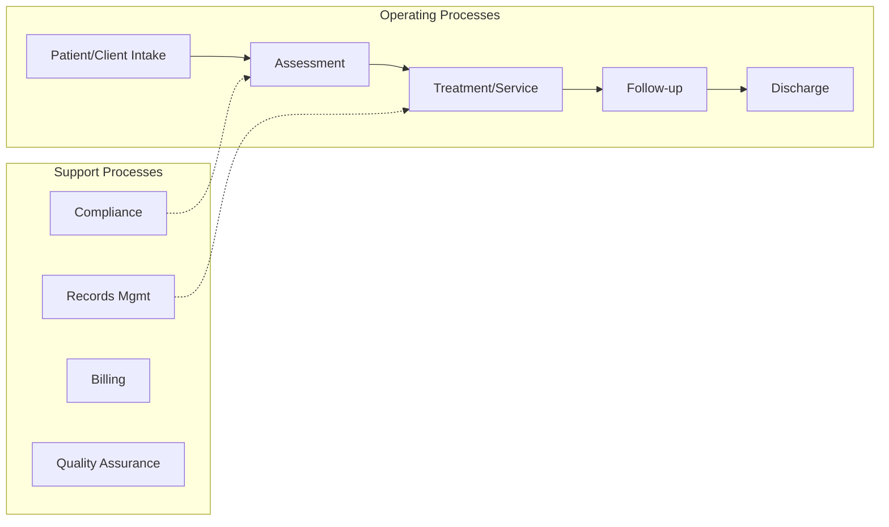

# Offices of Health Practitioners

> This industry group comprises establishments of independent health practitioners (except physicians and dentists).

## Overview

Offices of Health Practitioners represents an important category within the Health Care and Social Assistance sector (NAICS 62). This industry group encompasses establishments primarily engaged in offices of health practitioners.

This industry group comprises establishments of independent health practitioners (except physicians and dentists).

## Industry Hierarchy

## Key Statistics

| Metric | Value |
|--------|-------|
| NAICS Code | 6213 |
| Level | Industry Group |
| Parent | [Ambulatory Health Care Services](../) |
| Child Industries | 5 |

## Sub-Industries

| Industry | Code | Description |
|----------|------|-------------|
| [Offices of Chiropractors](./OfficesOfChiropractors/) | 62131 | See industry description for 621310 |
| [Offices of Optometrists](./OfficesOfOptometrists/) | 62132 | See industry description for 621320 |
| [Offices of Mental Health Practitioners](./OfficesOfMentalHealthPractitioners/) | 62133 | See industry description for 621330 |
| [Offices of Physical, Occupational Therapists](./OfficesOfPhysicalOccupationalTherapists/) | 62134 | See industry description for 621340 |
| [Offices of All Health Practitioners](./OfficesOfAllHealthPractitioners/) | 62139 | This industry comprises establishments of independent health practitioners (exce |

## Core Business Processes

## Industry Value Chain

---

*Source: NAICS 6213 - Offices of Health Practitioners*
