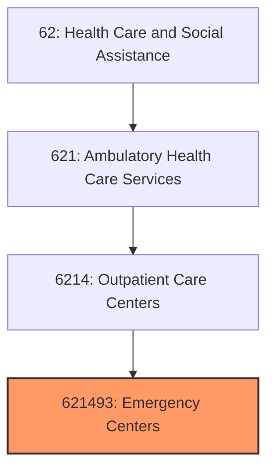
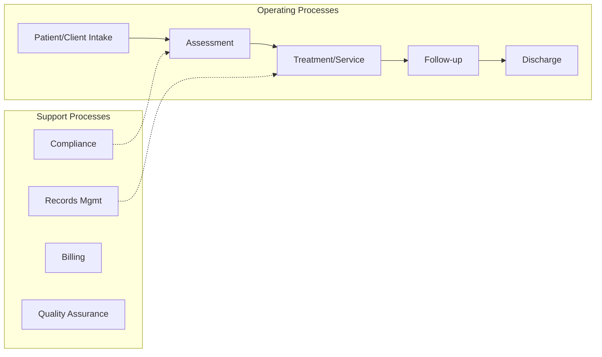

# Emergency Centers

> This U.

## Overview

Emergency Centers represents a specialized segment within the Health Care and Social Assistance sector (NAICS 62).

This U.S. industry comprises establishments with physicians and other medical staff primarily engaged in (1) providing surgical services (e.g., orthoscopic and cataract surgery) on an outpatient basis or (2) providing emergency care services (e.g., setting broken bones, treating lacerations, or tending to patients suffering injuries as a result of accidents, trauma, or medical conditions necessitating immediate medical care) on an outpatient basis. Outpatient surgical establishments have specialized facilities, such as operating and recovery rooms, and specialized equipment, such as anesthetic or X-ray equipment. Illustrative Examples: Freestanding ambulatory surgical centers and clinics Freestanding emergency medical centers and clinics Freestanding trauma centers (except hospitals) Urgent medical care centers and clinics (except hospitals) Cross-References.

## Industry Hierarchy

## Key Statistics

| Metric | Value |
|--------|-------|
| NAICS Code | 621493 |
| Level | National Industry |
| Child Industries | 0 |

## Related Occupations

See the [occupations directory](/occupations) for roles commonly found in this industry.

## Core Business Processes

## Industry Value Chain

```mermaid
graph LR
    subgraph Inputs["Inputs"]
        I1["Medical Supplies"]
        I2["Equipment"]
        I3["Professionals"]
    end

    subgraph Primary["Primary Activities"]
        A1["Inbound Logistics"]
        A2["Core Operations"]
        A3["Quality Assurance"]
        A4["Outbound/Delivery"]
    end

    subgraph Outputs["Products/Services"]
        O1["Patient Care"]
        O2["Diagnostics"]
        O3["Treatment"]
    end

    subgraph Customers["Markets"]
        C1["Patients"]
        C2["Insurers"]
        C3["Government"]
        C4["Employers"]
    end

    Inputs --> Primary --> Outputs --> Customers
```

---

*Source: NAICS 621493 - Emergency Centers*
