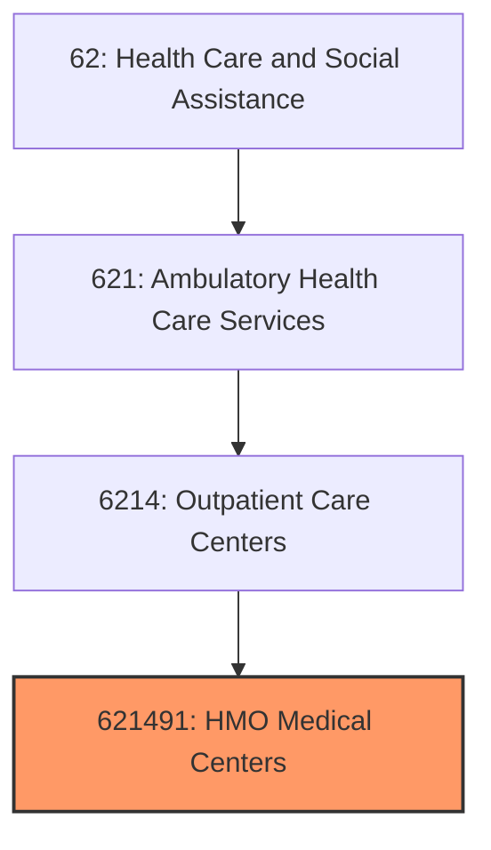
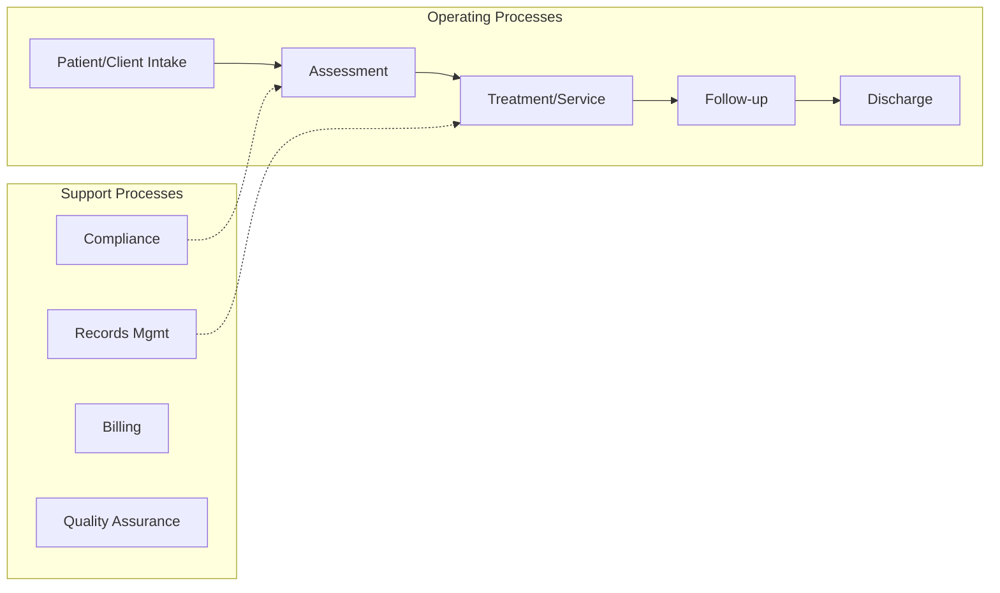

# HMO Medical Centers

> This U.

## Overview

HMO Medical Centers represents a specialized segment within the Health Care and Social Assistance sector (NAICS 62).

This U.S. industry comprises establishments with physicians and other medical staff primarily engaged in providing a range of outpatient medical services to the health maintenance organization (HMO) subscribers with a focus generally on primary health care. These establishments are owned by the HMO. Included in this industry are HMO establishments that both provide health care services and underwrite health and medical insurance policies. Cross-References.

## Industry Hierarchy

## Key Statistics

| Metric | Value |
|--------|-------|
| NAICS Code | 621491 |
| Level | National Industry |
| Child Industries | 0 |

## Related Occupations

- [Medical and Health Services Managers](/occupations/Management/MedicalAndHealthServicesManagers) - Plan and direct health services
- [Registered Nurses](/occupations/HealthcarePractitioners/RegisteredNurses) - Provide and coordinate patient care
- [Physicians](/occupations/PhysiciansAllOther) - Diagnose and treat illnesses
- [Pharmacists](/occupations/HealthcarePractitioners/Pharmacists) - Dispense medications and advise patients

## Core Business Processes

## Industry Value Chain

```mermaid
graph LR
    subgraph Inputs["Inputs"]
        I1["Medical Supplies"]
        I2["Equipment"]
        I3["Professionals"]
    end

    subgraph Primary["Primary Activities"]
        A1["Inbound Logistics"]
        A2["Core Operations"]
        A3["Quality Assurance"]
        A4["Outbound/Delivery"]
    end

    subgraph Outputs["Products/Services"]
        O1["Patient Care"]
        O2["Diagnostics"]
        O3["Treatment"]
    end

    subgraph Customers["Markets"]
        C1["Patients"]
        C2["Insurers"]
        C3["Government"]
        C4["Employers"]
    end

    Inputs --> Primary --> Outputs --> Customers
```

## Regulatory Environment

- **CMS** (Centers for Medicare & Medicaid Services) - Administers healthcare reimbursement programs
- **FDA** (Food and Drug Administration) - Regulates medical devices and pharmaceuticals
- **HIPAA** (Health Insurance Portability and Accountability Act) - Protects patient data privacy
- **State Health Departments** - License healthcare facilities and practitioners

## Technology & Innovation

- **Telehealth** - Virtual consultations, remote monitoring, and digital therapeutics
- **AI Diagnostics** - Machine learning-assisted imaging, pathology, and clinical decision support
- **Electronic Health Records** - Interoperable patient data systems and health information exchanges
- **Wearable Health Devices** - Continuous monitoring sensors, smartwatches, and biosensors

## Industry Outlook

The healthcare sector continues to expand with aging populations, chronic disease management, and technological innovation driving demand. Telehealth has become a permanent feature of care delivery, while AI-assisted diagnostics and personalized medicine advance clinical outcomes. Value-based care models and interoperability standards are reshaping reimbursement and health information systems.

---

*Source: NAICS 621491 - HMO Medical Centers*
