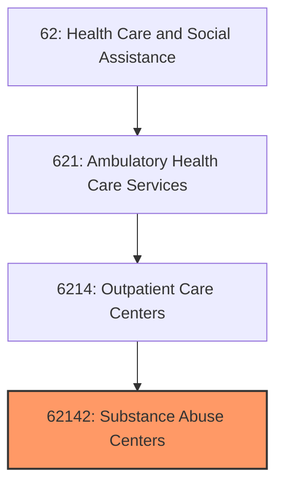
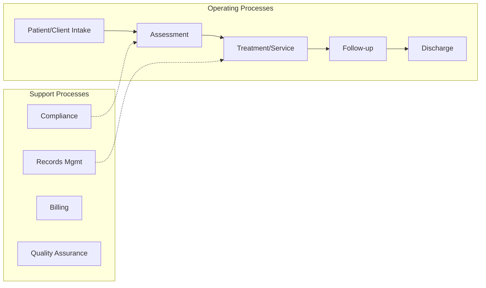

# Substance Abuse Centers

> See industry description for 621420.

## Overview

Substance Abuse Centers represents an important category within the Health Care and Social Assistance sector (NAICS 62).

## Industry Hierarchy

## Key Statistics

| Metric | Value |
|--------|-------|
| NAICS Code | 62142 |
| Level | Industry |
| Parent | [Outpatient Care Centers](../) |
| Child Industries | 0 |

## Related Occupations

See the [occupations directory](/occupations) for roles commonly found in this industry.

## Core Business Processes

## Industry Value Chain

```mermaid
graph LR
    subgraph Inputs["Inputs"]
        I1["Medical Supplies"]
        I2["Equipment"]
        I3["Professionals"]
    end

    subgraph Primary["Primary Activities"]
        A1["Inbound Logistics"]
        A2["Core Operations"]
        A3["Quality Assurance"]
        A4["Outbound/Delivery"]
    end

    subgraph Outputs["Products/Services"]
        O1["Patient Care"]
        O2["Diagnostics"]
        O3["Treatment"]
    end

    subgraph Customers["Markets"]
        C1["Patients"]
        C2["Insurers"]
        C3["Government"]
        C4["Employers"]
    end

    Inputs --> Primary --> Outputs --> Customers
```

---

*Source: NAICS 62142 - Substance Abuse Centers*
