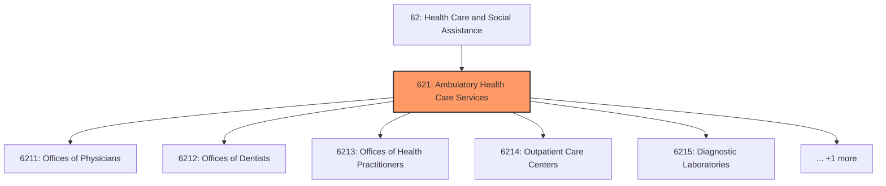
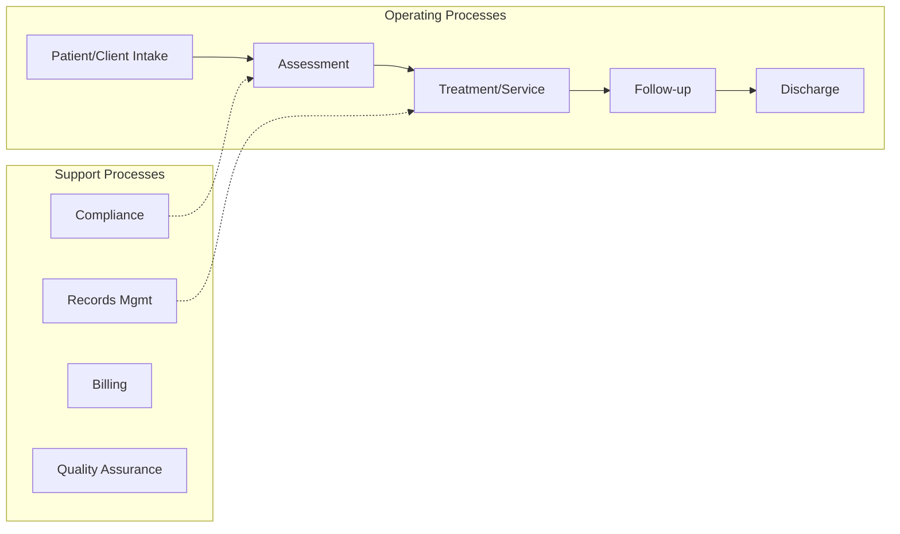

# Ambulatory Health Care Services

> Industries in the Ambulatory Health Care Services subsector provide health care services directly or indirectly to ambulatory patients and do not usually provide inpatient services.

## Overview

Ambulatory Health Care Services represents an important category within the Health Care and Social Assistance sector (NAICS 62). This subsector encompasses establishments primarily engaged in ambulatory health care services.

Industries in the Ambulatory Health Care Services subsector provide health care services directly or indirectly to ambulatory patients and do not usually provide inpatient services. Health practitioners in this subsector provide outpatient services, with the facilities and equipment not usually being the most significant part of the production process.

## Industry Hierarchy

## Key Statistics

| Metric | Value |
|--------|-------|
| NAICS Code | 621 |
| Level | Subsector |
| Parent | [Social Assistance](../) |
| Child Industries | 6 |

## Sub-Industries

| Industry | Code | Description |
|----------|------|-------------|
| [Offices of Physicians](./OfficesOfPhysicians/) | 6211 | Offices of Physicians |
| [Offices of Dentists](./OfficesOfDentists/) | 6212 | Offices of Dentists |
| [Offices of Health Practitioners](./OfficesOfHealthPractitioners/) | 6213 | This industry group comprises establishments of independent health practitioners |
| [Outpatient Care Centers](./OutpatientCareCenters/) | 6214 | This industry group comprises establishments with medical staff primarily engage |
| [Diagnostic Laboratories](./DiagnosticLaboratories/) | 6215 | Diagnostic Laboratories |
| [Home Health Care Services](./HomeHealthCareServices/) | 6216 | Home Health Care Services |

## Core Business Processes

## Industry Value Chain

```mermaid
graph LR
    subgraph Inputs["Inputs"]
        I1["Medical Supplies"]
        I2["Equipment"]
        I3["Professionals"]
    end

    subgraph Primary["Primary Activities"]
        A1["Inbound Logistics"]
        A2["Core Operations"]
        A3["Quality Assurance"]
        A4["Outbound/Delivery"]
    end

    subgraph Outputs["Products/Services"]
        O1["Patient Care"]
        O2["Diagnostics"]
        O3["Treatment"]
    end

    subgraph Customers["Markets"]
        C1["Patients"]
        C2["Insurers"]
        C3["Government"]
        C4["Employers"]
    end

    Inputs --> Primary --> Outputs --> Customers
```

## Market Context

Healthcare delivers essential medical services, with digital health, value-based care, and population health management transforming care delivery models.

| Aspect | Details |
|--------|---------|
| Industry Sector | Healthcare |
| NAICS/SIC Code | 621 |
| Market Segment | Ambulatory Health Care Services |

## Key Business Processes

- Patient registration and intake
- Clinical care delivery
- Billing and revenue cycle
- Quality and compliance
- Care coordination

## Common Occupations

- [Healthcare Managers](/occupations/Management/MedicalAndHealthServicesManagers)
- [Registered Nurses](/occupations/HealthcarePractitioners/RegisteredNurses)
- [Physicians](/occupations/HealthcarePractitioners/PhysiciansAndSurgeons)
- [Medical Assistants](/occupations/HealthcareSupport/MedicalAssistants)

## Regulations and Standards

- HIPAA privacy and security rules
- CMS regulations
- Joint Commission accreditation
- State licensing requirements
- FDA medical device regulations

## Technology and Tools

- Electronic Health Records (EHR)
- Telemedicine platforms
- Medical imaging systems
- Practice management software
- Patient portal systems

## Industry Trends

- Digital transformation and automation adoption
- Sustainability and environmental compliance focus
- Workforce development and skills training
- Supply chain resilience and optimization
- Customer experience enhancement

---

*Source: NAICS 621 - Ambulatory Health Care Services*
