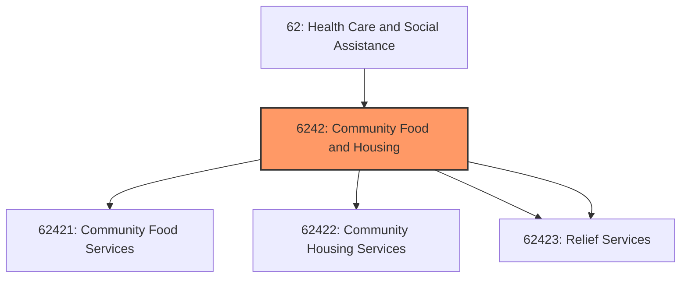
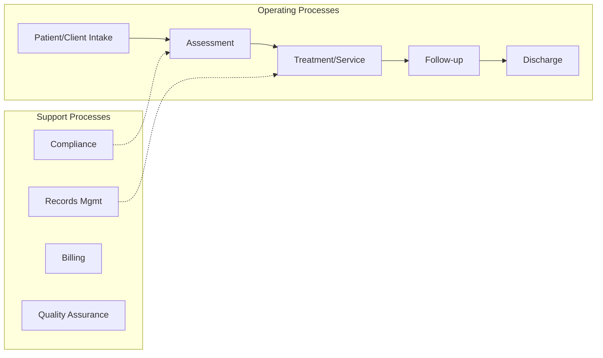

# Community Food and Housing

> This industry group comprises establishments primarily engaged in one of the following: (1) collecting, preparing, and delivering food for the needy; (2) providing short-term emergency shelter, temporary residential shelter, transitional housing, volunteer construction or repair of low-cost housing, and/or repair of homes for individuals or families in need; or (3) providing food, shelter, clothing, medical relief, resettlement, and counseling to victims of domestic or international disasters or conflicts (e.

## Overview

Community Food and Housing represents an important category within the Health Care and Social Assistance sector (NAICS 62).

This industry group comprises establishments primarily engaged in one of the following: (1) collecting, preparing, and delivering food for the needy; (2) providing short-term emergency shelter, temporary residential shelter, transitional housing, volunteer construction or repair of low-cost housing, and/or repair of homes for individuals or families in need; or (3) providing food, shelter, clothing, medical relief, resettlement, and counseling to victims of domestic or international disasters or conflicts (e.g., wars).

## Industry Hierarchy

## Key Statistics

| Metric | Value |
|--------|-------|
| NAICS Code | 6242 |
| Level | Industry Group |
| Child Industries | 4 |

## Sub-Industries

| Industry | Code | Description |
|----------|------|-------------|
| [Community Food Services](./CommunityFoodServices/) | 62421 | See industry description for 624210 |
| [Community Housing Services](./CommunityHousingServices/) | 62422 | This industry comprises establishments primarily engaged in providing one or mor |
| [Emergency](./Emergency/) | 62423 | See industry description for 624230 |
| [Relief Services](./ReliefServices/) | 62423 | See industry description for 624230 |

## Related Occupations

See the [occupations directory](/occupations) for roles commonly found in this industry.

## Core Business Processes

## Industry Value Chain

```mermaid
graph LR
    subgraph Inputs["Inputs"]
        I1["Medical Supplies"]
        I2["Equipment"]
        I3["Professionals"]
    end

    subgraph Primary["Primary Activities"]
        A1["Inbound Logistics"]
        A2["Core Operations"]
        A3["Quality Assurance"]
        A4["Outbound/Delivery"]
    end

    subgraph Outputs["Products/Services"]
        O1["Patient Care"]
        O2["Diagnostics"]
        O3["Treatment"]
    end

    subgraph Customers["Markets"]
        C1["Patients"]
        C2["Insurers"]
        C3["Government"]
        C4["Employers"]
    end

    Inputs --> Primary --> Outputs --> Customers
```

---

*Source: NAICS 6242 - Community Food and Housing*
