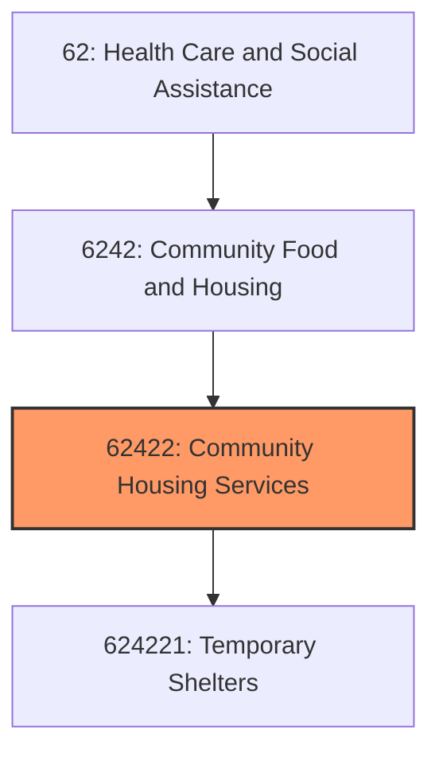
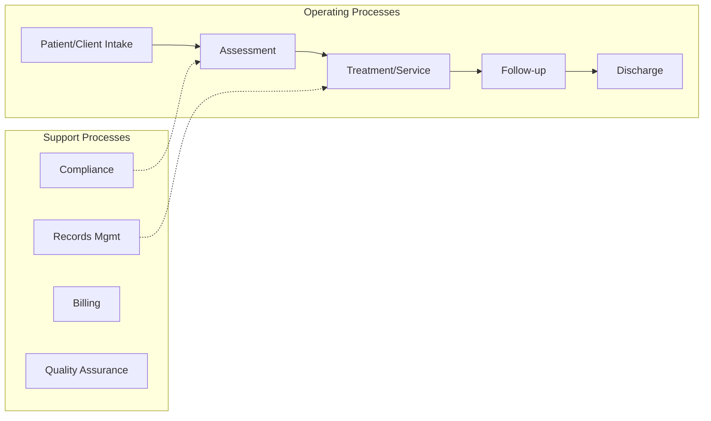

# Community Housing Services

> This industry comprises establishments primarily engaged in providing one or more of the following community housing services: (1) short-term emergency shelter for victims of domestic violence, sexual assault, or child abuse; (2) temporary residential shelter for the homeless, runaway youths, and patients and families caught in medical crises; (3) transitional housing for low-income individuals and families; (4) volunteer construction or repair of low-cost housing, in partnership with the homeowner who may assist in construction or repair work; and (5) repair of homes for elderly or disabled homeowners.

## Overview

Community Housing Services represents an important category within the Health Care and Social Assistance sector (NAICS 62).

This industry comprises establishments primarily engaged in providing one or more of the following community housing services: (1) short-term emergency shelter for victims of domestic violence, sexual assault, or child abuse; (2) temporary residential shelter for the homeless, runaway youths, and patients and families caught in medical crises; (3) transitional housing for low-income individuals and families; (4) volunteer construction or repair of low-cost housing, in partnership with the homeowner who may assist in construction or repair work; and (5) repair of homes for elderly or disabled homeowners. These establishments may operate their own shelter, they may subsidize housing using existing homes, apartments, hotels, or motels, or they may require a low-cost mortgage or work (sweat) equity. Cross-References.

## Industry Hierarchy

## Key Statistics

| Metric | Value |
|--------|-------|
| NAICS Code | 62422 |
| Level | Industry |
| Parent | [Community Food and Housing](../) |
| Child Industries | 1 |

## Sub-Industries

| Industry | Code | Description |
|----------|------|-------------|
| [Temporary Shelters](./TemporaryShelters.mdx) | 624221 | This U |

## Related Occupations

See the [occupations directory](/occupations) for roles commonly found in this industry.

## Core Business Processes

## Industry Value Chain

```mermaid
graph LR
    subgraph Inputs["Inputs"]
        I1["Medical Supplies"]
        I2["Equipment"]
        I3["Professionals"]
    end

    subgraph Primary["Primary Activities"]
        A1["Inbound Logistics"]
        A2["Core Operations"]
        A3["Quality Assurance"]
        A4["Outbound/Delivery"]
    end

    subgraph Outputs["Products/Services"]
        O1["Patient Care"]
        O2["Diagnostics"]
        O3["Treatment"]
    end

    subgraph Customers["Markets"]
        C1["Patients"]
        C2["Insurers"]
        C3["Government"]
        C4["Employers"]
    end

    Inputs --> Primary --> Outputs --> Customers
```

## Market Context

Healthcare delivers essential medical services, with digital health, value-based care, and population health management transforming care delivery models.

| Aspect | Details |
|--------|---------|
| Industry Sector | Healthcare |
| NAICS/SIC Code | 62422 |
| Market Segment | Community Housing Services |

## Key Business Processes

- Patient registration and intake
- Clinical care delivery
- Billing and revenue cycle
- Quality and compliance
- Care coordination

## Common Occupations

- [Healthcare Managers](/occupations/Management/MedicalAndHealthServicesManagers)
- [Registered Nurses](/occupations/HealthcarePractitioners/RegisteredNurses)
- [Physicians](/occupations/HealthcarePractitioners/PhysiciansAndSurgeons)
- [Medical Assistants](/occupations/HealthcareSupport/MedicalAssistants)

## Regulations and Standards

- HIPAA privacy and security rules
- CMS regulations
- Joint Commission accreditation
- State licensing requirements
- FDA medical device regulations

## Technology and Tools

- Electronic Health Records (EHR)
- Telemedicine platforms
- Medical imaging systems
- Practice management software
- Patient portal systems

## Industry Trends

- Digital transformation and automation adoption
- Sustainability and environmental compliance focus
- Workforce development and skills training
- Supply chain resilience and optimization
- Customer experience enhancement

---

*Source: NAICS 62422 - Community Housing Services*
