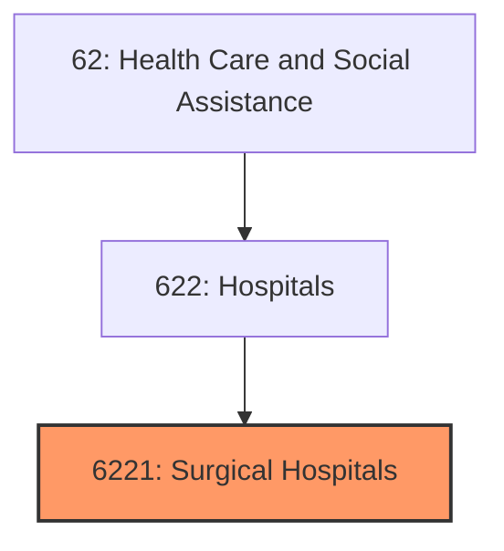
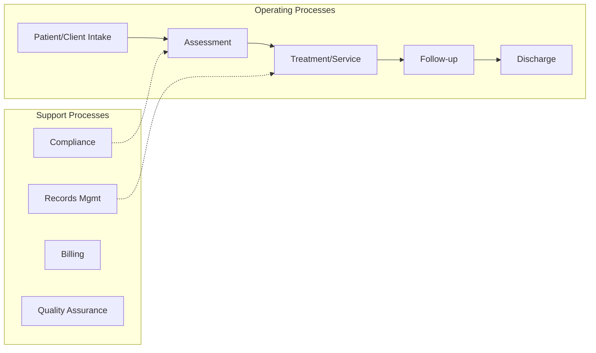

# Surgical Hospitals

> Establishments primarily engaged in surgical hospitals.

## Overview

Surgical Hospitals represents an important category within the Health Care and Social Assistance sector (NAICS 62). This industry group encompasses establishments primarily engaged in surgical hospitals.

## Industry Hierarchy

## Key Statistics

| Metric | Value |
|--------|-------|
| NAICS Code | 6221 |
| Level | Industry Group |
| Parent | [Hospitals](../) |
| Child Industries | 0 |

## Related Occupations

- [Medical and Health Services Managers](/occupations/Management/MedicalAndHealthServicesManagers) - Plan and direct health services
- [Registered Nurses](/occupations/HealthcarePractitioners/RegisteredNurses) - Provide and coordinate patient care
- [Physicians](/occupations/PhysiciansAllOther) - Diagnose and treat illnesses
- [Pharmacists](/occupations/HealthcarePractitioners/Pharmacists) - Dispense medications and advise patients

## Core Business Processes

## Industry Value Chain

```mermaid
graph LR
    subgraph Inputs["Inputs"]
        I1["Medical Supplies"]
        I2["Equipment"]
        I3["Professionals"]
    end

    subgraph Primary["Primary Activities"]
        A1["Inbound Logistics"]
        A2["Core Operations"]
        A3["Quality Assurance"]
        A4["Outbound/Delivery"]
    end

    subgraph Outputs["Products/Services"]
        O1["Patient Care"]
        O2["Diagnostics"]
        O3["Treatment"]
    end

    subgraph Customers["Markets"]
        C1["Patients"]
        C2["Insurers"]
        C3["Government"]
        C4["Employers"]
    end

    Inputs --> Primary --> Outputs --> Customers
```

## Regulatory Environment

- **CMS** (Centers for Medicare & Medicaid Services) - Administers healthcare reimbursement programs
- **FDA** (Food and Drug Administration) - Regulates medical devices and pharmaceuticals
- **HIPAA** (Health Insurance Portability and Accountability Act) - Protects patient data privacy
- **State Health Departments** - License healthcare facilities and practitioners

## Technology & Innovation

- **Telehealth** - Virtual consultations, remote monitoring, and digital therapeutics
- **AI Diagnostics** - Machine learning-assisted imaging, pathology, and clinical decision support
- **Electronic Health Records** - Interoperable patient data systems and health information exchanges
- **Wearable Health Devices** - Continuous monitoring sensors, smartwatches, and biosensors

## Industry Outlook

The healthcare sector continues to expand with aging populations, chronic disease management, and technological innovation driving demand. Telehealth has become a permanent feature of care delivery, while AI-assisted diagnostics and personalized medicine advance clinical outcomes. Value-based care models and interoperability standards are reshaping reimbursement and health information systems.

---

*Source: NAICS 6221 - Surgical Hospitals*
