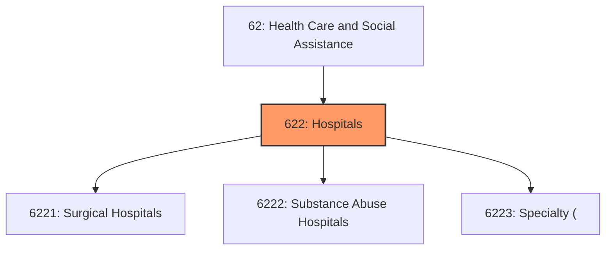
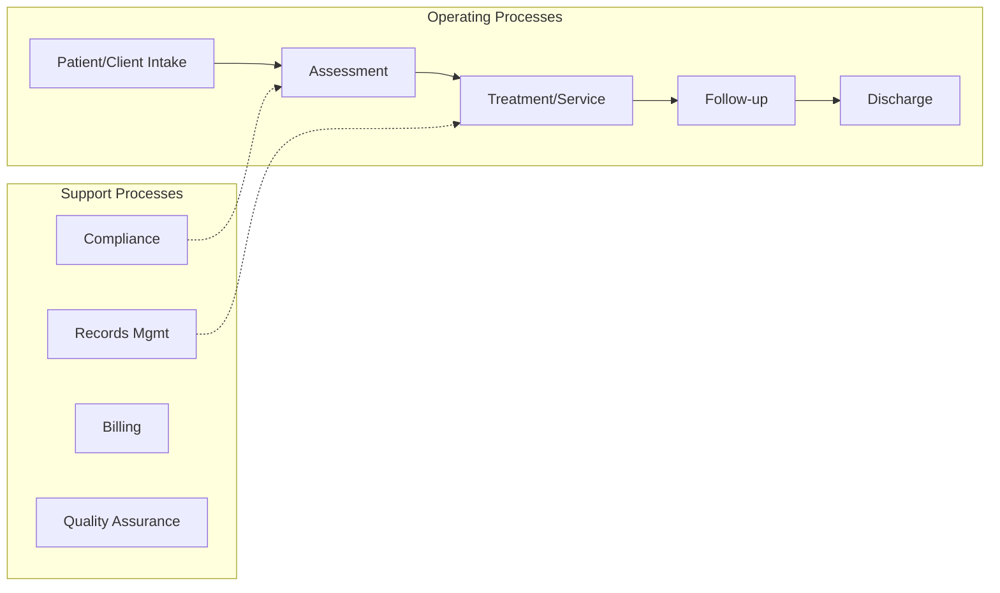

# Hospitals

> Industries in the Hospitals subsector provide medical, diagnostic, and treatment services that include physician, nursing, and other health services to inpatients and the specialized accommodation services required by inpatients.

## Overview

Hospitals represents an important category within the Health Care and Social Assistance sector (NAICS 62). This subsector encompasses establishments primarily engaged in hospitals.

Industries in the Hospitals subsector provide medical, diagnostic, and treatment services that include physician, nursing, and other health services to inpatients and the specialized accommodation services required by inpatients. Hospitals may also provide outpatient services as a secondary activity. Establishments in the Hospitals subsector provide inpatient health services, many of which can only be provided using the specialized facilities and equipment that form a significant and integral part of the production process.

## Industry Hierarchy

## Key Statistics

| Metric | Value |
|--------|-------|
| NAICS Code | 622 |
| Level | Subsector |
| Parent | [Social Assistance](../) |
| Child Industries | 3 |

## Sub-Industries

| Industry | Code | Description |
|----------|------|-------------|
| [Surgical Hospitals](./SurgicalHospitals/) | 6221 | Surgical Hospitals |
| [Substance Abuse Hospitals](./SubstanceAbuseHospitals/) | 6222 | Substance Abuse Hospitals |
| [Specialty (](./Specialty/) | 6223 | Specialty ( |

## Core Business Processes

## Industry Value Chain

```mermaid
graph LR
    subgraph Inputs["Inputs"]
        I1["Medical Supplies"]
        I2["Equipment"]
        I3["Professionals"]
    end

    subgraph Primary["Primary Activities"]
        A1["Inbound Logistics"]
        A2["Core Operations"]
        A3["Quality Assurance"]
        A4["Outbound/Delivery"]
    end

    subgraph Outputs["Products/Services"]
        O1["Patient Care"]
        O2["Diagnostics"]
        O3["Treatment"]
    end

    subgraph Customers["Markets"]
        C1["Patients"]
        C2["Insurers"]
        C3["Government"]
        C4["Employers"]
    end

    Inputs --> Primary --> Outputs --> Customers
```

---

*Source: NAICS 622 - Hospitals*
