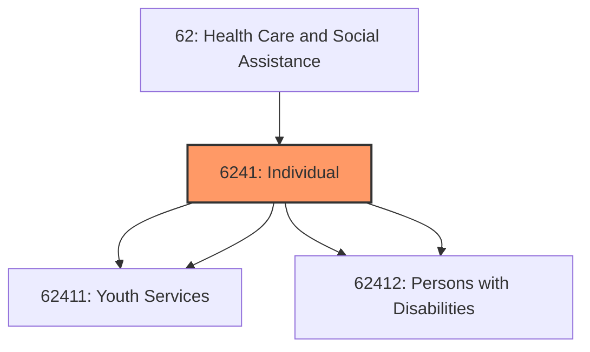
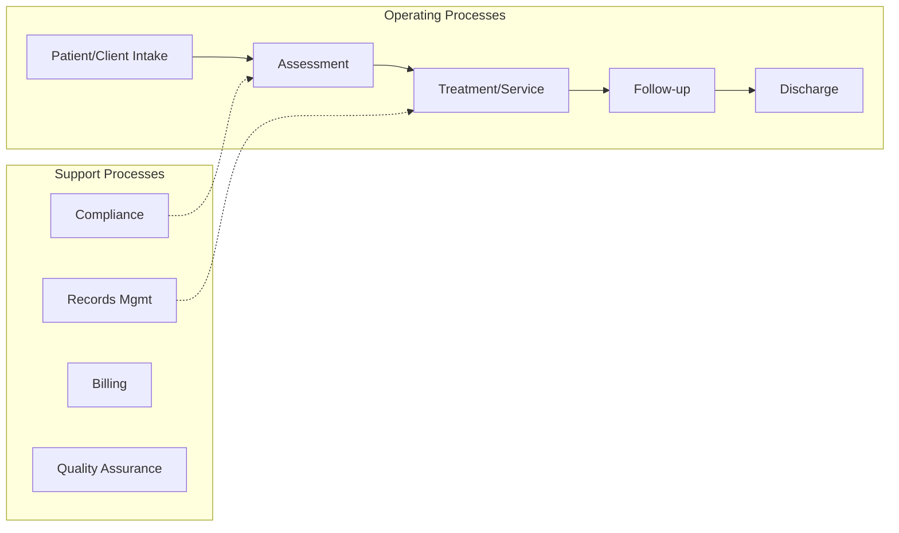

# Individual

> This industry group comprises establishments primarily engaged in providing nonresidential social assistance to children and youth, the elderly, persons with disabilities, and all other individuals and families.

## Overview

Individual represents an important category within the Health Care and Social Assistance sector (NAICS 62).

This industry group comprises establishments primarily engaged in providing nonresidential social assistance to children and youth, the elderly, persons with disabilities, and all other individuals and families.

## Industry Hierarchy

## Key Statistics

| Metric | Value |
|--------|-------|
| NAICS Code | 6241 |
| Level | Industry Group |
| Child Industries | 4 |

## Sub-Industries

| Industry | Code | Description |
|----------|------|-------------|
| [Child](./Child/) | 62411 | See industry description for 624110 |
| [Youth Services](./YouthServices/) | 62411 | See industry description for 624110 |
| [Services for the Elderly](./ServicesForTheElderly/) | 62412 | See industry description for 624120 |
| [Persons with Disabilities](./PersonsWithDisabilities/) | 62412 | See industry description for 624120 |

## Related Occupations

See the [occupations directory](/occupations) for roles commonly found in this industry.

## Core Business Processes

## Industry Value Chain

```mermaid
graph LR
    subgraph Inputs["Inputs"]
        I1["Medical Supplies"]
        I2["Equipment"]
        I3["Professionals"]
    end

    subgraph Primary["Primary Activities"]
        A1["Inbound Logistics"]
        A2["Core Operations"]
        A3["Quality Assurance"]
        A4["Outbound/Delivery"]
    end

    subgraph Outputs["Products/Services"]
        O1["Patient Care"]
        O2["Diagnostics"]
        O3["Treatment"]
    end

    subgraph Customers["Markets"]
        C1["Patients"]
        C2["Insurers"]
        C3["Government"]
        C4["Employers"]
    end

    Inputs --> Primary --> Outputs --> Customers
```

---

*Source: NAICS 6241 - Individual*
