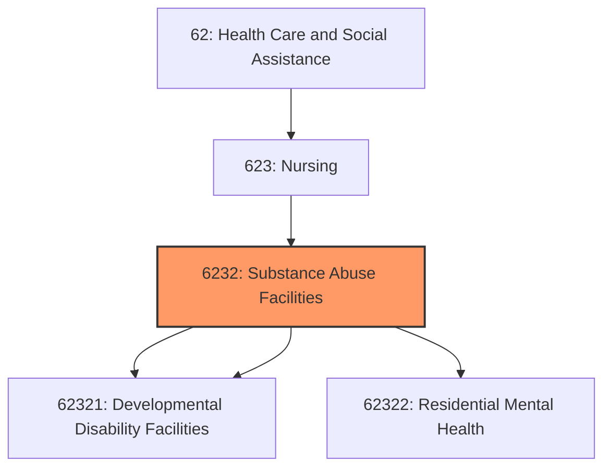
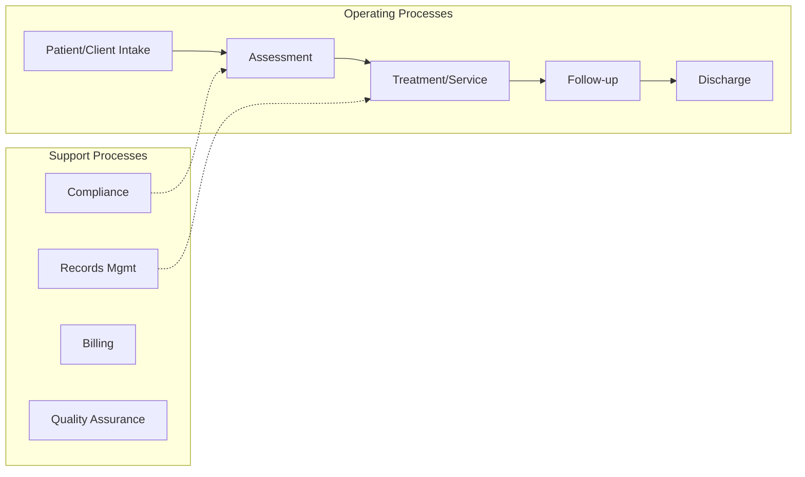

# Substance Abuse Facilities

> This industry group comprises establishments primarily engaged in providing residential care (but not licensed hospital care) to people with intellectual and developmental disabilities, mental illness, or substance abuse problems.

## Overview

Substance Abuse Facilities represents an important category within the Health Care and Social Assistance sector (NAICS 62).

This industry group comprises establishments primarily engaged in providing residential care (but not licensed hospital care) to people with intellectual and developmental disabilities, mental illness, or substance abuse problems.

## Industry Hierarchy

## Key Statistics

| Metric | Value |
|--------|-------|
| NAICS Code | 6232 |
| Level | Industry Group |
| Parent | [Nursing](../) |
| Child Industries | 3 |

## Sub-Industries

| Industry | Code | Description |
|----------|------|-------------|
| [Residential Intellectual](./ResidentialIntellectual/) | 62321 | See industry description for 623210 |
| [Developmental Disability Facilities](./DevelopmentalDisabilityFacilities/) | 62321 | See industry description for 623210 |
| [Residential Mental Health](./ResidentialMentalHealth/) | 62322 | See industry description for 623220 |

## Related Occupations

See the [occupations directory](/occupations) for roles commonly found in this industry.

## Core Business Processes

## Industry Value Chain

```mermaid
graph LR
    subgraph Inputs["Inputs"]
        I1["Medical Supplies"]
        I2["Equipment"]
        I3["Professionals"]
    end

    subgraph Primary["Primary Activities"]
        A1["Inbound Logistics"]
        A2["Core Operations"]
        A3["Quality Assurance"]
        A4["Outbound/Delivery"]
    end

    subgraph Outputs["Products/Services"]
        O1["Patient Care"]
        O2["Diagnostics"]
        O3["Treatment"]
    end

    subgraph Customers["Markets"]
        C1["Patients"]
        C2["Insurers"]
        C3["Government"]
        C4["Employers"]
    end

    Inputs --> Primary --> Outputs --> Customers
```

---

*Source: NAICS 6232 - Substance Abuse Facilities*
