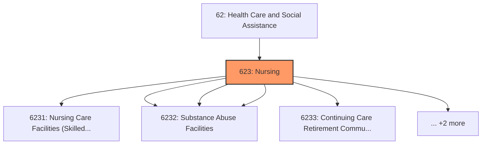
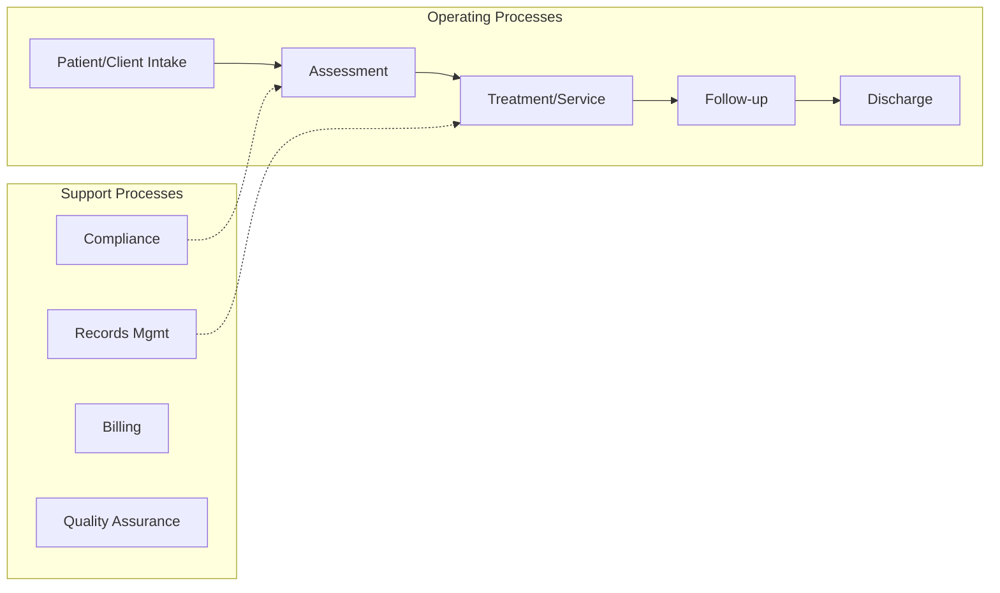

# Nursing

> Industries in the Nursing and Residential Care Facilities subsector provide residential care combined with either nursing, supervisory, or other types of care as required by the residents.

## Overview

Nursing represents an important category within the Health Care and Social Assistance sector (NAICS 62).

Industries in the Nursing and Residential Care Facilities subsector provide residential care combined with either nursing, supervisory, or other types of care as required by the residents. In this subsector, the facilities are a significant part of the production process, and the care provided is a mix of health and social services with the health services being largely some level of nursing services.

## Industry Hierarchy

## Key Statistics

| Metric | Value |
|--------|-------|
| NAICS Code | 623 |
| Level | Subsector |
| Parent | [Health Care](../) |
| Child Industries | 6 |

## Sub-Industries

| Industry | Code | Description |
|----------|------|-------------|
| [Nursing Care Facilities (Skilled Nursing Facilities)](./NursingCareFacilitiesSkilledNursingFacilities/) | 6231 | Nursing Care Facilities (Skilled Nursing Facilities) |
| [Residential Intellectual and Developmental Disability](./ResidentialIntellectualAndDevelopmentalDisability/) | 6232 | This industry group comprises establishments primarily engaged in providing resi |
| [Mental Health](./MentalHealth/) | 6232 | This industry group comprises establishments primarily engaged in providing resi |
| [Substance Abuse Facilities](./SubstanceAbuseFacilities/) | 6232 | This industry group comprises establishments primarily engaged in providing resi |
| [Continuing Care Retirement Communities](./ContinuingCareRetirementCommunities/) | 6233 | Continuing Care Retirement Communities |
| [Assisted Living Facilities for the Elderly](./AssistedLivingFacilitiesForTheElderly/) | 6233 | Assisted Living Facilities for the Elderly |

## Related Occupations

See the [occupations directory](/occupations) for roles commonly found in this industry.

## Core Business Processes

## Industry Value Chain

```mermaid
graph LR
    subgraph Inputs["Inputs"]
        I1["Medical Supplies"]
        I2["Equipment"]
        I3["Professionals"]
    end

    subgraph Primary["Primary Activities"]
        A1["Inbound Logistics"]
        A2["Core Operations"]
        A3["Quality Assurance"]
        A4["Outbound/Delivery"]
    end

    subgraph Outputs["Products/Services"]
        O1["Patient Care"]
        O2["Diagnostics"]
        O3["Treatment"]
    end

    subgraph Customers["Markets"]
        C1["Patients"]
        C2["Insurers"]
        C3["Government"]
        C4["Employers"]
    end

    Inputs --> Primary --> Outputs --> Customers
```

---

*Source: NAICS 623 - Nursing*
