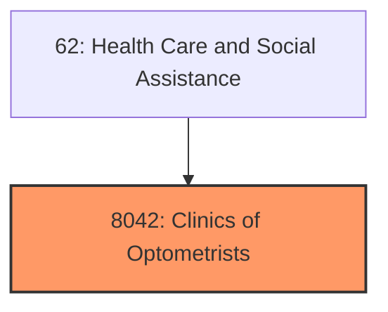
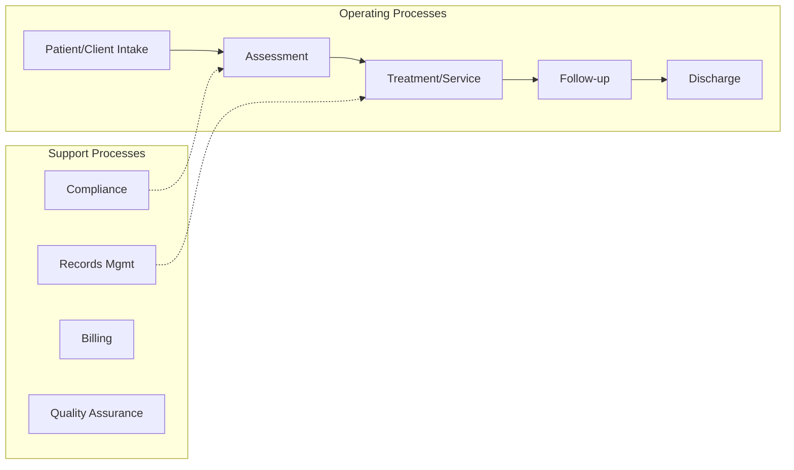

# Clinics of Optometrists

> Offices and Clinics of Optometrists.

## Overview

Clinics of Optometrists represents an important category within the Health Care and Social Assistance sector (SIC 8042).

## Industry Hierarchy

## Key Statistics

| Metric | Value |
|--------|-------|
| SIC Code | 8042 |
| Level | SIC (8042) |
| Child Industries | 0 |

## Related Occupations

See the [occupations directory](/occupations) for roles commonly found in this industry.

## Core Business Processes

## Industry Value Chain

---

*Source: SIC 8042 - Clinics of Optometrists*
