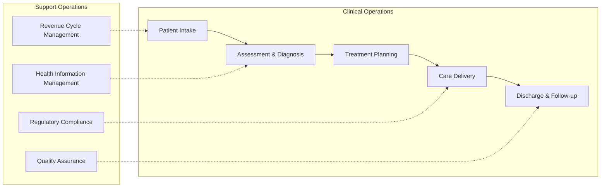
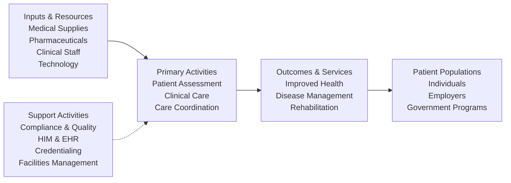

# Health Care and Social Assistance

> The Health Care and Social Assistance sector comprises establishments providing health care and social assistance for individuals, delivered by trained professionals with requisite expertise.

## Overview

This sector encompasses a continuum of services starting with establishments providing medical care exclusively, continuing with those providing health care and social assistance, and finally finishing with those providing only social assistance. The sector includes both health care and social assistance because it is sometimes difficult to distinguish between the boundaries of these two activities.

All industries in this sector share a commonality of process: labor inputs of health practitioners or social workers with the requisite expertise. Many industries are defined based on the educational degree held by practitioners included in the industry.

**Exclusions**: Yoga and aerobics instruction (Subsector 611), physical fitness facilities (Subsector 713), and personal fitness training services and non-medical diet and weight reducing centers (Subsector 812) are excluded, as these services are not typically delivered by health practitioners.

## Industry Hierarchy

```mermaid
graph TD
    S62["NAICS 62: Health Care and Social Assistance"]
    S62 --> SS621["621: Ambulatory Health Care Services"]
    S62 --> SS622["622: Hospitals"]
    S62 --> SS623["623: Nursing and Residential Care Facilities"]
    S62 --> SS624["624: Social Assistance"]

    SS621 --> G6211["6211: Offices of Physicians"]
    SS621 --> G6212["6212: Offices of Dentists"]
    SS621 --> G6213["6213: Offices of Other Health Practitioners"]
    SS621 --> G6214["6214: Outpatient Care Centers"]
    SS621 --> G6215["6215: Medical and Diagnostic Laboratories"]
    SS621 --> G6216["6216: Home Health Care Services"]
    SS621 --> G6219["6219: Other Ambulatory Health Care Services"]

    SS622 --> G6221["6221: General Medical and Surgical Hospitals"]
    SS622 --> G6222["6222: Psychiatric and Substance Abuse Hospitals"]
    SS622 --> G6223["6223: Specialty Hospitals"]

    SS623 --> G6231["6231: Nursing Care Facilities (SNFs)"]
    SS623 --> G6232["6232: Residential ID/DD, MH, and SA Facilities"]
    SS623 --> G6233["6233: CCRCs and Assisted Living"]
    SS623 --> G6239["6239: Other Residential Care Facilities"]

    SS624 --> G6241["6241: Individual and Family Services"]
    SS624 --> G6242["6242: Community Food, Housing, Emergency Services"]
    SS624 --> G6243["6243: Vocational Rehabilitation Services"]
    SS624 --> G6244["6244: Child Care Services"]
```

## Key Statistics

| Metric | Value |
|--------|-------|
| NAICS Code | 62 |
| Level | Sector |
| Subsectors | 4 |
| Industry Groups | 17 |
| National Industries | 37 |

## Sub-Industries

| Subsector | Code | Description |
|-----------|------|-------------|
| [Ambulatory Health Care Services](./AmbulatoryHealthCare/) | 621 | Outpatient health care services including physician offices, clinics, laboratories, and home health |
| [Hospitals](./Hospitals/) | 622 | Inpatient medical, diagnostic, and treatment services with specialized accommodation |
| [Nursing and Residential Care Facilities](./NursingAndResidentialCare/) | 623 | Residential care combined with nursing, supervisory, or other types of care |
| [Social Assistance](./SocialAssistance/) | 624 | Non-residential social assistance services for individuals and families |

## Related Occupations

- [Physicians and Surgeons](/occupations/PhysiciansAndSurgeons) - Medical diagnosis and treatment
- [Registered Nurses](/occupations/HealthcarePractitioners/RegisteredNurses) - Patient care coordination and clinical services
- [Medical and Health Services Managers](/occupations/Management/MedicalAndHealthServicesManagers) - Healthcare operations management
- [Physical Therapists](/occupations/HealthcarePractitioners/PhysicalTherapists) - Rehabilitation services
- [Social Workers](/occupations/SocialServices/SocialWorkers) - Social assistance and case management
- [Home Health and Personal Care Aides](/occupations/HealthcareSupport/HomeHealthAides) - In-home patient care

## Core Business Processes

### Patient Care Delivery

The core process of healthcare involves patient intake, clinical assessment, diagnosis, treatment planning, care delivery, and post-care follow-up. This process varies significantly across care settings (ambulatory, inpatient, residential) but follows consistent clinical workflows.

**Key Activities:**
- Patient registration and insurance verification
- Clinical assessment and diagnostic workup
- Care plan development and multidisciplinary coordination
- Treatment administration and monitoring
- Discharge planning and care transitions

### Revenue Cycle Management

Managing the financial aspects of healthcare delivery from patient registration through final payment collection.

**Key Activities:**
- Patient eligibility verification
- Charge capture and medical coding
- Claims submission and management
- Payment posting and reconciliation
- Denial management and appeals

## Industry Value Chain

## Regulatory Environment

Healthcare is among the most heavily regulated sectors in the U.S. economy:

### Federal Regulations
- **CMS (Centers for Medicare & Medicaid Services)**: Medicare/Medicaid participation conditions, payment systems (DRGs, APCs, RVUs), quality reporting requirements
- **HHS/OCR**: HIPAA privacy and security rules for protected health information
- **FDA**: Drug and medical device approval, clinical trial oversight
- **OIG**: Anti-kickback and fraud enforcement
- **DOJ**: False Claims Act enforcement, Stark Law compliance

### State Regulations
- **State Licensing Boards**: Facility licensure, provider credentialing
- **Certificate of Need (CON)**: Facility construction and service expansion (in applicable states)
- **State Insurance Commissioners**: Managed care regulations, network adequacy

### Accreditation Bodies
- **The Joint Commission (TJC)**: Hospital and health system accreditation
- **NCQA**: Health plan and medical practice accreditation
- **CARF**: Rehabilitation and behavioral health accreditation
- **AAAHC**: Ambulatory care accreditation

## Technology & Innovation

### Electronic Health Records (EHR)
- **ONC Health IT Certification**: Certified EHR technology requirements
- **Interoperability**: HL7 FHIR, information blocking rules
- **21st Century Cures Act**: Patient access to health information

### Emerging Technologies
- **Telehealth**: Virtual care delivery expansion
- **AI/ML**: Clinical decision support, diagnostic imaging
- **Remote Patient Monitoring**: Chronic disease management
- **Precision Medicine**: Genomics and personalized treatment
- **Robotic Surgery**: Minimally invasive procedures

### Healthcare IT Standards
- **HL7 FHIR**: Fast Healthcare Interoperability Resources
- **ICD-10**: Diagnosis coding
- **CPT/HCPCS**: Procedure coding
- **SNOMED CT**: Clinical terminology
- **LOINC**: Laboratory and clinical observations

## Payment Models

| Model | Description | Common Settings |
|-------|-------------|-----------------|
| Fee-for-Service | Payment per service rendered | Ambulatory, acute care |
| DRG-based | Bundled payment per admission | Hospitals |
| Capitation | Per-member-per-month payment | Managed care, ACOs |
| Value-Based | Payment tied to quality outcomes | All settings |
| Episode-Based | Bundled payment for care episode | Surgical, chronic care |

---

*Source: NAICS 62 - Health Care and Social Assistance*
