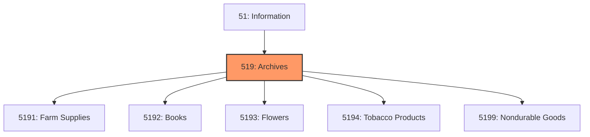
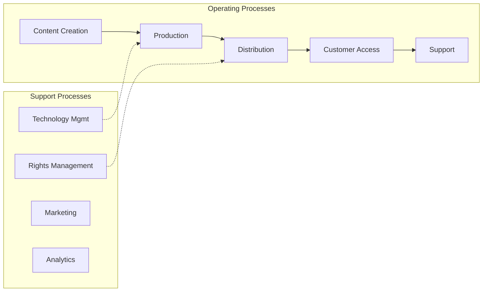

# Archives

> Industries in the Web Search Portals, Libraries, Archives, and Other Information Services subsector group establishments supplying information, storing and providing access to information, searching and retrieving information, and operating Web sites that use search engines to allow for searching information on the Internet.

## Overview

Archives represents an important category within the Information sector (NAICS 51).

Industries in the Web Search Portals, Libraries, Archives, and Other Information Services subsector group establishments supplying information, storing and providing access to information, searching and retrieving information, and operating Web sites that use search engines to allow for searching information on the Internet. The main components of the subsector are libraries, archives, and Web search portals.

## Industry Hierarchy

## Key Statistics

| Metric | Value |
|--------|-------|
| NAICS Code | 519 |
| Level | Subsector |
| Parent | [Information](../) |
| Child Industries | 0 |

## Related Occupations

See the [occupations directory](/occupations) for roles commonly found in this industry.

## Core Business Processes

## Industry Value Chain

```mermaid
graph LR
    subgraph Inputs["Inputs"]
        I1["Content"]
        I2["Technology"]
        I3["Talent"]
    end

    subgraph Primary["Primary Activities"]
        A1["Inbound Logistics"]
        A2["Core Operations"]
        A3["Quality Assurance"]
        A4["Outbound/Delivery"]
    end

    subgraph Outputs["Products/Services"]
        O1["Information Products"]
        O2["Software"]
        O3["Media"]
    end

    subgraph Customers["Markets"]
        C1["Businesses"]
        C2["Consumers"]
        C3["Government"]
        C4["Education"]
    end

    Inputs --> Primary --> Outputs --> Customers
```

---

*Source: NAICS 519 - Archives*
