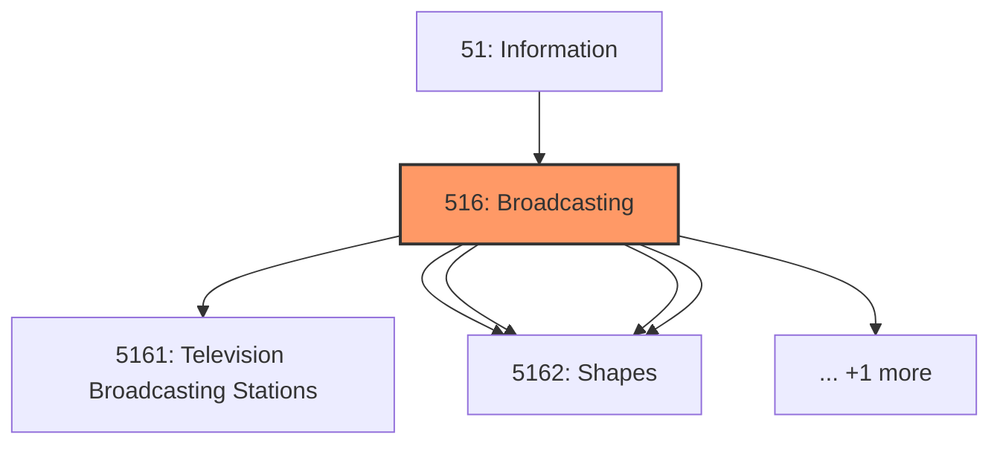
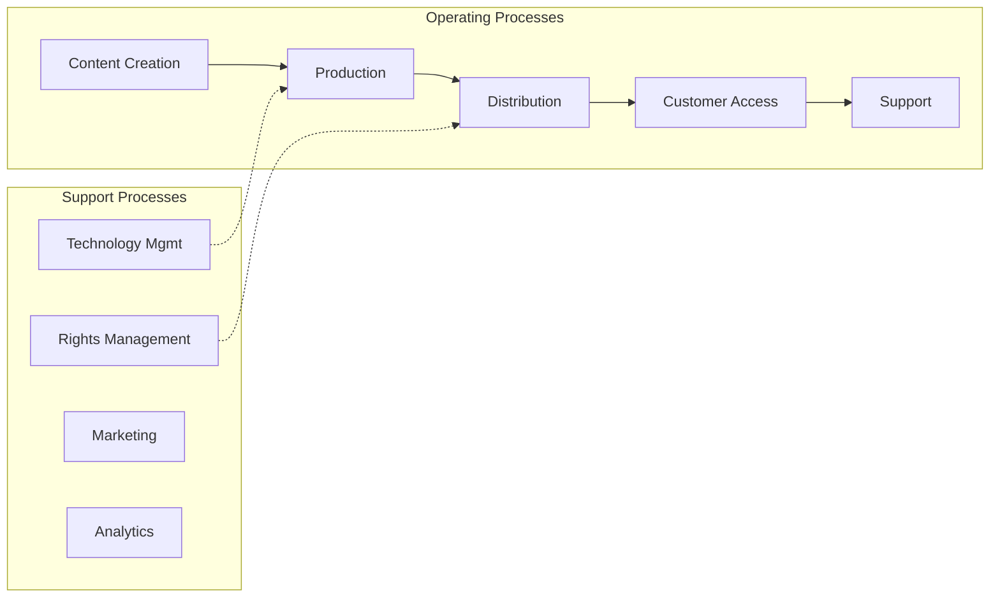

# Broadcasting

> Industries in the Broadcasting and Content Providers subsector include establishments that create content or acquire the right to distribute content and subsequently broadcast or distribute that content.

## Overview

Broadcasting represents an important category within the Information sector (NAICS 51).

Industries in the Broadcasting and Content Providers subsector include establishments that create content or acquire the right to distribute content and subsequently broadcast or distribute that content. The industry groups (Radio and Television Broadcasting Stations and Media Streaming Distribution Services, Social Networks, and Other Media Networks and Content Providers) are based on differences in the methods of communication and the nature of services provided. The Radio and Television Broadcasting Stations industry group includes establishments that operate radio or television broadcasting stations for the programming and transmission of programs to the public. Programming may originate in their own studio, from an affiliated network, or from external sources. The Media Streaming Distribution Services, Social Networks, and Other Media Networks and Content Providers industry group includes establishments providing media streaming distribution services, operating social network sites, operating media broadcasting and cable television networks, and supplying information, such as news reports, articles, pictures, and features, to the news media. The establishments classified in this subsector are often engaged in the production and purchase of programs and other textual, audio, and/or video content, and they typically generate revenues from the sale of advertising space and air time, subscriptions, donations, subsidies, and/or the sale of programs. Establishments operating telecommunications facilities and infrastructure and distributing audio and video programming, including cable and satellite television subscription programming, are included in Subsector 517, Telecommunications. Establishments primarily engaged as independent contractors in the installation and maintenance of broadcasting systems are classified in Sector 23, Construction. Establishments primarily engaged in the production, or production and distribution, of motion pictures and sound recordings are included in Subsector 512, Motion Picture and Sound Recording Industries.

## Industry Hierarchy

## Key Statistics

| Metric | Value |
|--------|-------|
| NAICS Code | 516 |
| Level | Subsector |
| Parent | [Information](../) |
| Child Industries | 4 |

## Sub-Industries

| Industry | Code | Description |
|----------|------|-------------|
| [Television Broadcasting Stations](./TelevisionBroadcastingStations/) | 5161 | This industry group comprises establishments operating radio or television broad |
| [Media Streaming Distribution Services](./MediaStreamingDistributionServices/) | 5162 | Media Streaming Distribution Services |
| [Social Networks](./SocialNetworks/) | 5162 | Social Networks |
| [Media Networks and Content Providers](./MediaNetworksAndContentProviders/) | 5162 | Media Networks and Content Providers |

## Related Occupations

See the [occupations directory](/occupations) for roles commonly found in this industry.

## Core Business Processes

## Industry Value Chain

---

*Source: NAICS 516 - Broadcasting*
