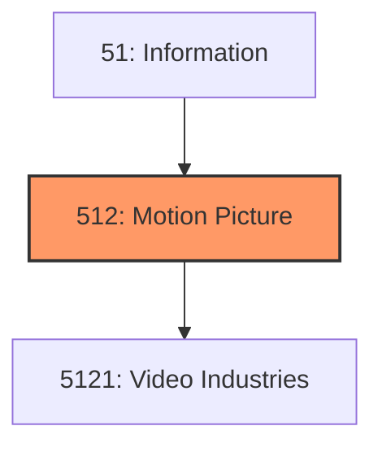
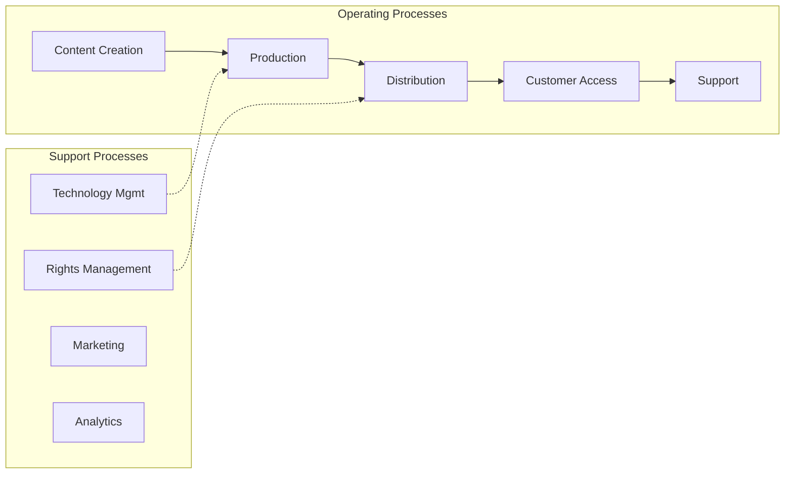

# Motion Picture

> Industries in the Motion Picture and Sound Recording Industries subsector group establishments involved in the production and distribution of motion pictures and sound recordings.

## Overview

Motion Picture represents an important category within the Information sector (NAICS 51).

Industries in the Motion Picture and Sound Recording Industries subsector group establishments involved in the production and distribution of motion pictures and sound recordings. While producers and distributors of motion pictures and sound recordings issue works for sale as traditional publishers do, the processes are sufficiently different to warrant placing establishments engaged in these activities in a separate subsector. Production is typically a complex process that involves several distinct types of establishments that are engaged in activities, such as contracting with performers, creating the film or sound content, and providing technical postproduction services. Film distribution is often to exhibitors, such as theaters and broadcasters, rather than through the wholesale and retail distribution chain. When the product is in a mass-produced form, NAICS treats production and distribution as the major economic activity as it does in the Publishing Industries subsector, rather than as a subsidiary activity to the manufacture of such products. This subsector does not include establishments primarily engaged in the wholesale distribution of video and sound recordings, such as compact discs and audio tapes; these establishments are included in the Wholesale Trade sector. Reproduction of video and sound recordings that is carried out separately from establishments engaged in production and distribution is treated in NAICS as a manufacturing activity. Establishments that primarily acquire the rights to distribute video and sound recordings to the public via television or radio broadcast or streaming distribution services are classified in Subsector 516, Broadcasting and Content Providers. Establishments using facilities and infrastructure that they operate to distribute cable and satellite television subscription programming are included in Subsector 517, Telecommunications.

## Industry Hierarchy

## Key Statistics

| Metric | Value |
|--------|-------|
| NAICS Code | 512 |
| Level | Subsector |
| Parent | [Information](../) |
| Child Industries | 1 |

## Sub-Industries

| Industry | Code | Description |
|----------|------|-------------|
| [Video Industries](./VideoIndustries/) | 5121 | This industry group comprises establishments primarily engaged in the production |

## Related Occupations

See the [occupations directory](/occupations) for roles commonly found in this industry.

## Core Business Processes

## Industry Value Chain

---

*Source: NAICS 512 - Motion Picture*
