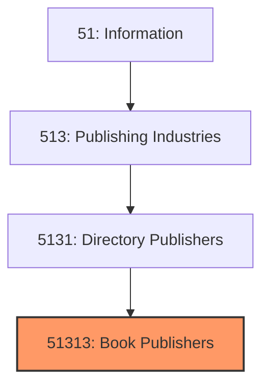
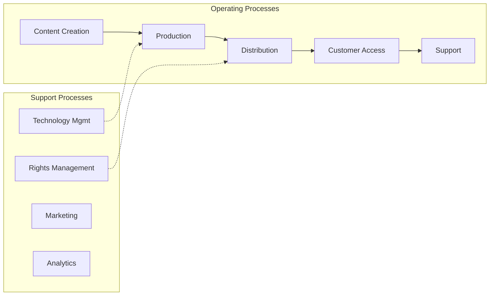

# Book Publishers

> See industry description for 513130.

## Overview

Book Publishers represents an important category within the Information sector (NAICS 51). This industry encompasses establishments primarily engaged in book publishers.

## Industry Hierarchy

## Key Statistics

| Metric | Value |
|--------|-------|
| NAICS Code | 51313 |
| Level | Industry |
| Parent | [Directory Publishers](../) |
| Child Industries | 0 |

## Core Business Processes

## Industry Value Chain

```mermaid
graph LR
    subgraph Inputs["Inputs"]
        I1["Content"]
        I2["Technology"]
        I3["Talent"]
    end

    subgraph Primary["Primary Activities"]
        A1["Inbound Logistics"]
        A2["Core Operations"]
        A3["Quality Assurance"]
        A4["Outbound/Delivery"]
    end

    subgraph Outputs["Products/Services"]
        O1["Information Products"]
        O2["Software"]
        O3["Media"]
    end

    subgraph Customers["Markets"]
        C1["Businesses"]
        C2["Consumers"]
        C3["Government"]
        C4["Education"]
    end

    Inputs --> Primary --> Outputs --> Customers
```

---

*Source: NAICS 51313 - Book Publishers*
