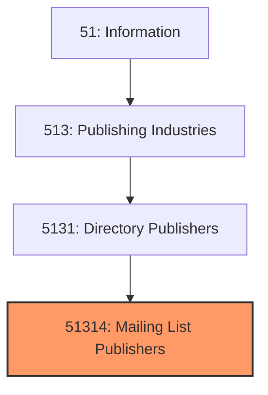
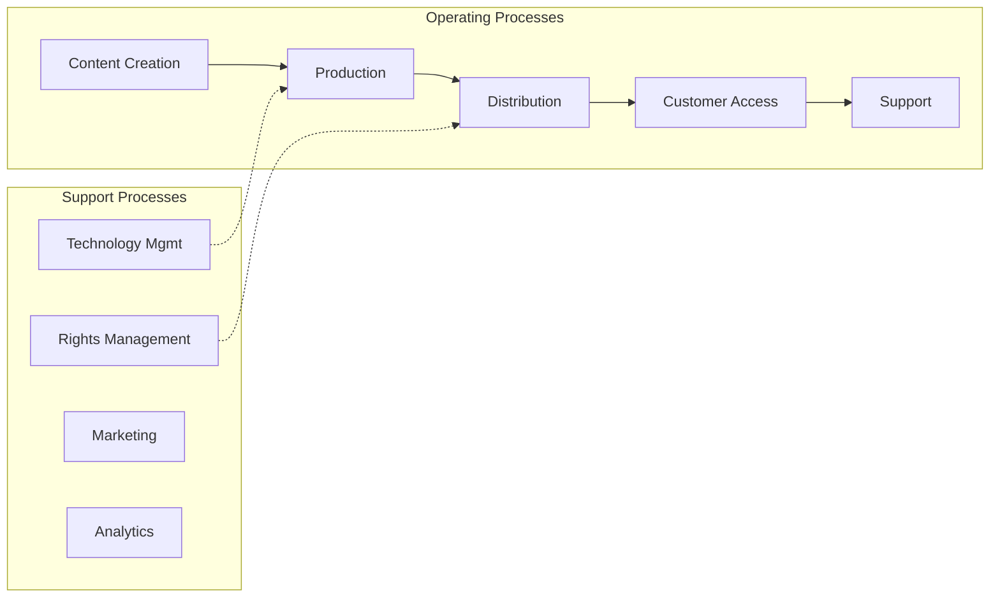

# Mailing List Publishers

> See industry description for 513140.

## Overview

Mailing List Publishers represents an important category within the Information sector (NAICS 51). This industry encompasses establishments primarily engaged in mailing list publishers.

## Industry Hierarchy

## Key Statistics

| Metric | Value |
|--------|-------|
| NAICS Code | 51314 |
| Level | Industry |
| Parent | [Directory Publishers](../) |
| Child Industries | 0 |

## Related Occupations

- [Computer and Information Systems Managers](/occupations/Management/ComputerAndInformationSystemsManagers) - Plan and direct IT activities
- [Software Developers](/occupations/Technology/SoftwareDevelopers) - Design and develop software applications
- [Information Security Analysts](/occupations/Technology/InformationSecurityAnalysts) - Plan and implement security measures
- [Database Administrators](/occupations/Technology/DatabaseAdministrators) - Administer and maintain databases

## Core Business Processes

## Industry Value Chain

```mermaid
graph LR
    subgraph Inputs["Inputs"]
        I1["Content"]
        I2["Technology"]
        I3["Talent"]
    end

    subgraph Primary["Primary Activities"]
        A1["Inbound Logistics"]
        A2["Core Operations"]
        A3["Quality Assurance"]
        A4["Outbound/Delivery"]
    end

    subgraph Outputs["Products/Services"]
        O1["Information Products"]
        O2["Software"]
        O3["Media"]
    end

    subgraph Customers["Markets"]
        C1["Businesses"]
        C2["Consumers"]
        C3["Government"]
        C4["Education"]
    end

    Inputs --> Primary --> Outputs --> Customers
```

## Regulatory Environment

- **FCC** (Federal Communications Commission) - Regulates telecommunications and broadcasting
- **FTC** (Federal Trade Commission) - Enforces data privacy and consumer protection
- **Copyright Office** - Manages intellectual property in media and publishing
- **State Data Privacy Laws** - Govern consumer data handling (e.g., CCPA, state equivalents)

## Technology & Innovation

- **Artificial Intelligence** - Generative AI, machine learning, and natural language processing
- **Cloud Computing** - SaaS platforms, edge computing, and hybrid cloud architectures
- **5G and Connectivity** - High-speed networks enabling IoT, AR/VR, and real-time applications
- **Cybersecurity** - Zero-trust architectures, AI threat detection, and privacy-enhancing technologies

## Industry Outlook

The information sector continues to expand rapidly, driven by AI, cloud computing, and data-driven business models. Generative AI is transforming content creation, software development, and information services. Cybersecurity investment is growing alongside increasing digital threats, while regulatory frameworks for data privacy and AI governance are evolving across jurisdictions.

---

*Source: NAICS 51314 - Mailing List Publishers*
