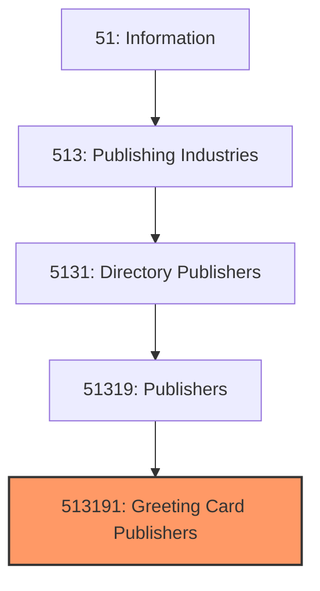
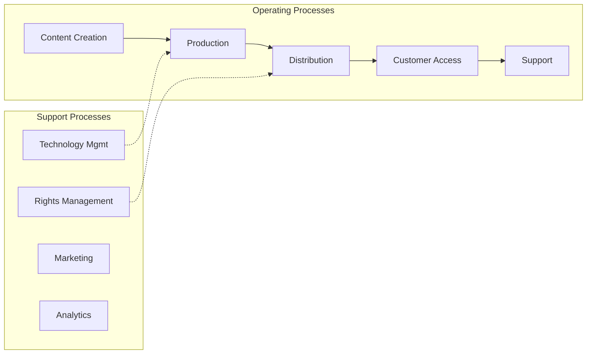

# Greeting Card Publishers

> This U.S. industry comprises establishments primarily engaged in publishing greeting cards.
## Overview

Greeting Card Publishers represents a specialized segment within the Information sector (NAICS 51). This national industry encompasses establishments primarily engaged in greeting card publishers.

This U.S. industry comprises establishments primarily engaged in publishing greeting cards. These establishments may publish works in print or electronic form, including exclusively on the Internet. Cross-References.

## Industry Hierarchy

## Key Statistics

| Metric | Value |
|--------|-------|
| NAICS Code | 513191 |
| Level | National Industry |
| Parent | [Publishers](../) |
| Child Industries | 0 |

## Core Business Processes

## Industry Value Chain

---

*Source: NAICS 513191 - Greeting Card Publishers*
