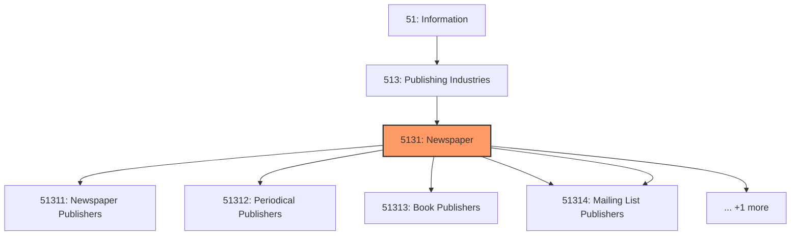
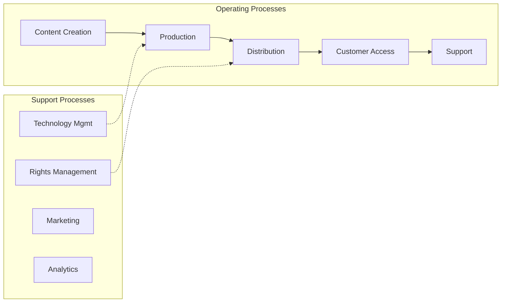

# Newspaper

> This industry group comprises establishments primarily engaged in publishing newspapers, magazines, other periodicals, books, directories and mailing lists, and other works, such as calendars, greeting cards, and maps.

## Overview

Newspaper represents an important category within the Information sector (NAICS 51).

This industry group comprises establishments primarily engaged in publishing newspapers, magazines, other periodicals, books, directories and mailing lists, and other works, such as calendars, greeting cards, and maps. These works are characterized by the intellectual creativity required in their development and are usually protected by copyright. Publishers distribute or arrange for the distribution of these works. Publishing establishments may create the works in-house, or contract for, purchase, or compile works that were originally created by others. These works may be published in one or more formats, such as print and/or electronic form, including proprietary electronic networks or exclusively on the Internet. Establishments in this industry may print, reproduce, or offer direct access to the works themselves or may arrange with others to carry out such functions. Establishments that both print and publish may fill excess capacity with commercial or job printing. However, the publishing activity is still considered to be the primary activity of these establishments.

## Industry Hierarchy

## Key Statistics

| Metric | Value |
|--------|-------|
| NAICS Code | 5131 |
| Level | Industry Group |
| Parent | [Publishing Industries](../) |
| Child Industries | 6 |

## Sub-Industries

| Industry | Code | Description |
|----------|------|-------------|
| [Newspaper Publishers](./NewspaperPublishers/) | 51311 | See industry description for 513110 |
| [Periodical Publishers](./PeriodicalPublishers/) | 51312 | See industry description for 513120 |
| [Book Publishers](./BookPublishers/) | 51313 | See industry description for 513130 |
| [Directory](./Directory/) | 51314 | See industry description for 513140 |
| [Mailing List Publishers](./MailingListPublishers/) | 51314 | See industry description for 513140 |
| [Publishers](./Publishers/) | 51319 | This industry comprises establishments known as publishers (except newspaper, ma |

## Related Occupations

See the [occupations directory](/occupations) for roles commonly found in this industry.

## Core Business Processes

## Industry Value Chain

```mermaid
graph LR
    subgraph Inputs["Inputs"]
        I1["Content"]
        I2["Technology"]
        I3["Talent"]
    end

    subgraph Primary["Primary Activities"]
        A1["Inbound Logistics"]
        A2["Core Operations"]
        A3["Quality Assurance"]
        A4["Outbound/Delivery"]
    end

    subgraph Outputs["Products/Services"]
        O1["Information Products"]
        O2["Software"]
        O3["Media"]
    end

    subgraph Customers["Markets"]
        C1["Businesses"]
        C2["Consumers"]
        C3["Government"]
        C4["Education"]
    end

    Inputs --> Primary --> Outputs --> Customers
```

---

*Source: NAICS 5131 - Newspaper*
