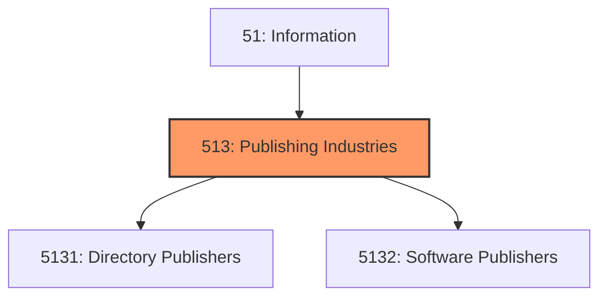
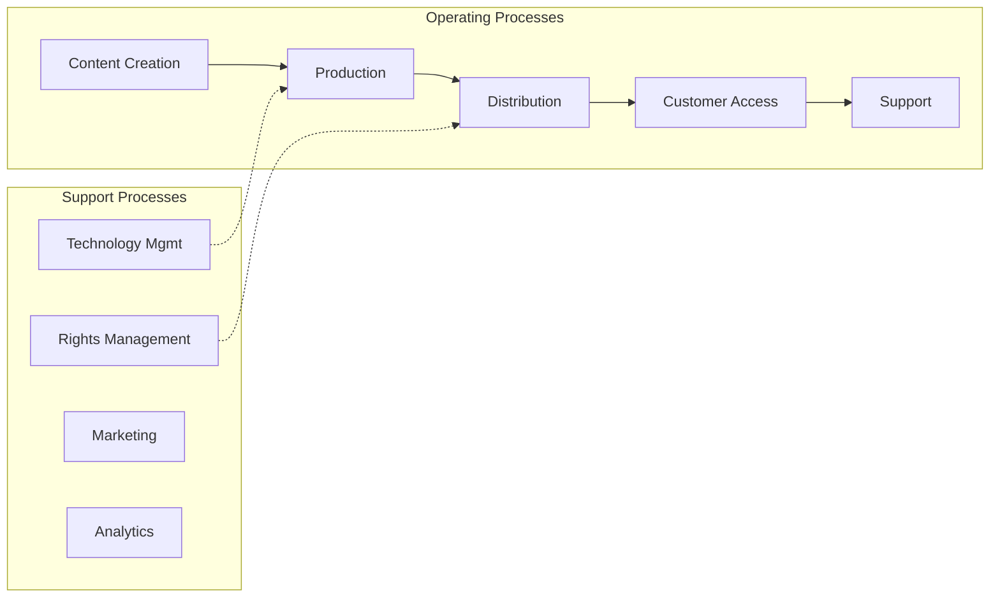

# Publishing Industries

> Industries in the Publishing Industries subsector group establishments engaged in publishing newspapers, magazines, other periodicals, books, directories, and software.

## Overview

Publishing Industries represents an important category within the Information sector (NAICS 51). This subsector encompasses establishments primarily engaged in publishing industries.

Industries in the Publishing Industries subsector group establishments engaged in publishing newspapers, magazines, other periodicals, books, directories, and software. In general, establishments known as publishers issue copies of works for which they usually possess copyright. Works may be in one or more formats including print form, CD-ROM, proprietary electronic networks, or exclusively on the Internet. Publishers may publish works originally created by others for which they have obtained the rights and/or works that they have created in-house. Publishers may publish only and license rights to others to distribute their content, or they may publish and distribute content they create or own. Software publishing is included here because the activity, creation of a copyrighted product and bringing it to market, is equivalent to the creation process for other types of intellectual products. In NAICS, publishing--the reporting, writing, editing, and other processes that are required to create an edition of a newspaper, for example--is treated as a major economic activity in its own right, rather than as a subsidiary activity to a manufacturing activity, printing. Thus, publishing is classified in the Information sector; whereas, printing is in the Manufacturing sector. The Publishing Industries subsector excludes printed products, such as manifold business forms and appointment books, for which information is not the essential component. Establishments producing these items are included in Subsector 323, Printing and Related Support Activities. Reproduction of prepackaged software is treated in NAICS as a manufacturing activity, and custom design of software to client specifications is included in the Professional, Scientific, and Technical Services sector. These distinctions arise because of the different ways that software is created, reproduced, and distributed. Music publishers and establishments primarily engaged in the production, or production and distribution, of motion pictures and sound recordings are included in Subsector 512, Motion Picture and Sound Recording Industries. Establishments not engaged in publishing and exclusively obtaining rights from publishers to broadcast and distribute content are included in Subsector 516, Broadcasting and Content Providers.

## Industry Hierarchy

## Key Statistics

| Metric | Value |
|--------|-------|
| NAICS Code | 513 |
| Level | Subsector |
| Parent | [Information](../) |
| Child Industries | 2 |

## Sub-Industries

| Industry | Code | Description |
|----------|------|-------------|
| [Directory Publishers](./DirectoryPublishers/) | 5131 | This industry group comprises establishments primarily engaged in publishing new |
| [Software Publishers](./SoftwarePublishers/) | 5132 | Software Publishers |

## Core Business Processes

## Industry Value Chain

---

*Source: NAICS 513 - Publishing Industries*
