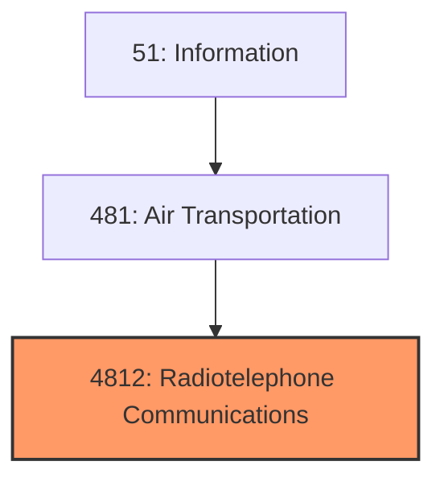
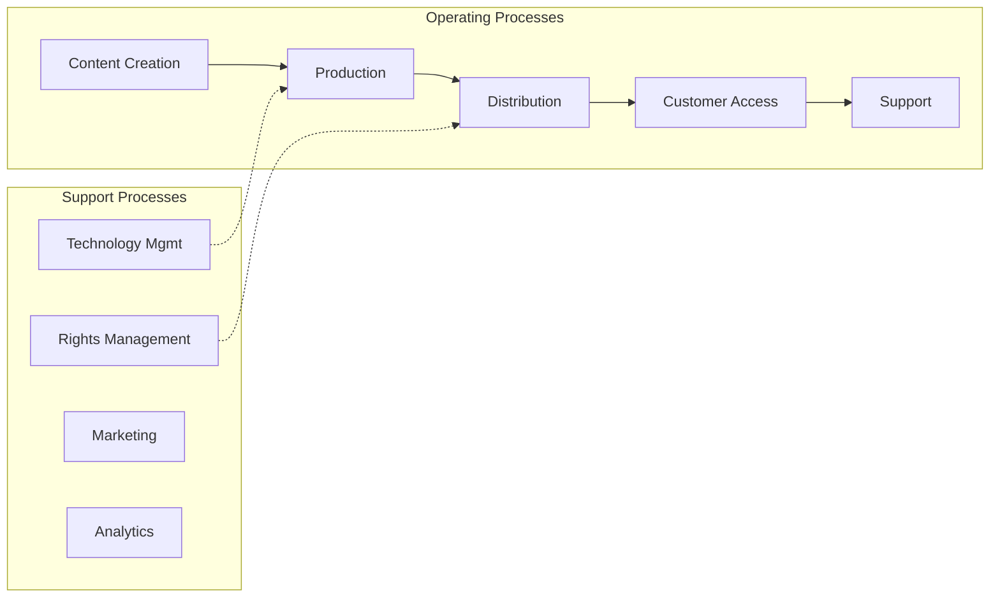

# Radiotelephone Communications

> Radiotelephone Communications.

## Overview

Radiotelephone Communications represents an important category within the Information sector (SIC 4812).

## Industry Hierarchy

## Key Statistics

| Metric | Value |
|--------|-------|
| SIC Code | 4812 |
| Level | SIC (4812) |
| Child Industries | 0 |

## Related Occupations

- [Computer and Information Systems Managers](/occupations/Management/ComputerAndInformationSystemsManagers) - Plan and direct IT activities
- [Software Developers](/occupations/Technology/SoftwareDevelopers) - Design and develop software applications
- [Information Security Analysts](/occupations/Technology/InformationSecurityAnalysts) - Plan and implement security measures
- [Database Administrators](/occupations/Technology/DatabaseAdministrators) - Administer and maintain databases

## Core Business Processes

## Industry Value Chain

```mermaid
graph LR
    subgraph Inputs["Inputs"]
        I1["Content"]
        I2["Technology"]
        I3["Talent"]
    end

    subgraph Primary["Primary Activities"]
        A1["Inbound Logistics"]
        A2["Core Operations"]
        A3["Quality Assurance"]
        A4["Outbound/Delivery"]
    end

    subgraph Outputs["Products/Services"]
        O1["Information Products"]
        O2["Software"]
        O3["Media"]
    end

    subgraph Customers["Markets"]
        C1["Businesses"]
        C2["Consumers"]
        C3["Government"]
        C4["Education"]
    end

    Inputs --> Primary --> Outputs --> Customers
```

## Regulatory Environment

- **FCC** (Federal Communications Commission) - Regulates telecommunications and broadcasting
- **FTC** (Federal Trade Commission) - Enforces data privacy and consumer protection
- **Copyright Office** - Manages intellectual property in media and publishing
- **State Data Privacy Laws** - Govern consumer data handling (e.g., CCPA, state equivalents)

## Technology & Innovation

- **Artificial Intelligence** - Generative AI, machine learning, and natural language processing
- **Cloud Computing** - SaaS platforms, edge computing, and hybrid cloud architectures
- **5G and Connectivity** - High-speed networks enabling IoT, AR/VR, and real-time applications
- **Cybersecurity** - Zero-trust architectures, AI threat detection, and privacy-enhancing technologies

## Industry Outlook

The information sector continues to expand rapidly, driven by AI, cloud computing, and data-driven business models. Generative AI is transforming content creation, software development, and information services. Cybersecurity investment is growing alongside increasing digital threats, while regulatory frameworks for data privacy and AI governance are evolving across jurisdictions.

## Market Context

Information industries create and distribute content and technology services, with digital transformation and streaming reshaping media consumption.

| Aspect | Details |
|--------|---------|
| Industry Sector | Information |
| NAICS/SIC Code | 4812 |
| Market Segment | Radiotelephone Communications |

## Key Business Processes

- Content creation and curation
- Technology development
- Network operations
- Customer acquisition
- Service delivery

## Common Occupations

- [Computer Systems Managers](/occupations/Management/ComputerAndInformationSystemsManagers)
- [Software Developers](/occupations/Technology/SoftwareDevelopers)
- [Data Scientists](/occupations/Technology/DataScientists)
- [Network Administrators](/occupations/Technology/NetworkAndComputerSystemsAdministrators)

## Regulations and Standards

- FCC communications regulations
- Data privacy laws (CCPA, GDPR)
- Intellectual property protections
- Cybersecurity frameworks
- Net neutrality policies

## Technology and Tools

- Cloud computing platforms
- Content management systems
- Broadcasting equipment
- Network infrastructure
- Streaming technologies

## Industry Trends

- Digital transformation and automation adoption
- Sustainability and environmental compliance focus
- Workforce development and skills training
- Supply chain resilience and optimization
- Customer experience enhancement

---

*Source: SIC 4812 - Radiotelephone Communications*
